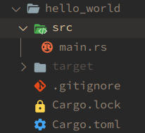

---

title: Rust学习笔记
date: 2020-09-15 14:54:06
tags: rust
categories: language
index_img: https://www.rust-lang.org/static/images/rust-logo-blk.svg
banner_img: https://encrypted-tbn0.gstatic.com/images?q=tbn%3AANd9GcSe1nzV5XLy4vds6cQFBxivCU8WzmHl2620OQ&usqp=CAU
---


本文是我在根据 [the book](https://doc.rust-lang.org/book/) 学习 rust 时所做的记录，用来加强理解（毕竟本人太菜了）。~~通常是隔5、6章做一次整理，其中有不理解或存在拓展的点进行标注，在文末总结。有什么意见或者建议欢迎提出。~~回过头来，看看写的实在太烦了，想必日后会有精简 + 归纳吧。

<!-- more -->

# Rust 学习笔记

## 一.入门指南

> 仅介绍 Linux 版本（水字数用）

### 安装

+ #### 安装 rustup

  在终端输入：`$ curl https://sh.rustup.rs -sSf | sh`

  如果安装成功，将会显示：`Rust is installed now. Great!`

  如果希望立刻开始使用 Rust 而不重启终端，在 shell 中运行如下命令，手动将 Rust 加入系统 PATH 变量中：`$ source $HOME/.cargo/env`

  或者，可以在（bash用户）`~/.bash_profile`或（fish用户）`~/.config/fish/config.fish`文件中增加：

  `$ export PATH="$HOME/.cargo/bin:$PATH"`

+ #### 更新和卸载

  更新：`$ rustup update`

  卸载：`$ rustup self uninstall`

+ #### 故障排除

  检查是否正确安装了 Rust ：`$ rustc --version`

  显示为如下格式：`rustc x.y.z (abcabcabc yyyy-mm-dd)`

### Hello, Cargo!

Cargo 是 Rust 的构建系统和包管理器，非常方便。

+ #### 使用 Cargo 创建项目

  在命令行内输入：

  `$ cargo new hello_world`

  `$ cd hello_world`

  第一行命令新建了名为 hello_world 的目录，同时在这个目录中创建了项目文件

  

+ #### 构建并运行 Cargo 项目

  在 hello_world 目录下，输入以下命令来构建项目：

  `$ cargo build`

  这个命令会创建一个可执行文件 *target/debug/hello_cargo*。可以通过这个命令运行可执行文件：

  `$ ./target/debug/hello_cargo`

  也可以用以下命令来同时编译并运行：

  `$ cargo run`

  Cargo 还提供了 `cargo check` 快速检查代码确保其可以编译，但并不产生可执行文件。

+ #### 发布构建

  当项目最终准备好发布时，可以用 `cargo build --release` 来优化编译项目。

  这会在 *target/release* 而不是 *target/debug* 下生成可执行文件。

## 二.常见编程概念

### 变量和可变性

在 rust 中变量默认是不可变的。当变量不可变时，一旦值被绑定到一个名称上，就不能改变这个值。

```rust
fn main() {
    let x = 5;
    println!("The value of x is: {}", x);
    x = 6;
    println!("The value of x is: {}", x);
}
```

例如，对上面这段代码用 `cargo run` 进行运行，会显示错误：

```
error[E0384]: cannot assign twice to immutable variable `x`
 --> src/main.rs:4:5
  |
2 |     let x = 5;
  |         - first assignment to `x`
3 |     println!("The value of x is: {}", x);
4 |     x = 6;
  |     ^^^^^ cannot assign twice to immutable variable

```

因为不能对不可变量 x 进行二次赋值。

虽然这意味着当阅读和编写代码时，不需要追踪一个值如何和在哪可能会被改变，从而使得代码易于推导，但是可变性也是非常有用的。我们可以在变量名之前加`mut` 来使其可变。

#### 变量和常量的区别

首先，不允许对常量使用mut。常量不光默认不能变，它总是不能变。

声明常量使用 `const` 关键字而不是 `let` ，且必须注明值的类型：

`const MAX_POINTS: u32 = 100_000;`

在声明它的作用域之中，常量在整个程序<u>生命周期</u>（1）中都有效。

#### 隐藏

我们可以定义一个与之前变量同名的新变量，而新变量会隐藏之前的变量。我们成为第一个变量被第二个隐藏了——使用这个变量时会看到第二个值。

```rust
fn main() {
    let x = 5;	//注意这时是不可变量
    let x = x + 1;
    let x = x * 2;
    println!("The value of x is: {}", x);
}
```

运行这个程序，会有如下输出 `The value of x is: 12`。

我们会发现隐藏与 `mut` 很像，但其实是有区别的：使用隐藏时所有的变量都是不变的；使用隐藏时，当再次用 `let` 时，实际上创建了一个新变量，我们可以改变值的类型，但复用这个名字：

```rust
let spaces = "     ";
let spaces = spaces.len();
```

然而当使用 `mut` 时：

```rust
let mut spaces = "   ";
spaces = spaces.len();
```

会得到编译错误。

### 数据类型

在 Rust 中，每一个值都属于某一个数据类型。

Rust 是静态类型编译，所以在编译时就必须知道所有变量的类型。

当多种类型都有可能时，必须增加类型注解：

`let guess: u32 = "42".parse().expect("Not a number!");`

#### 标量类型

标量类型代表一个单独的值。Rust 有四种基本的标量类型：整型、浮点型、布尔类型和字符类型。

其中，Rust 的 `char` 类型大小为4个字节，并代表了一个 Unicode 标量值，因此可以比 ASCII表示更多内容。

#### 复合类型

Rust 有两个原生的复合类型：元组（tuple）和数组（array）。


##### 元组类型

元组是一个将多个其他类型的值组合进一个复合类型的主要方式。元组长度固定：一旦声明，其长度不会增大或缩小。

元组中的每一个位置都有一个类型，而且这些不同值的类型也不必是相同的。

```rust
fn main() {
    let tup: (i32, f64, u8) = (500, 6.4, 1);
}
```

这个例子把 `tup` 变量绑定到整个元组上，并进行了类型注解。

为了从元组中获取单个值，可以使用模式匹配来结构元组值：

```rust
fn main() {
    let tup = (500, 6.4, 1);
    let (x, y, z) = tup;
    println!("The value of y is: {}", y);
}
```

除了模式匹配解构外，也可以使用点号后跟值来直接访问它们：

```rust
fn main() {
    let x: (i32, f64, u8) = (500, 6.4, 1);
    let five_hundred = x.0;
    let six_point_four = x.1;
    let one = x.2;
}
```

当需要使用函数来返回多个不同类型的数据时元组是一个很好的选择。

##### 数组类型

与元组不同，数组中的每个元素的类型必须相同。Rust 中的数组是固定长度的：一旦声明，它们的长度不能增长或缩小。

Rust 中，数组中的值位于中括号内的逗号分隔的列表中：

```rust
fn main() {
	let a = [1, 2, 3, 4, 5];
}
```

当想在栈上为数据分配空间，或者想确保总是有固定数量的元素时，数组非常有用。

但是数组并不如 <u>vector 类型</u>（2）灵活。vector 类型是标准库提供的一个允许增长和缩小长度的类似数组的集合类型。

可以像这样编写数组：在方括号中包含每个元素的类型，后跟分号，再后跟数组元素的数量。

```rust
let a: [i32; 5] = [1, 2, 3, 4, 5];
```

这里，`i32` 是每个元素的类型。分号之后，数字 `5` 表明该数组包含五个元素。

如果要为每个元素创建包含相同值的数组，可以指定初始值，后跟分号，然后在方括号中指定数组的长度，如下所示：

```rust
let a = [3; 5];
```

###### 访问数组元素

数组是一整块分配在栈上的内存。可以使用索引来访问数组的元素，像这样：

```rust
fn main() {
    let a = [1, 2, 3, 4, 5];

    let first = a[0];
    let second = a[1];
}
```

当尝试用索引访问一个元素时，Rust 会检查指定的索引是否小于数组的长度。如果索引超出了数组长度，Rust 会 *panic*，这是 Rust 术语，它用于程序因为错误而退出的情况。

### 函数

Rust 中的函数定义以 `fn` 开始并在函数名后跟一对圆括号。大括号告诉编译器哪里是函数体的开始和结尾。

Rust 不关心函数定义于何处，只要定义了就行。例：

```rust
fn main() {
    println!("Hello, world!");

    another_function();
}

fn another_function() {
    println!("Another function.");
}
```

#### 函数参数

函数也可以被定义为拥有参数，参数是特殊变量，是函数签名的一部分。

```rust
fn main() {
    another_function(5);
}

fn another_function(x: i32) {
    println!("The value of x is: {}", x);
}
```

这个例子指明在函数签名中，必须声明每个参数的类型。

当一个函数有多个参数时，使用逗号分隔：

```rust
fn main() {
    another_function(5, 6);
}

fn another_function(x: i32, y: i32) {
    println!("The value of x is: {}", x);
    println!("The value of y is: {}", y);
}
```

#### 包含语句和表达式的函数体

函数体由一系列的语句和一个可选的结尾表达式构成。

语句是执行一些操作但不返回值的指令。表达式计算并产生一个值。

```rust
fn main() {
	let y = 6;
}
```

这个例子，使用 `let` 关键字创建变量并绑定一个值是一个语句。同时，函数定义也是一个语句，上面整个例子就是一个语句。

语句不能返回值，因此不能把 `let` 语句赋值给另一个变量：

```rust
fn main() {
    let x = (let y = 6);
}
```

这个例子是错误的。

表达式会计算出一些值，考虑一个简单的数学运算，比如 `5 + 6`，这是一个表达式并计算出值 `11`。

表达式可以是语句的一部分：在上个例子中，语句 `let y = 6;` 中的 `6` 是一个表达式，它计算出的值是 `6`。

函数调用是一个表达式。宏调用是一个表达式。我们用来创建新作用域的大括号（代码块），`{}`，也是一个表达式，例如：

```rust
fn main() {
    let x = 5;

    let y = {
        let x = 3;
        x + 1
    };

    println!("The value of y is: {}", y);
}
```

这个表达式：

```rust
{
    let x = 3;
    x + 1
}
```

是一个代码块，它的值为4.这个值作为 `let` 语句的一部分被绑定到 `y` 上。表达式的结尾没有分号。如果在表达式的结尾加上分号，它就变成了语句，而语句不会返回值。

#### 具有返回值的函数

函数可以向调用它的代码返回值。我们并不对返回值命名，但要在箭头（`->`）后声明它的类型。

在 Rust 中，函数的返回值等同于函数体最后一个表达式的值。使用 `return` 关键字和指定值，可从函数中提前返回；但大部分函数隐式的返回最后的表达式。

```rust
fn five() -> i32 {
    5
}

fn main() {
    let x = five();

    println!("The value of x is: {}", x);
}
```

再看一个例子：

```rust
fn main() {
    let x = plus_one(5);

    println!("The value of x is: {}", x);
}

fn plus_one(x: i32) -> i32 {
    x + 1
}
```

### 注释

在 Rust 中，注释必须以两道斜杠开始，并持续到本行的结尾。对于超过一行的注释，需要在每一行前都加上 `//`，像这样：

```rust
// So we’re doing something complicated here, long enough that we need
// multiple lines of comments to do it! Whew! Hopefully, this comment will
// explain what’s going on.
```

### 控制流

#### if 表达式

`if` 表达式允许根据条件执行不同的代码分支。

```rust
fn main() {
    let number = 3;

    if number < 5 {
        println!("condition was true");
    } else {
        println!("condition was false");
    }
}
```

所有的 `if` 表达式都以 `if` 关键字开头，其后跟一个条件。也可以包含一个可选的 `else` 表达式来提供一个在条件为假时应当执行的代码块。如果不提供 `else` 表达式并且条件为假时，程序会直接忽略 `if` 代码块并继续执行下面的代码。

另外值得注意的是代码中的条件 **必须** 是 `bool` 值。如果条件不是 `bool` 值，我们将得到一个错误。例如：

```rust
fn main() {
    let number = 3;

    if number {
        println!("number was three");
    }
}
```

这里 `if` 条件的值是 `3`，Rust 抛出了一个错误：

```bash
error[E0308]: mismatched types
 --> src/main.rs:4:8
  |
4 |     if number {
  |        ^^^^^^ expected bool, found integer
  |
  = note: expected type `bool`
             found type `{integer}`
```

这个错误表明 Rust 期望一个 `bool` 却得到了一个整数。

##### 使用 else if 处理多重条件

```rust
fn main() {
    let number = 6;

    if number % 4 == 0 {
        println!("number is divisible by 4");
    } else if number % 3 == 0 {
        println!("number is divisible by 3");
    } else if number % 2 == 0 {
        println!("number is divisible by 2");
    } else {
        println!("number is not divisible by 4, 3, or 2");
    }
}
```

Rust 只会执行第一个条件为真的代码块，并且一旦它找到一个以后，甚至都不会检查剩下的条件了。

使用过多的 `else if` 表达式会使代码显得杂乱无章，所以如果有多于一个 `else if` 表达式，最好重构代码。之后会介绍一个强大的 Rust 分支结构，叫做 `match`。

##### 在 let 语句中使用 if

因为 `if` 是一个表达式，我们可以在 `let` 语句的右侧使用它：

```rust
fn main() {
    let condition = true;
    let number = if condition {
        5
    } else {
        6
    };

    println!("The value of number is: {}", number);
}
```

将 `if` 表达式的返回值赋给一个变量`number` 变量将会绑定到表示 `if` 表达式结果的值上。

代码块的值是其最后一个表达式的值，而数字本身就是一个表达式。在这个例子中，整个 `if` 表达式的值取决于哪个代码块被执行。这意味着 `if` 的每个分支的可能的返回值都必须是相同类型；在这个例子 中，`if` 分支和 `else` 分支的结果都是 `i32` 整型。

#### 使用循环重复执行

##### 使用 loop 重复执行代码

`loop` 关键字告诉 Rust 一遍又一遍地执行一段代码直到你明确要求停止。

```rust
fn main() {
    loop {
        println!("again!");
    }
}
```

当运行这个程序时，我们会看到连续的反复打印 `again!`，直到我们手动停止程序。当然也可以使用 `break` 关键字来告诉程序何时停止循环。

##### 从循环返回

`loop` 的一个用例是重试可能会失败的操作，比如检查线程是否完成了任务。然而你可能会需要将操作的结果传递给其它的代码。如果将返回值加入你用来停止循环的 `break` 表达式，它会被停止的循环返回：

```rust
fn main() {
    let mut counter = 0;

    let result = loop {
        counter += 1;

        if counter == 10 {
            break counter * 2;
        }
    };

    println!("The result is {}", result);
}
```

当相等时，使用 `break` 关键字返回值 `counter * 2`。循环之后，我们通过分号结束赋值给 `result` 的语句。

##### while 条件循环

```rust
fn main() {
    let mut number = 3;

    while number != 0 {
        println!("{}!", number);

        number = number - 1;
    }

    println!("LIFTOFF!!!");
}
```

当条件为真时，使用 `while` 循环运行代码，否则退出循环。

##### 使用 for 遍历集合

作为更简洁的方案，可以使用 `for` 循环来对一个集合的每个元素执行一些代码。

```rust
fn main() {
    let a = [10, 20, 30, 40, 50];

    for element in a.iter() {
        println!("the value is: {}", element);
    }
}
```

增强了代码安全性，并消除了可能由于超出数组的结尾或遍历长度不够而缺少一些元素而导致的 bug。

`for` 的详细用法（3）

## 三.认识所有权

### 什么是所有权？


Rust 的核心功能之一是所有权。

一些语言中具有垃圾回收机制，在程序运行时不断地寻找不再使用的内存；在另一些语言中，程序员必须亲自分配和释放内存。Rust 则选择了第三种方式：通过所有权系统管理内存，编译器在编译时会根据一系列的规则进行检查。

> 栈与堆
>
> 栈和堆都是代码在运行时可供使用的内存，但是它们的结构不同。
>
> 栈以放入值的顺序存储值并以相反顺序取出值。这也被称作后进先出。
>
> 栈中的所有数据都必须占用已知且固定的大小。在编译时大小未知或大小可能变化的数据，要改为存储在堆上。
>
> 堆是缺乏组织的：当向堆放入数据时，你要请求一定大小的空间。操作系统在堆的某处找到一块足够大的空位，把它标记为已使用，并返回一个表示该位置地址的指针。这个过程称作在堆上分配内存。

#### 所有权规则

1. Rust 中的每一个值都有一个被称为其所有者的变量。
2. 值在任一时刻有且只有一个所有者。
3. 当所有者（变量）离开作用域，这个值将被丢弃。

#### 变量作用域

作用域是一个项（item）在程序中有效的范围。例：

```rust

fn main() {
                     // s 在这里无效, 它尚未声明
    let s = "hello";   // 从此处起，s 是有效的

    // 使用 s
                      // 此作用域已结束，s 不再有效
}

```

变量 `s` 绑定到了一个<u>字符串字面值</u>（数据类型为 &str），这个字符串值是硬编码进程序代码中的。

#### String 类型

这里使用 `String` 作为例子，并专注于 `String` 与所有权相关的部分。在之后会更深入地讲解 `String`。

字符串字面值是很方便的，不过它们并不适合使用文本的每一种场景。原因之一就是它们是不可变的。

另一个原因是并非所有字符串的值都能在编写代码时就知道：例如，要是想获取用户输入并存储该怎么办呢？

为此，Rust 有第二个字符串类型，`String`。这个类型被分配到堆上，所以能够存储在编译时未知大小的文本。可以使用 `from` 函数基于字符串字面值来创建 `String`，如下：

```rust
let s = String::from("hello");
```

这两个冒号（`::`）是运算符，允许将特定的 `from` 函数置于 `String` 类型的命名空间下。

可以修改此类字符串：

```rust
let mut s = String::from("hello");

s.push_str(", world!"); // push_str() 在字符串后追加字面值

println!("{}", s); // 将打印 `hello, world!`
```

为什么 `String` 可变而字面值却不行呢？区别在于两个类型对内存的处理上。

#### 内存与分配

就字符串字面值来说，我们在编译时就知道其内容，所以文本被直接<u>硬编码</u>（4）进最终的可执行文件中。这使得字符串字面值快速且高效。不过这些特性都只得益于字符串字面值的不可变性。

对于 `String` 类型，为了支持一个可变的文本片段，需要在堆上分配一块在编译时未知大小的内存来存放内容。

这意味着：

- 必须在运行时向操作系统请求内存。
- 需要一个当我们处理完 `String` 时将内存返回给操作系统的方法。

第一部分由我们完成：当调用 `String::from` 时，它的实现 (*implementation*) 请求其所需的内存。

对于第二部分，Rust 采取了一个不同的策略：内存在拥有它的变量离开作用域后就被自动释放。

```rust

fn main () {
    let s = String::from("hello"); // 从此处起，s 是有效的

    // 使用 s
}                                  // 此作用域已结束，
                                   // s 不再有效
```

当变量离开作用域，Rust 为我们调用一个特殊的函数。这个函数叫做 `drop`，在这里 `String` 的作者可以放置释放内存的代码。Rust 在结尾的 `}` 处自动调<u>用 `drop`。</u>（5）

#### 变量与数据交互的方式（一）：移动

```rust
let x = 5;
let y = x;
```

现在有了两个变量，`x` 和 `y`，都等于 `5`。因为整数是有已知固定大小的简单值，所以这两个 `5` 被放入了栈中。

```rust
let s1 = String::from("hello");
let s2 = s1;
```

虽然两个例子非常相似，但是事实上第二个例子中，第二行并不是生成一个 `s1` 的拷贝并绑定到 `s2` 上。


如上图所示：`String` 由三部分组成，如图左侧所示：一个指向存放字符串内容内存的指针，一个长度，和一个容量。这一组数据存储在栈上。右侧则是堆上存放内容的内存部分。

这是将值 `"hello"` 绑定给 `s1` 的 `String` 在内存中的表现形式。


当我们将 `s1` 赋值给 `s2`，`String` 的数据被复制了，这意味着我们从栈上拷贝了它的指针、长度和容量。我们并没有复制指针指向的堆上数据。表现如上图所示。

如果 Rust 也拷贝了堆上的数据，那么操作 `s2 = s1` 在堆上数据比较大的时候会对运行时性能造成非常大的影响。。

之前我们提到过当变量离开作用域后，Rust 自动调用 `drop` 函数并清理变量的堆内存。这就有了一个问题：当 `s2` 和 `s1` 离开作用域，他们都会尝试释放相同的内存。这是一个叫做二次释放的错误。

为了确保内存安全，这种场景下 Rust 的处理有另一个细节值得注意。

```rust
fn main () {
    let s1 = String::from("hello");
	let s2 = s1;

	println!("{}, world!", s1);
}
```

运行这段代码时，会发生如下错误：

```bash
error[E0382]: use of moved value: `s1`
 --> src/main.rs:5:28
  |
3 |     let s2 = s1;
  |         -- value moved here
4 |
5 |     println!("{}, world!", s1);
  |                            ^^ value used here after move
  |
  = note: move occurs because `s1` has type `std::string::String`, which does
  not implement the `Copy` trait
```

Rust 同时使第一个变量无效了，这个操作被称为移动。


内存表现如上图所示。

因为只有 `s2` 是有效的，当其离开作用域，它就释放自己的内存，完毕。

#### 变量与数据交互的方式（二） ：克隆

如果我们确实需要深度复制 `String` 中堆上的数据，而不仅仅是栈上的数据，可以使用一个叫做 `clone` 的通用函数。

```rust
let s1 = String::from("hello");
let s2 = s1.clone();

println!("s1 = {}, s2 = {}", s1, s2);
```

#### 只在栈上的数据：拷贝

```rust
let x = 5;
let y = x;

println!("x = {}, y = {}", x, y);
```

Rust 有一个叫做 `Copy` <u>trait</u>（6） 的特殊注解，可以用在类似整型这样的存储在栈上的类型上。如果一个类型拥有 `Copy` trait，一个旧的变量在将其赋值给其他变量后仍然可用。

如下是一些 `Copy` 的类型：

- 所有整数类型，比如 `u32`。
- 布尔类型，`bool`，它的值是 `true` 和 `false`。
- 所有浮点数类型，比如 `f64`。
- 字符类型，`char`。
- 元组，当且仅当其包含的类型也都是 `Copy` 的时候。比如，`(i32, i32)` 是 `Copy` 的，但 `(i32, String)` 就不是。

#### 所有权与函数

将值传递给函数在语义上与给变量赋值相似。向函数传递值可能会移动或者复制，就像赋值语句一样。

```rust
fn main() {
    let s = String::from("hello");  // s 进入作用域

    takes_ownership(s);             // s 的值移动到函数里 ...
                                    // ... 所以到这里不再有效

    let x = 5;                      // x 进入作用域

    makes_copy(x);                  // x 应该移动函数里，
                                    // 但 i32 是 Copy 的，所以在后面可继续使用 x

} // 这里, x 先移出了作用域，然后是 s。但因为 s 的值已被移走，
  // 所以不会有特殊操作

fn takes_ownership(some_string: String) { // some_string 进入作用域
    println!("{}", some_string);
} // 这里，some_string 移出作用域并调用 `drop` 方法。占用的内存被释放

fn makes_copy(some_integer: i32) { // some_integer 进入作用域
    println!("{}", some_integer);
} // 这里，some_integer 移出作用域。不会有特殊操作
```

#### 返回值和作用域

返回值也可以转移所有权。

```rust
fn main() {
    let s1 = gives_ownership();         // gives_ownership 将返回值
                                        // 移给 s1

    let s2 = String::from("hello");     // s2 进入作用域

    let s3 = takes_and_gives_back(s2);  // s2 被移动到
                                        // takes_and_gives_back 中,
                                        // 它也将返回值移给 s3
} // 这里, s3 移出作用域并被丢弃。s2 也移出作用域，但已被移走，
  // 所以什么也不会发生。s1 移出作用域并被丢弃

fn gives_ownership() -> String {             // gives_ownership 将返回值移动给
                                             // 调用它的函数

    let some_string = String::from("hello"); // some_string 进入作用域.

    some_string                              // 返回 some_string 并移出给调用的函数
}

// takes_and_gives_back 将传入字符串并返回该值
fn takes_and_gives_back(a_string: String) -> String { // a_string 进入作用域

    a_string  // 返回 a_string 并移出给调用的函数
}
```

变量的所有权总是遵循相同的模式：将值赋给另一个变量时移动它。当持有堆中数据值的变量离开作用域时，其值将通过 `drop` 被清理掉，除非数据被移动为另一个变量所有。

除此之外，我们也可能想返回函数体中产生的一些数据。

```rust
fn main() {
    let s1 = String::from("hello");

    let (s2, len) = calculate_length(s1);

    println!("The length of '{}' is {}.", s2, len);
}

fn calculate_length(s: String) -> (String, usize) {
    let length = s.len(); // len() 返回字符串的长度

    (s, length)
}
```

这个代码便是返回了调用的所有权。

如果我们想要函数使用一个值但不获取所有权，Rust 对此提供了一个功能，叫做 引用。

### 引用与借用

在上一个例子当中，我们必须将 `String` 返回给调用函数，以便在调用 `calculate_length` 后仍能使用 `String`。

下面的例子定义了一个新的函数，它以一个对象的引用作为参数而不是获取值的所有权。

```rust
fn main() {
    let s1 = String::from("hello");

    let len = calculate_length(&s1);

    println!("The length of '{}' is {}.", s1, len);
}

fn calculate_length(s: &String) -> usize {
    s.len()
}
```

在这个例子当中，变量声明和函数返回值中的所有元组代码都消失了；变量声明和函数返回值中的所有元组代码都消失了。

这些 & 符号就是引用，它们允许你使用值但不获取其所有权。


```rust
fn calculate_length(s: &String) -> usize { // s 是对 String 的引用
    s.len()
} // 这里，s 离开了作用域。但因为它并不拥有引用值的所有权，
  // 所以什么也不会发生
```

变量 `s` 有效的作用域与函数参数的作用域一样，不过当引用离开作用域后并不丢弃它指向的数据，因为我们没有所有权。

我们将获取引用作为函数参数称为借用。

```rust
fn main() {
    let s = String::from("hello");

    change(&s);
}

fn change(some_string: &String) {
    some_string.push_str(", world");
}
```

尝试修改借用的值。但是不行的。

```bash
error[E0596]: cannot borrow immutable borrowed content `*some_string` as mutable
 --> error.rs:8:5
  |
7 | fn change(some_string: &String) {
  |                        ------- use `&mut String` here to make mutable
8 |     some_string.push_str(", world");
  |     ^^^^^^^^^^^ cannot borrow as mutable
```

正如变量默认是不可变的，引用也一样。（默认）不允许修改引用的值。

#### 可变引用

所以对之前的代码进行修改：

```rust
fn main() {
    let mut s = String::from("hello");

    change(&mut s);
}

fn change(some_string: &mut String) {
    some_string.push_str(", world");
}
```

首先，必须将 `s` 改为 `mut`。然后必须创建一个可变引用 `&mut s` 和接受一个可变引用 `some_string: &mut String`。

不过可变引用有一个很大的限制：在特定作用域中的特定数据只能有一个可变引用。

这个限制的好处是 Rust 可以在编译时就避免数据竞争。<u>数据竞争</u>（7）类似于竞态条件，它可由这三个行为造成：

- 两个或更多指针同时访问同一数据。
- 至少有一个指针被用来写入数据。
- 没有同步数据访问的机制。

可以使用大括号来创建一个新的作用域，以允许拥有多个可变引用，只是不能 **同时** 拥有：

```rust
let mut s = String::from("hello");

{
    let r1 = &mut s;

} // r1 在这里离开了作用域，所以我们完全可以创建一个新的引用

let r2 = &mut s;
```

类似的规则也存在于同时使用可变与不可变引用中。这些代码会导致一个错误：

```rust
let mut s = String::from("hello");

let r1 = &s; // 没问题
let r2 = &s; // 没问题
let r3 = &mut s; // 大问题

println!("{}, {}, and {}", r1, r2, r3);
```

我们也不能在拥有不可变引用的同时拥有可变引用。

注意一个引用的作用域从声明的地方开始一直持续到最后一次使用为止。例如，因为最后一次使用不可变引用在声明可变引用之前，所以如下代码是可以编译的：

```rust
let mut s = String::from("hello");

let r1 = &s; // 没问题
let r2 = &s; // 没问题
println!("{} and {}", r1, r2);
// 此位置之后 r1 和 r2 不再使用

let r3 = &mut s; // 没问题
println!("{}", r3);
```

不可变引用 `r1` 和 `r2` 的作用域在 `println!` 最后一次使用之后结束，这也是创建可变引用 `r3` 的地方。它们的作用域没有重叠，所以代码是可以编译的。

#### 悬垂引用

在具有指针的语言中，很容易通过释放内存时保留指向它的指针而错误地生成一个悬垂指针，所谓悬垂指针是其指向的内存可能已经被分配给其它持有者。

让我们尝试创建一个悬垂引用，Rust 会通过一个编译时错误来避免：

```rust
fn main() {
    let reference_to_nothing = dangle();
}

fn dangle() -> &String {
    let s = String::from("hello");

    &s
}
```

让我们仔细看看我们的 `dangle` 代码的每一步到底发生了什么：

```rust
fn dangle() -> &String { // dangle 返回一个字符串的引用

    let s = String::from("hello"); // s 是一个新字符串

    &s // 返回字符串 s 的引用
} // 这里 s 离开作用域并被丢弃。其内存被释放。
  // 危险！
```

这里的解决方法是直接返回 `String`。

### Slice 类型

另一个没有所有权的数据类型是 *slice*。slice 允许你引用集合中一段连续的元素序列，而不用引用整个集合。

字符串 slice 是 `String` 中一部分值的引用，它看起来像这样：

```rust
let s = String::from("hello world");

let hello = &s[0..5];
let world = &s[6..11];
```

它不是对整个 `String` 的引用，而是对部分 `String` 的引用。

对于 Rust 的 `..` range 语法，如果想要从第一个索引（0）开始，可以不写两个点号之前的值。如下两个语句是相同的：

```rust
let s = String::from("hello");

let slice = &s[0..2];
let slice = &s[..2];
```

如果 slice 包含 `String` 的最后一个字节，也可以舍弃尾部的数字。这意味着如下也是相同的：

```rust
let s = String::from("hello");

let len = s.len();

let slice = &s[3..len];
let slice = &s[3..];
```

也可以同时舍弃这两个值来获取整个字符串的 slice。所以如下亦是相同的：

```rust
let s = String::from("hello");

let len = s.len();

let slice = &s[0..len];
let slice = &s[..];
```

##### 字符串字面值就是 slice

```rust
let s = "Hello, world!";
```

这里 `s` 的类型是 `&str`：它是一个指向二进制程序特定位置的 slice。这也就是为什么字符串字面值是不可变的；`&str` 是一个不可变引用。

#### 字符串 slice 作为参数

```rust
fn main() {
    let my_string = String::from("hello world");

    // first_word 中传入 `String` 的 slice
    let word = first_word(&my_string[..]);

    let my_string_literal = "hello world";

    // first_word 中传入字符串字面值的 slice
    let word = first_word(&my_string_literal[..]);

    // 因为字符串字面值 **就是** 字符串 slice，
    // 这样写也可以，即不使用 slice 语法！
    let word = first_word(my_string_literal);
}
```

#### 其他类型的 slice

字符串 slice，正如你想象的那样，是针对字符串的。不过也有更通用的 slice 类型。

```rust
let a = [1, 2, 3, 4, 5];

let slice = &a[1..3];
```

这个 slice 的类型是 `&[i32]`。跟字符串 slice 的工作方式一样，通过存储第一个集合元素的引用和一个集合总长度。

## 四.使用结构体组织相关联的数据

### 定义并实体化结构体

和元组一样，结构体的每一部分可以是不同类型。但不同于元组，结构体需要命名各部分数据以便能清楚的表明其值的意义。由于有了这些名字，结构体比元组更灵活：不需要依赖顺序来指定或访问实例中的值。

定义结构体，需要使用 `struct` 关键字并为整个结构体提供一个名字。接着，在大括号中，定义每一部分数据的名字和类型，我们称为字段.

```rust
struct User {
    username: String,
    email: String,
    sign_in_count: u64,
    active: bool,
}
```

一旦定义了结构体后，为了使用它，通过为每个字段指定具体值来创建这个结构体的实例。实例中字段的顺序不需要和它们在结构体中声明的顺序一致。

```rust
let user1 = User {
    email: String::from("someone@example.com"),
    username: String::from("someusername123"),
    active: true,
    sign_in_count: 1,
};
```

为了从结构体中获取某个特定的值，可以使用点号。要更改结构体中的值，如果结构体的实例是可变的，我们可以使用点号并为对应的字段赋值。

```rust
let mut user1 = User {
    email: String::from("someone@example.com"),
    username: String::from("someusername123"),
    active: true,
    sign_in_count: 1,
};

user1.email = String::from("anotheremail@example.com");
```

注意整个实例必须是可变的；Rust 并不允许只将某个字段标记为可变。

同其他任何表达式一样，我们可以在函数体的最后一个表达式中构造一个结构体的新实例，来隐式地返回这个实例。

```rust
fn build_user(email: String, username: String) -> User {
    User {
        email: email,
        username: username,
        active: true,
        sign_in_count: 1,
    }
}
```

#### 变量与字段同名时的字段初始化简写语法

参数名与字段名都完全相同，我们可以使用字段初始化简写语法。

```rust
fn build_user(email: String, username: String) -> User {
    User {
        email,
        username,
        active: true,
        sign_in_count: 1,
    }
}
```

#### 使用结构体更新语法从其他结构体实例创建新实例

使用旧实例的大部分值但改变其部分值来创建一个新的结构体实例通常是很有帮助的。这可以通过结构体更新语法实现。

```rust
let user2 = User {
    email: String::from("another@example.com"),
    username: String::from("anotherusername567"),
    active: user1.active,
    sign_in_count: user1.sign_in_count,
};
```

我们可以通过更少的代码来达到相同的效果

```rust
let user2 = User {
    email: String::from("another@example.com"),
    username: String::from("anotherusername567"),
    ..user1
};
```

#### 使用没有命名字段的元组结构体来创建不同的类型

也可以定义与元组类似的结构体，称为元组结构体。元组结构体有着结构体名称提供的含义，但没有具体的字段名，只有字段的类型。

当想给整个元组取一个名字，并使元组成为与其他元组不同的类型时，元组结构体是很有用的，这时像常规结构体那样为每个字段命名就显得多余和形式化了。

```rust
struct Color(i32, i32, i32);
struct Point(i32, i32, i32);

let black = Color(0, 0, 0);
let origin = Point(0, 0, 0);
```

 `black` 和 `origin` 值的类型不同，因为它们是不同的元组结构体的实例。一个获取 `Color` 类型参数的函数不能接受 `Point` 作为参数，即便这两个类型都由三个 `i32` 值组成。

在其他方面，元组结构体实例类似于元组：可以将其解构为单独的部分，也可以使用 `.` 后跟索引来访问单独的值。

#### 一个使用结构体的示例程序

#### 通过派生 trait 增加实用功能

如果能够在调试程序时打印出 结构体实例来查看其所有字段的值就更好了。

但是不能像之前的例子一样直接使用 `println！` 宏，需要在结构体定义之前加上 `#[derive(Debug)]` 注解。

```rust
#[derive(Debug)]
struct Rectangle {
    width: u32,
    height: u32,
}

fn main() {
    let rect1 = Rectangle { width: 30, height: 50 };

    println!("rect1 is {:?}", rect1);
}
```

增加注解来派生 `Debug` trait，并使用调试格式打印 `Rectangle` 实例。

当我们有一个更大的结构体时，能有更易读一点的输出就好了，为此可以使用 `{:#?}` 替换 `println!` 字符串中的 `{:?}`。

```rust
rect1 is Rectangle {
    width: 30,
    height: 50
}
```

Rust 为我们提供了很多可以通过 `derive` 注解来使用的 trait，他们可以为我们的自定义类型增加实用的行为。

### 方法语法

方法与函数类似：它们使用 `fn` 关键字和名称声明，可以拥有参数和返回值，同时包含在某处调用该方法时会执行的代码。不过方法与函数是不同的，因为它们在结构体的上下文中被定义，并且它们第一个参数总是 `self`，它代表调用该方法的结构体实例。

#### 定义方法

```rust
#[derive(Debug)]
struct Rectangle {
    width: u32,
    height: u32,
}

impl Rectangle {
    fn area(&self) -> u32 {
        self.width * self.height
    }
}

fn main() {
    let rect1 = Rectangle { width: 30, height: 50 };

    println!(
        "The area of the rectangle is {} square pixels.",
        rect1.area()
    );
}
```

为了使函数定义于 `Rectangle` 的上下文中，我们开始了一个 `impl` 块。

接着将 `area` 函数移动到 `impl` 大括号中，并将签名中的第一个参数和函数体中其他地方的对应参数改成 `self`。

然后在 `main` 中将我们先前调用 `area` 方法并传递 `rect1` 作为参数的地方，改成使用方法语法在 `Rectangle` 实例上调用 `area` 方法。方法语法获取一个实例并加上一个点号，后跟方法名、圆括号以及任何参数。

#### 带有更多参数的方法

```rust
impl Rectangle {
    fn area(&self) -> u32 {
        self.width * self.height
    }

    fn can_hold(&self, other: &Rectangle) -> bool {
        self.width > other.width && self.height > other.height
    }
}
fn main() {
    let rect1 = Rectangle { width: 30, height: 50 };
    let rect2 = Rectangle { width: 10, height: 40 };
    let rect3 = Rectangle { width: 60, height: 45 };

    println!("Can rect1 hold rect2? {}", rect1.can_hold(&rect2));
    println!("Can rect1 hold rect3? {}", rect1.can_hold(&rect3));
}
```

在方法签名中，可以在 `self` 后增加多个参数，而且这些参数就像函数中的参数一样工作。

#### 关联函数

`impl` 块的另一个有用的功能是：允许在 `impl` 块中定义不以 `self` 作为参数的函数。这被称为关联函数，因为它们与结构体相关联。它们仍是函数而不是方法，因为它们并不作用于一个结构体的**实例**。就如 `String::from` 。

例如我们可以提供一个关联函数，它接受一个维度参数并且同时作为宽和高，这样可以更轻松的创建一个正方形 `Rectangle` 而不必指定两次同样的值：

```rust
impl Rectangle {
    fn square(size: u32) -> Rectangle {
        Rectangle { width: size, height: size }
    }
}
```

使用结构体名和 `::` 语法来调用这个关联函数：比如 `let sq = Rectangle::square(3);`。

#### 多个 impl 块

每个结构体都允许拥有多个 `impl` 块。

```rust
impl Rectangle {
    fn area(&self) -> u32 {
        self.width * self.height
    }
}

impl Rectangle {
    fn can_hold(&self, other: &Rectangle) -> bool {
        self.width > other.width && self.height > other.height
    }
}
```

这里没有理由将这些方法分散在多个 `impl` 块中，不过这是有效的语法。

## 五.枚举和模式匹配

枚举是一个很多语言都有的功能，不过不同语言中其功能各不相同。Rust 的枚举与 F#、OCaml 和 Haskell 这样的函数式编程语言中的 **<u>代数数据类型</u>**（7）（*algebraic data types*）最为相似。

### 定义枚举

先举个例子，假设我们要处理 IP 地址。目前被广泛使用的两个主要 IP 标准：IPv4（version four）和 IPv6（version six）。

这是我们的程序可能会遇到的**所有**可能的 IP 地址类型，而且任何一个 IP 地址要么是 IPv4 的要么是 IPv6 的，**不能两者都是**。

IP 地址的这个特性使得枚举数据结构非常适合这个场景，因为枚举值只可能是其中一个成员。

IPv4 和 IPv6 从根本上讲仍是 IP 地址，所以当代码在处理适用于任何类型的 IP 地址的场景时应该把它们当作相同的类型。

```rust
enum IpAddrKind {
    V4,
    V6,
}
```

`V4` 和 `V6` 被称为枚举的成员。

现在 `IpAddrKind` 就是一个可以在代码中使用的自定义数据类型了。

#### 枚举值

可以像这样创建 `IpAddrKind` 两个不同成员的实例：

```rust
let four = IpAddrKind::V4;
let six = IpAddrKind::V6;
```

枚举的成员位于其标识符的命名空间中，并使用两个冒号分开。这么设计的益处是现在 `IpAddrKind::V4` 和 `IpAddrKind::V6` 都是 `IpAddrKind` 类型的。

例如，接着可以定义一个函数来获取任何 `IpAddrKind`：

```rust
fn route(ip_type: IpAddrKind) { }
```

现在可以使用任一成员来调用这个函数：

```rust
route(IpAddrKind::V4);
route(IpAddrKind::V6);
```

进一步考虑一下我们的 IP 地址类型，目前没有一个存储实际 IP 地址 **数据** 的方法；只知道它是什么 **类型** 的。

```rust
enum IpAddrKind {
    V4,
    V6,
}

struct IpAddr {
    kind: IpAddrKind,
    address: String,
}

let home = IpAddr {
    kind: IpAddrKind::V4,
    address: String::from("127.0.0.1"),
};

let loopback = IpAddr {
    kind: IpAddrKind::V6,
    address: String::from("::1"),
};
```

将 IP 地址的数据和 `IpAddrKind` 成员存储在一个 `struct` 中，现在枚举成员就与值相关联了。

我们可以使用一种更简洁的方式来表达相同的概念，仅仅使用枚举并将数据直接放进每一个枚举成员而不是将枚举作为结构体的一部分。

```rust
enum IpAddr {
    V4(String),
    V6(String),
}

let home = IpAddr::V4(String::from("127.0.0.1"));

let loopback = IpAddr::V6(String::from("::1"));
```

用枚举替代结构体还有另一个优势：每个成员可以处理不同类型和数量的数据。

如果我们想要将 `V4` 地址存储为四个 `u8` 值而 `V6` 地址仍然表现为一个 `String`，这就不能使用结构体了。

```rust
enum IpAddr {
    V4(u8, u8, u8, u8),
    V6(String),
}

let home = IpAddr::V4(127, 0, 0, 1);

let loopback = IpAddr::V6(String::from("::1"));
```

可以将任意类型的数据放入枚举成员中：例如字符串、数字类型或者结构体。甚至可以包含另一个枚举！

结构体和枚举还有另一个相似点：就像可以使用 `impl` 来为结构体定义方法那样，也可以在枚举上定义方法。

接下来，让我们看看标准库中的另一个非常常见且实用的枚举：`Option`。

#### Option 枚举和其相对空值的优势。

`Option` 是标准库定义的一个枚举。`Option` 类型应用广泛因为它编码了一个非常普遍的场景，即一个值要么有值要么没值。

Rust 并没有很多其他语言中有的空值功能。**空值**（*Null* ）是一个值，它代表没有值。在有空值的语言中，变量总是这两种状态之一：空值和非空值。

空值的问题在于当你尝试像一个非空值那样使用一个空值，会出现某种形式的错误。然而，空值尝试表达的概念仍然是有意义的：空值是一个因为某种原因目前无效或缺失的值。

为此，Rust 并没有空值，不过它确实拥有一个可以编码存在或不存在概念的枚举。

这个枚举是 `Option<T>`，而且它[定义于标准库中](https://doc.rust-lang.org/std/option/enum.Option.html)：

```rust
enum Option<T> {
    Some(T),
    None,
}
```

`Option<T>` 枚举被包含在了 prelude 之中，所以不需要将其显式引入作用域。

另外，它的成员也是如此，可以不需要 `Option::` 前缀来直接使用 `Some` 和 `None`。

`<T>` 语法是一个还未讲到的 Rust 功能。

这里是一些包含数字类型和字符串类型 `Option` 值的例子：这里是一些包含数字类型和字符串类型 `Option` 值的例子：

```rust
let some_number = Some(5);
let some_string = Some("a string");

let absent_number: Option<i32> = None;
```

如果使用 `None` 而不是 `Some`，需要告诉 Rust `Option<T>` 是什么类型的。

因为 `Option<T>` 和 `T`（这里 `T` 可以是任何类型）是不同的类型，编译器不允许像一个肯定有效的值那样使用 `Option<T>`。例如，这段代码不能编译，因为它尝试将 `Option<i8>` 与 `i8` 相加：

```rust
let x: i8 = 5;
let y: Option<i8> = Some(5);

let sum = x + y;
```

换句话说，在对 `Option<T>` 进行 `T` 的运算之前必须将其转换为 `T`。通常这能帮助我们捕获到空值最常见的问题之一：假设某值不为空但实际上为空的情况。

关于 `Option<T>` 还有很多不了解的，等着之后在研究研究，看看[它的文档](https://doc.rust-lang.org/std/option/enum.Option.html)。

### match 控制流运算符

Rust 有一个叫做 `match` 的极为强大的控制流运算符，它允许我们将一个值与一系列的模式相比较，并根据相匹配的模式执行相应代码。

```rust
enum Coin {
    Penny,
    Nickel,
    Dime,
    Quarter,
}

fn value_in_cents(coin: Coin) -> u8 {
    match coin {
        Coin::Penny => 1,
        Coin::Nickel => 5,
        Coin::Dime => 10,
        Coin::Quarter => 25,
    }
}
```

首先，我们列出 `match` 关键字后跟一个表达式，在这个例子中是 `coin` 的值。

这看起来非常像 `if` 使用的表达式，不过这里有一个非常大的区别：对于 `if`，表达式必须返回一个布尔值，而这里它可以是任何类型的。

接下来是 `match` 的分支。一个分支有两个部分：一个模式和一些代码。

第一个分支的模式是值 `Coin::Penny` 而之后的 `=>` 运算符将模式和将要运行的代码分开。这里的代码就仅仅是值 `1`。每一个分支之间使用逗号分隔。

如果想要在分支中运行多行代码，可以使用大括号。

#### 绑定值的模式

匹配分支的另一个有用的功能是可以绑定匹配的模式的部分值。

```rust
#[derive(Debug)] // 这样可以可以立刻看到州的名称
enum UsState {
    Alabama,
    Alaska,
    // --snip--
}

enum Coin {
    Penny,
    Nickel,
    Dime,
    Quarter(UsState),
}
```

在这些代码的匹配表达式中，我们在匹配 `Coin::Quarter` 成员的分支的模式中增加了一个叫做 `state` 的变量。

```rust
fn value_in_cents(coin: Coin) -> u8 {
    match coin {
        Coin::Penny => 1,
        Coin::Nickel => 5,
        Coin::Dime => 10,
        Coin::Quarter(state) => {
            println!("State quarter from {:?}!", state);
            25
        },
    }
}
```

#### 匹配 Option<T> 

我们在之前的部分中使用 `Option<T>` 时，是为了从 `Some` 中取出其内部的 `T` 值；我们还可以像处理 `Coin` 枚举那样使用 `match` 处理 `Option<T>`。

```rust
fn plus_one(x: Option<i32>) -> Option<i32> {
    match x {
        None => None,
        Some(i) => Some(i + 1),
    }
}

let five = Some(5);
let six = plus_one(five);
let none = plus_one(None);
```

##### 匹配 Some(T)

听简单的，就略过了。

#### 匹配是穷尽的

`match` 还有另一方面需要讨论。考虑一下 `plus_one` 函数的这个版本，它有一个 bug 并不能编译：

```rust
fn plus_one(x: Option<i32>) -> Option<i32> {
    match x {
        Some(i) => Some(i + 1),
    }
}
```

我们没有处理 `None` 的情况，所以这些代码会造成一个 bug。

Rust 知道我们没有覆盖所有可能的情况甚至知道哪些模式被忘记了！Rust 中的匹配是穷尽的：必须穷举到最后的可能性来使代码有效。

#### _ 通配符

Rust 也提供了一个模式用于不想列举出所有可能值的场景。

```rust
let some_u8_value = 0u8;
match some_u8_value {
    1 => println!("one"),
    3 => println!("three"),
    5 => println!("five"),
    7 => println!("seven"),
    _ => (),
}
```

`_` 模式会匹配所有的值。

`()` 就是 unit 值，所以 `_` 的情况什么也不会发生。

### if let 简单控制流

`if let` 语法让我们以一种不那么冗长的方式结合 `if` 和 `let`，来处理只匹配一个模式的值而忽略其他模式的情况。

```rust
let some_u8_value = Some(0u8);
match some_u8_value {
    Some(3) => println!("three"),
    _ => (),
}
```

我们想要对 `Some(3)` 匹配进行操作但是不想处理任何其他 `Some<u8>` 值或 `None` 值。

为了满足 `match` 表达式（穷尽性）的要求，必须在处理完这唯一的成员后加上 `_ => ()`，这样也要增加很多样板代码。不过我们可以使用 `if let` 这种更短的方式编写。

```rust
if let Some(3) = some_u8_value {
    println!("three");
}
```

使用 `if let` 意味着编写更少代码，更少的缩进和更少的样板代码。然而，这样会失去 `match` 强制要求的穷尽性检查。

可以在 `if let` 中包含一个 `else`。`else` 块中的代码与 `match` 表达式中的 `_` 分支块中的代码相同。

```rust
let mut count = 0;
match coin {
    Coin::Quarter(state) => println!("State quarter from {:?}!", state),
    _ => count += 1,
}
```

可以这样表达：

```rust
let mut count = 0;
if let Coin::Quarter(state) = coin {
    println!("State quarter from {:?}!", state);
} else {
    count += 1;
}
```

## 六.使用包、Crate和模块管理不断增长的项目

经过了一周的继续学习，这一章差不多理解了。

但是不想写这一章了，还是咕了吧。

## 七.常见集合

在书中这一章只介绍了三种常见的集合，对于其他的类型的集合，可以查看[文档](https://doc.rust-lang.org/stable/std/collections/)，也可以看这本[Learn Rust With Entirely Too Many Linked Lists](https://rust-unofficial.github.io/too-many-lists/index.html)。

### vector 用来存储一系列的值

#### 新建 vector

创建一个新的空 vector，可以调用 `Vec::new` 函数：

```rust
let v: Vec<i32> = Vec::new();
```

在这里需要一个类型注解，因为没有向这个 vector 中插入任何值，Rust 并不知道需要存储什么类型的元素。

为了方便 Rust 提供了 `vec!` 宏。

```rust
let v = vec![1, 2, 3];
```

#### 更新 vector

对于新建一个 vector 并向其增加元素，可以使用 `push` 方法：

```rust
let mut v = Vec::new();

v.push(5);
v.push(6);
v.push(7);
v.push(8);
```

当然，如同其他变量一样，如果想改变 vector 的值，必须使用 `mut` 关键字。

#### 丢弃 vector 时也会丢弃其所有元素

类似于其他的结构体，vector 在离开其作用域时会被释放：

```rust
{
    let v = vec![1, 2, 3, 4];

    // 处理变量 v

} // <- 这里 v 离开作用域并被丢弃
```

#### 读取 vector 的元素

有两种方法可以引用 vector 中储存的值：索引语法或者 `get` 方法：

```rust
let v = vec![1, 2, 3, 4, 5];

let third: &i32 = &v[2];
println!("The third element is {}", third);

match v.get(2) {
    Some(third) => println!("The third element is {}", third),
    None => println!("There is no third element."),
}
```

使用 `&` 和 `[]`  返回一个引用；以及使用 `get` 方法以索引作为参数来返回一个 `Option<&T>` 。

如果索引值超过了 vector 的数据数量：

```rust
let v = vec![1, 2, 3, 4, 5];

let does_not_exist = &v[100];
let does_not_exist = v.get(100);
```

对于第一种方法会造成 panic。

对于第二种方法则是返回 `None` 。

一旦程序获取了一个有效的引用，借用检查器会执行所有权和借用规则来确保 vector 内容的这个引用和其他引用保持有效。

```rust
let mut v = vec![1, 2, 3, 4, 5];

let first = &v[0];

v.push(6);

println!("The first element is: {}", first);
```

这段程序会出现编译错误：

```bash
error[E0502]: cannot borrow `v` as mutable because it is also borrowed as immutable
 --> src/main.rs:6:5
  |
4 |     let first = &v[0];
  |                  - immutable borrow occurs here
5 |
6 |     v.push(6);
  |     ^^^^^^^^^ mutable borrow occurs here
7 |
8 |     println!("The first element is: {}", first);
  |                                          ----- immutable borrow later used here
```

因为在 vector 的结尾增加新元素时，在没有足够空间将所有所有元素依次相邻存放的情况下，可能会要求分配新内存并将老的元素拷贝到新的空间中。这时，第一个元素的引用就指向了被释放的内存。借用规则阻止程序陷入这种状况。

#### 遍历 vector 中的元素

可以通过 `for` 循环遍历 vector 的元素并打印：

```rust
let v = vec![100, 32, 57];
for i in &v {
    println!("{}", i);
}
```

也可以遍历可变 vector 的每一个元素的可变引用来改变他们。

```rust
let mut v = vec![100, 32, 57];
for i in &mut v {
    *i += 50;
}
```

在使用 `+=` 运算符之前必须使用解引用运算符（`*`）获取 `i` 中的值。

#### 使用枚举来储存多种类型

vector 只能储存相同类型的值，这有时会不方便，不过因为枚举的成员都被定义为相同的枚举类型，所以。。。

```rust
enum SpreadsheetCell {
    Int(i32),
    Float(f64),
    Text(String),
}

let row = vec![
    SpreadsheetCell::Int(3),
    SpreadsheetCell::Text(String::from("blue")),
    SpreadsheetCell::Float(10.12),
];
```

如果在编写程序时不能确切无遗地知道运行时会储存进 vector 的所有类型，枚举技术就行不通了。

当然还有其他许多的方法，具体可以看[文档](https://doc.rust-lang.org/stable/std/vec/struct.Vec.html)。

### 使用字符串存储 <u>UTF-8</u> （8）编码

#### 什么是字符串

Rust 的核心语言中只有一种字符串类型：`str`，字符串 slice，它通常以被借用的形式出现，`&str`。它们是一些储存在别处的 UTF-8 编码字符串数据的引用。

称作 `String` 的类型是由标准库提供的，而没有写进核心语言部分，它是可增长的、可变的、有所有权的、UTF-8 编码的字符串类型。

#### 新建字符串

新建一个空的 `String` ：

```rust
let mut s = String::new();
```

使用 `to_string` 方法从字面值创建 `String` :

```rust
let data = "initial contents";
let s = data.to_string();
//也可以这样
let s = "intial contents".to_string();
```

也可以使用 `String::from` 函数来从字符串字面值创建 `String`：

```rust
let s = String::from("initial contents");
```

字符串是 UTF-8 编码的，所以可以包含任何可以正确编码的数据：

```rust
let hello = String::from("السلام عليكم");
let hello = String::from("Dobrý den");
let hello = String::from("Hello");
let hello = String::from("שָׁלוֹם");
let hello = String::from("नमस्ते");
let hello = String::from("こんにちは");
let hello = String::from("안녕하세요");
let hello = String::from("你好");
let hello = String::from("Olá");
let hello = String::from("Здравствуйте");
let hello = String::from("Hola");
```

#### 更新字符串

##### 使用 push_str 和 push 附加字符串

可以通过 `push_str` 方法来附加字符串 slice，从而使 `String` 变长：

```rust
let mut s = String::from("foo");
s.push_str("bar");
```

`push_str` 方法采用字符串 slice，因为并不需要获取参数的所有权。

`push` 方法被定义为获取一个单独的字符作为参数，并附加到 `String` 中：

```rust
let mut s = String::from("lo");
s.push('l');
```

##### 使用 + 运算符或 format！宏拼接字符串

如果想把两个已知的字符串合并在一起，一种办法是像这样使用 `+` 运算符：

```rust
let s1 = String::from("Hello, ");
let s2 = String::from("world!");
let s3 = s1 + &s2; // 注意 s1 被移动了，不能继续使用
```

字符串 `s3` 将会包含 `Hello, world!`。`s1` 在相加后不再有效的原因，和使用 `s2` 的引用的原因，与使用 `+` 运算符时调用的函数签名有关。`+` 运算符使用了 `add` 函数，这个函数签名看起来像这样：

```rust
fn add(self, s: &str) -> String {
```

当`add`函数被调用时，Rust 使用了一个被称为 **解引用强制多态**（*deref coercion*）的技术，你可以将其理解为它把 `&s2` 变成了 `&s2[..]`。之后会讲。

如果想要级联多个字符串，`+` 的行为就显得笨重了：

```rust
let s1 = String::from("tic");
let s2 = String::from("tac");
let s3 = String::from("toe");

let s = s1 + "-" + &s2 + "-" + &s3;
```

对于更为复杂的字符串链接，可以使用 `format!` 宏：

```rust
let s1 = String::from("tic");
let s2 = String::from("tac");
let s3 = String::from("toe");

let s = format!("{}-{}-{}", s1, s2, s3);
```

#### 索引字符串

在 Rust 中，如果你尝试使用索引语法访问 `String` 的一部分，会出现一个错误。

```rust
let s1 = String::from("hello");
let h = s1[0];
```

这段代码会导致如下错误：

```bash
error[E0277]: the trait bound `std::string::String: std::ops::Index<{integer}>` is not satisfied
 -->
  |
3 |     let h = s1[0];
  |             ^^^^^ the type `std::string::String` cannot be indexed by `{integer}`
  |
  = help: the trait `std::ops::Index<{integer}>` is not implemented for `std::string::String`
```

错误和提示说明了全部问题：Rust 的字符串不支持索引。

##### 内部表现

`String` 是一个 `Vec<u8>` 的封装。

接下来是一些例子：

```rust
let len = String::from("Hola").len();
```

在这里，`len` 的值是 4 ，这意味着储存字符串 “Hola” 的 `Vec` 的长度是四个字节。

```rust
let len = String::from("Здравствуйте").len();
```

这里 `len` 的值为 24。因为每个 Unicode 标量值需要两个字节存储。

作为演示，考虑如下无效的 Rust 代码：

```rust
let hello = "Здравствуйте";
let answer = &hello[0];
```

当使用 UTF-8 编码时，`З` 的第一个字节 `208`，第二个是 `151`，所以 `answer` 实际上应该是 `208`，不过 `208` 自身并不是一个有效的字母。 即便 `&"hello"[0]` 是返回字节值的有效代码，它也应当返回 `104` 而不是 `h`。

为了避免返回意外的值并造成不能立刻发现的 bug，Rust 根本不会编译这些代码，并在开发过程中及早杜绝了误会的发生。

##### 字节、标量值和字形簇

从 Rust 的角度来讲，事实上有三种相关方式可以理解字符串：字节、标量值和字形簇。

比如这个用梵文书写的印度语单词 “नमस्ते”，最终它储存在 vector 中的 `u8` 值看起来像这样：

```rust
[224, 164, 168, 224, 164, 174, 224, 164, 184, 224, 165, 141, 224, 164, 164, 224, 165, 135]
```

这里有 18 个字节，也就是计算机最终会储存的数据。

如果从 Unicode 标量值的角度理解它们，也就像 Rust 的 `char` 类型那样，这些字节看起来像这样：

```rust
['न', 'म', 'स', '्', 'त', 'े']
```

最后，如果以字形簇的角度理解，就会得到人们所说的构成这个单词的四个字母：

```rust
["न", "म", "स्", "ते"]
```

#### 字符串 slice

如果你真的希望使用索引创建字符串 slice 时，Rust 会要求你更明确一些。

为了更明确索引并表明你需要一个字符串 slice，相比使用 `[]` 和单个值的索引，可以使用 `[]` 和一个 range 来创建含特定字节的字符串 slice：

```rust
let hello = "Здравствуйте";

let s = &hello[0..4];
```

这里，`s` 会是一个 `&str`，它包含字符串的头四个字节。`s` 将会是 “Зд”。

如果获取 `&hello[0..1]` 会发生什么呢？答案是：Rust 在运行时会 panic，就跟访问 vector 中的无效索引时一样。

#### 遍历字符串的方法

幸运的是，这里还有其他获取字符串元素的方式。

可以对 “नमस्ते” 调用 `chars` 方法会将其分开并返回六个 `char` 类型的值，接着就可以遍历其结果来访问每一个元素了：

```rust
for c in "नमस्ते".chars() {
    println!("{}", c);
}
```

这些代码会打印出如下内容：

```rust
न
म
स
्
त
े
```

`bytes` 方法返回每一个原始字节：

```rust
for b in "नमस्ते".bytes() {
    println!("{}", b);
}
```

这些代码会打印出组成 `String` 的 18 个字节：

```rust
224
164
// --snip--
165
135
```

### 哈希 map 储存键值对

`HashMap<K, V>` 类型储存了一个键类型 `K` 对应一个值类型 `V` 的映射。它通过一个 **哈希函数**（*hashing function*）来实现映射，决定如何将键和值放入内存中。

#### 新建一个哈希 map

可以使用 `new` 创建一个空的 `HashMap`，并使用 `insert` 增加元素。

```rust
use std::collections::HashMap;

let mut scores = HashMap::new();

scores.insert(String::from("Blue"), 10);
scores.insert(String::from("Yellow"), 50);
```

注意必须首先 `use` 标准库中集合部分的 `HashMap`。

像 vector 一样，哈希 map 将它们的数据储存在堆上

类似于 vector，哈希 map 是同质的：所有的键必须是相同类型，值也必须都是相同类型。

另一个构建哈希 map 的方法是使用一个元组的 vector 的 `collect` 方法，其中每个元组包含一个键值对。`collect` 方法可以将数据收集进一系列的集合类型，包括 `HashMap`。

```rust
use std::collections::HashMap;

let teams  = vec![String::from("Blue"), String::from("Yellow")];
let initial_scores = vec![10, 50];

let scores: HashMap<_, _> = teams.iter().zip(initial_scores.iter()).collect();
```

如果队伍的名字和初始分数分别在两个 vector 中，可以使用 `zip` 方法来创建一个元组的 vector，其中 “Blue” 与 10 是一对，依此类推。接着就可以使用 `collect` 方法将这个元组 vector 转换成一个 `HashMap` 。

这里 `HashMap<_, _>` 类型注解是必要的，因为 `collect` 可以构造很多不同的数据结构。

#### 哈希 map 和所有权

对于像 `i32` 这样的实现了 `Copy` trait 的类型，其值可以拷贝进哈希 map。

对于像 `String` 这样拥有所有权的值，其值将被移动而哈希 map 会成为这些值的所有者：

```rust
use std::collections::HashMap;

let field_name = String::from("Favorite color");
let field_value = String::from("Blue");

let mut map = HashMap::new();
map.insert(field_name, field_value);
// 这里 field_name 和 field_value 不再有效，
// 尝试使用它们看看会出现什么编译错误！
```

如果将值的引用插入哈希 map，这些值本身将不会被移动进哈希 map。但是这些引用指向的值必须至少在哈希 map 有效时也是有效的。

#### 访问哈希 map 中的值

可以通过 `get` 方法并提供对应的键来从哈希 map 中获取值：

```rust
use std::collections::HashMap;

let mut scores = HashMap::new();

scores.insert(String::from("Blue"), 10);
scores.insert(String::from("Yellow"), 50);

let team_name = String::from("Blue");
let score = scores.get(&team_name);
```

这里，`score` 是与蓝队分数相关的值，应为 `Some(10)`。因为 `get` 返回 `Option<V>`，所以结果被装进 `Some` ；如果某个键在哈希 map 中没有对应的值，`get` 会返回 `None`。

可以使用与 vector 类似的方式来遍历哈希 map 中的每一个键值对：

```rust
use std::collections::HashMap;

let mut scores = HashMap::new();

scores.insert(String::from("Blue"), 10);
scores.insert(String::from("Yellow"), 50);

for (key, value) in &scores {
    println!("{}: {}", key, value);
}
```

#### 更新哈希 map

###### 覆盖一个值

如果我们插入了一个键值对，接着用相同的键插入一个不同的值，与这个键相关联的旧值将被替换。

```rust
use std::collections::HashMap;

let mut scores = HashMap::new();

scores.insert(String::from("Blue"), 10);
scores.insert(String::from("Blue"), 25);

println!("{:?}", scores);
```

这会打印出 `{"Blue": 25}`。原始的值 `10` 则被覆盖了。

##### 只在键入没有对应值是插入

有时想要检查某个特定的键是否有值，如果没有就插入一个值。

为此哈希 map 有一个特有的 API，叫做 `entry`，它获取我们想要检查的键作为参数。

<u>`entry` 函数</u>（9）的返回值是一个枚举，`Entry`，它代表了可能存在也可能不存在的值。

```rust
use std::collections::HashMap;

let mut scores = HashMap::new();
scores.insert(String::from("Blue"), 10);

scores.entry(String::from("Yellow")).or_insert(50);
scores.entry(String::from("Blue")).or_insert(50);

println!("{:?}", scores);
```

运行该代码会打印出 `{"Yellow": 50, "Blue": 10}`。

##### 根据旧值更新一个值

另一个常见的哈希 map 的应用场景是找到一个键对应的值并根据旧的值更新它。

```rust
use std::collections::HashMap;

let text = "hello world wonderful world";

let mut map = HashMap::new();

for word in text.split_whitespace() {
    let count = map.entry(word).or_insert(0);
    *count += 1;
}

println!("{:?}", map);
```

这会打印出 `{"world": 2, "hello": 1, "wonderful": 1}` 。

`or_insert` 方法事实上会返回这个键的值的一个可变引用（`&mut V`）。

## 八.错误处理

错误对于软件来说是不可避免的，所以 Rust 有很多特性来处理出现错误的情况。

Rust 将错误组合成两个主要类别可恢复错误和不可恢复错误。

大部分语言并不区分这两类错误，并采用类似异常这样方式统一处理他们。Rust 并没有异常，但是，有可恢复错误 `Result<T, E>` ，和不可恢复(遇到错误时停止程序执行)错误 `panic!`。

### panic！与不可恢复错误

如果代码出现了问题，同时并不清楚该如何处理，可以使用 `panic!`宏，执行时，程序会打印出一个错误消息，展开并清理数据栈，然后退出。

> 对应 panic 时的栈展开或终止
>
> 当出现 panic 时，程序默认会开始 **展开**（*unwinding*），这意味着 Rust 会回溯栈并清理它遇到的每一个函数的数据，不过这个回溯并清理的过程有很多工作。另一种选择是直接 **终止**（*abort*），这会不清理数据就退出程序。
>
> 如果你需要项目的最终二进制文件越小越好，panic 时通过在 *Cargo.toml* 的 `[profile]` 部分增加 `panic = 'abort'`，可以由展开切换为终止。

先试试在简单的程序中调用 `panic!` ：

```rust
fn main() {
    panic!("crash and burn");
}
```

会出现如下输出：

```bash
$ cargo run
   Compiling panic v0.1.0 (file:///projects/panic)
    Finished dev [unoptimized + debuginfo] target(s) in 0.25s
     Running `target/debug/panic`
thread 'main' panicked at 'crash and burn', src/main.rs:2:5
note: Run with `RUST_BACKTRACE=1` for a backtrace.
```

最后两行包含 `panic!` 调用造成的错误信息。

在这个例子中，被指明的那一行是我们代码的一部分,我们可以使用 `panic!` 被调用的函数的 backtrace 来寻找代码中出问题的地方。

#### 使用 panic！的 backtrace

看看另一个因为代码中的 bug 引起的别的库中 `panic!` 的例子，而不是直接的宏调用：

```rust
fn main() {
    let v = vec![1, 2, 3];

    v[99];
}
```

这里尝试访问 vector 的第一百个元素（这里的索引是 99 因为索引从 0 开始），不过它只有三个元素。这种情况下 Rust 会 panic

为了使程序远离这类漏洞，如果尝试读取一个索引不存在的元素，Rust 会停止执行并拒绝继续。尝试运行上面的程序会出现如下：

```rust
$ cargo run
   Compiling panic v0.1.0 (file:///projects/panic)
    Finished dev [unoptimized + debuginfo] target(s) in 0.27s
     Running `target/debug/panic`
thread 'main' panicked at 'index out of bounds: the len is 3 but the index is 99', libcore/slice/mod.rs:2448:10
note: Run with `RUST_BACKTRACE=1` for a backtrace.
```

这指向了一个不是我们编写的文件，*libcore/slice/mod.rs*。其为 Rust 源码中 `slice` 的实现。这是当对 vector `v` 使用 `[]` 时 *libcore/slice/mod.rs* 中会执行的代码，也是真正出现 `panic!` 的地方。

接下来的几行提醒我们可以设置 `RUST_BACKTRACE` 环境变量来得到一个 <u>backtrace。</u>（10）

### Result 与可恢复的错误

大部分错误并没有严重到需要程序完全停止执行。有时，一个函数会因为一个容易理解并做出反应的原因失败。

这时可以想到 `Result` 枚举，它定义有如下两个成员：

```rust
enum Result<T, E> {
    Ok(T),
    Err(E),
}
```

`T` 和 `E` 是泛型类型参数，`T` 代表成功时返回的 `Ok` 成员中的数据的类型，而 `E` 代表失败时返回的 `Err` 成员中的错误的类型。

打开文件：

```rust
use std::fs::File;

fn main() {
    let f = File::open("hello.txt");
}
```

 `File::open` 函数的返回值类型是 `Result<T, E>` 。

这里泛型参数 `T` 放入了成功值的类型 `std::fs::File`，它是一个文件句柄。`E` 被用在失败值上时 `E` 的类型是 `std::io::Error`。

这个返回值类型说明 `File::open` 调用可能会成功并返回一个可以进行读写的文件句柄。这个函数也可能会失败：例如，文件可能并不存在，或者可能没有访问文件的权限。`File::open` 需要一个方式告诉我们是成功还是失败，并同时提供给我们文件句柄或错误信息。而这些信息正是 `Result` 枚举可以提供的。

所以可以根据 `File::open` 返回值进行不同处理的逻辑：

```rust
use std::fs::File;

fn main() {
    let f = File::open("hello.txt");

    let f = match f {
        Ok(file) => file,
        Err(error) => {
            panic!("Problem opening the file: {:?}", error)
        },
    };
}
```

与 `Option` 枚举一样，`Result` 枚举和其成员也被导入到了 prelude 中，所以就不需要在 `match` 分支中的 `Ok` 和 `Err` 之前指定 `Result::`。

这段代码，当结果是 `Ok` 时，返回 `Ok` 成员中的 `file` 值，然后将这个文件句柄赋值给变量 `f`。

`match` 的另一个分支处理从 `File::open` 得到 `Err` 值的情况。在这种情况下，我们选择调用 `panic!` 宏。

如果当前目录没有一个叫做 *hello.txt* 的文件，当运行这段代码时会看到如下来自 `panic!` 宏的输出：

```bash
thread 'main' panicked at 'Problem opening the file: Error { repr:
Os { code: 2, message: "No such file or directory" } }', src/main.rs:9:12
```

#### 匹配不同的错误

上面那代码不管 `File::open` 是因为什么原因失败都会 `panic!`。我们真正希望的是对不同的错误原因采取不同的行为。

于是使用 `match` 增加了另一个分支：

```rust
use std::fs::File;
use std::io::ErrorKind;

fn main() {
    let f = File::open("hello.txt");

    let f = match f {
        Ok(file) => file,
        Err(error) => match error.kind() {
            ErrorKind::NotFound => match File::create("hello.txt") {
                Ok(fc) => fc,
                Err(e) => panic!("Problem creating the file: {:?}", e),
            },
            other_error => panic!("Problem opening the file: {:?}", other_error),
        },
    };
}
```

`File::open` 返回的 `Err` 成员中的值类型 `io::Error` 是一个标准库中提供的结构体。

这个结构体有一个返回 `io::ErrorKind` 值的 `kind` 方法可供调用。它的成员对应 `io` 操作可能导致的不同错误类型。

#### 失败时 panic 的简写：unwrap 和 expect

`match` 能够胜任它的工作，不过它可能有点冗长并且不总是能很好的表明其意图。`Result<T, E>` 类型定义了很多辅助方法来处理各种情况。

其中一种就是 `unwrap` ，它的实现就类似 `match` 语句。

如果 `Result` 值是成员 `Ok`，`unwrap` 会返回 `Ok` 中的值。如果 `Result` 是成员 `Err`，`unwrap` 会为我们调用 `panic!` ：

```rust
use std::fs::File;

fn main() {
    let f = File::open("hello.txt").unwrap();
}
```

如果调用这段代码时不存在 *hello.txt* 文件，我们将会看到一个 `unwrap` 调用 `panic!` 时提供的错误信息：

```bash
thread 'main' panicked at 'called `Result::unwrap()` on an `Err` value: Error {
repr: Os { code: 2, message: "No such file or directory" } }',
src/libcore/result.rs:906:4
```

还有另一个类似于 `unwrap` 的方法它还允许我们选择 `panic!` 的错误信息：`expect` ：

```rust
use std::fs::File;

fn main() {
    let f = File::open("hello.txt").expect("Failed to open hello.txt");
}
```

`expect` 与 `unwrap` 的使用方式一样：返回文件句柄或调用 `panic!` 宏。

但`expect` 用来调用 `panic!` 的错误信息将会作为参数传递给 `expect` ，而不像`unwrap` 那样使用默认的 `panic!` 信息。

#### 传播错误

当编写一个其实现会调用一些可能会失败的操作的函数时，除了在这个函数中处理错误外，还可以选择让调用者知道这个错误并决定该如何处理。

下面展示了一个从文件中读取用户名的函数。如果文件不存在或不能读取，这个函数会将这些错误返回给调用它的代码：

```rust
use std::io;
use std::io::Read;
use std::fs::File;

fn read_username_from_file() -> Result<String, io::Error> {
    let f = File::open("hello.txt");

    let mut f = match f {
        Ok(file) => file,
        Err(e) => return Err(e),
    };

    let mut s = String::new();

    match f.read_to_string(&mut s) {
        Ok(_) => Ok(s),
        Err(e) => Err(e),
    }
}
```

这个函数的返回值：`Result<String, io::Error>`。这意味着函数返回一个 `Result<T, E>` 类型的值，其中泛型参数 `T` 的具体类型是 `String`，而 `E` 的具体类型是 `io::Error`。

接着使用 `match` 处理返回值 `Result`，类似于之前的 `match`，唯一的区别是当 `Err` 时不再调用 `panic!`，而是提早返回并将 `File::open` 返回的错误值作为函数的错误返回值传递给调用者。

#### 传播错误的简写： ？运算符

```rust
use std::io;
use std::io::Read;
use std::fs::File;

fn read_username_from_file() -> Result<String, io::Error> {
    let mut f = File::open("hello.txt")?;
    let mut s = String::new();
    f.read_to_string(&mut s)?;
    Ok(s)
}
```

一个使用 `?` 运算符向调用者返回错误的函数。

`Result` 值之后的 `?` 被定义为与处理 `Result` 值的 `match` 表达式有着完全相同的工作方式。

如果 `Result` 的值是 `Ok`，这个表达式将会返回 `Ok` 中的值而程序将继续执行。如果值是 `Err`，`Err` 中的值将作为整个函数的返回值，就好像使用了 `return` 关键字一样，这样错误值就被传播给了调用者。

上述代码中`File::open` 调用结尾的 `?` 将会把 `Ok` 中的值返回给变量 `f`。如果出现了错误，`?` 运算符会提早返回整个函数并将一些 `Err` 值传播给调用者。同理也适用于 `read_to_string` 调用结尾的 `?`。

#### ？运算符可被用于返回 Result 的函数

`match` 的 `return Err(e)` 部分要求返回值类型是 `Result`，所以函数的返回值必须是 `Result` 才能与这个 `return` 相兼容。而 `？` 运算符又有着与 `match` 表达式完全相同的工作方式。

让我们看看在 `main` 函数中使用 `?` 运算符会发生什么：

```rust
use std::fs::File;

fn main() {
    let f = File::open("hello.txt")?;
}
```

当编译这些代码，会得到如下错误信息：

```bash
error[E0277]: the `?` operator can only be used in a function that returns
`Result` or `Option` (or another type that implements `std::ops::Try`)
 --> src/main.rs:4:13
  |
4 |     let f = File::open("hello.txt")?;
  |             ^^^^^^^^^^^^^^^^^^^^^^^^ cannot use the `?` operator in a
  function that returns `()`
  |
  = help: the trait `std::ops::Try` is not implemented for `()`
  = note: required by `std::ops::Try::from_error`
```

`main` 函数是特殊的，其必须返回什么类型是有限制的。`main` 函数的一个有效的返回值是 `()`，同时出于方便，另一个有效的返回值是 `Result<T, E>`，如下所示：

```rust
use std::error::Error;
use std::fs::File;

fn main() -> Result<(), Box<dyn Error>> {
    let f = File::open("hello.txt")?;

    Ok(())
}
```

`Box<dyn Error>` 被称为 “trait 对象”（“trait object”），之后会讲到。

### 什么时候该用 panic！

跳过

## 九.泛型、 trait 和生命周期

每一个编程语言都有高效处理重复概念的工具。在 Rust 中其工具之一就是泛型（*generics*）。泛型是具体类型或其他属性的抽象替代。

### 泛型数据类型

可以使用泛型为像函数签名或结构体这样的项创建定义，这样它们就可以用于多种不同的具体数据类型。

#### 在函数定义中使用泛型

一个寻找 slice 中最大值功能的函数：

```rust
fn largest_i32(list: &[i32]) -> i32 {
    let mut largest = list[0];

    for &item in list.iter() {
        if item > largest {
            largest = item;
        }
    }

    largest
}

fn largest_char(list: &[char]) -> char {
    let mut largest = list[0];

    for &item in list.iter() {
        if item > largest {
            largest = item;
        }
    }

    largest
}

fn main() {
    let number_list = vec![34, 50, 25, 100, 65];

    let result = largest_i32(&number_list);
    println!("The largest number is {}", result);

    let char_list = vec!['y', 'm', 'a', 'q'];

    let result = largest_char(&char_list);
    println!("The largest char is {}", result);
}
```

`largest_i32` 函数和`largest_char` 函数有着相同的代码，所以可以在一个单独的函数中引入泛型参数来消除重复。

当在函数签名中使用一个类型参数时，必须在使用它之前就声明它。为了定义泛型版本的 `largest` 函数，类型参数声明位于函数名称与参数列表中间的尖括号 `<>` 中，像这样：

```rust
fn largest<T>(list: &[T]) -> T {
```

这可以理解为：函数 `largest` 有泛型类型 `T`。它有一个参数 `list`，它的类型是一个 `T` 值的 slice。`largest` 函数将会返回一个与 `T` 相同类型的值。

```rust
fn largest<T>(list: &[T]) -> T {
    let mut largest = list[0];

    for &item in list.iter() {
        if item > largest {
            largest = item;
        }
    }

    largest
}

fn main() {
    let number_list = vec![34, 50, 25, 100, 65];

    let result = largest(&number_list);
    println!("The largest number is {}", result);

    let char_list = vec!['y', 'm', 'a', 'q'];

    let result = largest(&char_list);
    println!("The largest char is {}", result);
}
```

一个还不能编译的使用泛型参数的 `largest` 函数定义。

如果现在就尝试编译这些代码，会出现如下错误：

```bash
error[E0369]: binary operation `>` cannot be applied to type `T`
 --> src/main.rs:5:12
  |
5 |         if item > largest {
  |            ^^^^^^^^^^^^^^
  |
  = note: an implementation of `std::cmp::PartialOrd` might be missing for `T`
```

注释中提到了 `std::cmp::PartialOrd`，这是一个 *trait*。

不过简单来说，这个错误表明 `largest` 的函数体不能适用于 `T` 的所有可能的类型。因为在函数体需要比较 `T` 类型的值，不过它只能用于我们知道如何排序的类型。为了开启比较功能，标准库中定义的 `std::cmp::PartialOrd` trait 可以实现类型的比较功能（[查看附录 C 获取该 trait 的更多信息](https://kaisery.github.io/trpl-zh-cn/appendix-03-derivable-traits.html)）。

#### 结构体定义中的泛型

同样也可以使用 `<>` 语法来定义拥有一个或多个泛型参数类型字段的结构体。

一个可以存放任何类型的 `x` 和 `y` 坐标值的结构体 `Point`：

```rust
struct Point<T> {
    x: T,
    y: T,
}

fn main() {
    let integer = Point { x: 5, y: 10 };
    let float = Point { x: 1.0, y: 4.0 };
}
```

首先，必须在结构体名称后面的尖括号中声明泛型参数的名称。接着在结构体定义中可以指定具体数据类型的位置使用泛型类型。

注意 `Point<T>` 的定义中只使用了一个泛型类型，这个定义表明结构体 `Point<T>` 对于一些类型 `T` 是泛型的，而且字段 `x` 和 `y` **都是** 相同类型的，无论它具体是何类型。

如果想要定义一个 `x` 和 `y` 可以有不同类型且仍然是泛型的 `Point` 结构体，我们可以使用多个泛型类型参数：

```rust
struct Point<T, U> {
    x: T,
    y: U,
}

fn main() {
    let both_integer = Point { x: 5, y: 10 };
    let both_float = Point { x: 1.0, y: 4.0 };
    let integer_and_float = Point { x: 5, y: 4.0 };
}
```

#### 枚举定义中的泛型

类似于结构体，枚举也可以在其成员中存放泛型数据类型。

标准库提供的 `Option<T>` 枚举：

```rust
enum Option<T> {
    Some(T),
    None,
}
```

`Option<T>` 是一个拥有泛型 `T` 的枚举，它有两个成员：`Some`，它存放了一个类型 `T` 的值，和不存在任何值的`None`。

枚举也可以拥有多个泛型类型， `Result` 枚举定义就是一个这样的例子：

```rust
enum Result<T, E> {
    Ok(T),
    Err(E),
}
```

`Result` 枚举有两个泛型类型，`T` 和 `E`。`Result` 有两个成员：`Ok`，它存放一个类型 `T` 的值，而 `Err` 则存放一个类型 `E` 的值。

#### 方法定义中的泛型

也可以在定义中使用泛型在结构体和枚举上实现方法。

下面代码展示了结构体 `Point<T>`，和在其上实现的名为 `x` 的方法：

```rust
struct Point<T> {
    x: T,
    y: T,
}

impl<T> Point<T> {
    fn x(&self) -> &T {
        &self.x
    }
}

fn main() {
    let p = Point { x: 5, y: 10 };

    println!("p.x = {}", p.x());
}
```

必须在 `impl` 后面声明 `T`，这样就可以在 `Point<T>` 上实现的方法中使用它了。

结构体定义中的泛型类型参数并不总是与结构体方法签名中使用的泛型是同一类型：

```rust
struct Point<T, U> {
    x: T,
    y: U,
}

impl<T, U> Point<T, U> {
    fn mixup<V, W>(self, other: Point<V, W>) -> Point<T, W> {
        Point {
            x: self.x,
            y: other.y,
        }
    }
}

fn main() {
    let p1 = Point { x: 5, y: 10.4 };
    let p2 = Point { x: "Hello", y: 'c'};

    let p3 = p1.mixup(p2);

    println!("p3.x = {}, p3.y = {}", p3.x, p3.y);
}
```

这个方法获取另一个 `Point` 作为参数，而它可能与调用 `mixup` 的 `self` 是不同的 `Point` 类型。

#### 泛型代码的性能

Rust 通过在编译时进行泛型代码的单态化来保证效率。单态化是一个通过填充编译时使用的具体类型，将通用代码转换为特定代码的过程。

一个使用标准库中 `Option` 枚举的例子：

```rust
let integer = Some(5);
let float = Some(5.0);
```

当 Rust 编译这些代码的时候，它会进行单态化。编译器会读取传递给 `Option<T>` 的值并发现有两种 `Option<T>`：一个对应 `i32` 另一个对应 `f64`。为此，它会将泛型定义 `Option<T>` 展开为 `Option_i32` 和 `Option_f64`，接着将泛型定义替换为这两个具体的定义：

```rust
enum Option_i32 {
    Some(i32),
    None,
}

enum Option_f64 {
    Some(f64),
    None,
}

fn main() {
    let integer = Option_i32::Some(5);
    let float = Option_f64::Some(5.0);
}
```

### trait ：定义共享的行为

*trait* 告诉 Rust 编译器某个特定类型拥有可能与其他类型共享的功能。

可以通过 trait 以一种抽象的方式定义共享的行为。可以使用 *trait bounds* 指定泛型是任何拥有特定行为的类型。

#### 定义 trait

一个类型的行为由其可供调用的方法构成。如果可以对不同类型调用相同的方法的话，这些类型就可以共享相同的行为了。

trait 定义是一种将方法签名组合起来的方法，目的是定义一个实现某些目的所必需的行为的集合。

例如，现在有两个结构体： `NewsArticle` 和 `Tweet` 。如果想要创建一个多媒体聚合库用来显示可能储存在 `NewsArticle` 或 `Tweet` 实例中的数据的总结。

每一个结构体都需要的行为是他们是能够被总结的，这样的话就可以调用实例的 `summarize` 方法来请求总结。

下面是一个表现这个概念的 `Summary` trait 的定义：

```rust
pub trait Summary {
    fn summarize(&self) -> String;
}
```

这里使用 `trait` 关键字来声明一个 trait，后面是 trait 的名字，在这个例子中是 `Summary`。

在大括号中声明描述实现这个 trait 的类型所需要的行为的方法签名，在这个例子中是 `fn summarize(&self) -> String`。

在方法签名后跟分号，而不是在大括号中提供其实现。

接着每一个实现这个 trait 的类型都需要提供其自定义行为的方法体，编译器也会确保任何实现 `Summary` trait 的类型都拥有与这个签名的定义完全一致的 `summarize` 方法。

#### 为类型实现 trait

现在我们定义了 `Summary` trait，接着就可以在多媒体聚合库中需要拥有这个行为的类型上实现它了：

```rust
pub struct NewsArticle {
    pub headline: String,
    pub location: String,
    pub author: String,
    pub content: String,
}

impl Summary for NewsArticle {
    fn summarize(&self) -> String {
        format!("{}, by {} ({})", self.headline, self.author, self.location)
    }
}

pub struct Tweet {
    pub username: String,
    pub content: String,
    pub reply: bool,
    pub retweet: bool,
}

impl Summary for Tweet {
    fn summarize(&self) -> String {
        format!("{}: {}", self.username, self.content)
    }
}
```

在 `NewsArticle` 和 `Tweet` 类型上实现 `Summary` trait。

一旦实现了 trait，我们就可以用与 `NewsArticle` 和 `Tweet` 实例的非 trait 方法一样的方式调用 trait 方法了：

```rust
let tweet = Tweet {
    username: String::from("horse_ebooks"),
    content: String::from("of course, as you probably already know, people"),
    reply: false,
    retweet: false,
};

println!("1 new tweet: {}", tweet.summarize());
```

上个示例中，我们在相同的 *lib.rs* 里定义了 `Summary` trait 和 `NewsArticle` 与 `Tweet` 类型，所以他们是位于同一作用域的。如果别人想要利用我们 crate 的功能为其自己的库作用域中的结构体实现 `Summary` trait。首先他们需要将 trait 引入作用域。`Summary` 还必须是公有 trait 使得其他 crate 可以实现它，这也是为什么将 `pub` 置于 `trait` 之前。

>实现 trait 时需要注意的一个限制是，只有当 trait 或者要实现 trait 的类型位于 crate 的本地作用域时，才能为该类型实现 trait。例如，可以为 `aggregator` crate 的自定义类型 `Tweet` 实现如标准库中的 `Display` trait，这是因为 `Tweet` 类型位于 `aggregator` crate 本地的作用域中。类似地，也可以在 `aggregator` crate 中为 `Vec<T>` 实现 `Summary`，这是因为 `Summary` trait 位于 `aggregator` crate 本地作用域中。
>
>但是不能为外部类型实现外部 trait。例如，不能在 `aggregator` crate 中为 `Vec<T>` 实现 `Display` trait。这是因为 `Display` 和 `Vec<T>` 都定义于标准库中，它们并不位于 `aggregator` crate 本地作用域中。这个限制是被称为 **相干性**（*coherence*） 的程序属性的一部分，或者更具体的说是 **孤儿规则**（*orphan rule*），其得名于不存在父类型。这条规则确保了其他人编写的代码不会破坏你代码，反之亦然。没有这条规则的话，两个 crate 可以分别对相同类型实现相同的 trait，而 Rust 将无从得知应该使用哪一个实现。

有点绕，晕。

#### 默认实现

有时为 trait 中的某些或全部方法提供默认的行为，而不是在每个类型的每个实现中都定义自己的行为是很有用的。

下面展示了如何为 `Summary` trait 的 `summarize` 方法指定一个默认的字符串值：

```rust
pub trait Summary {
    fn summarize(&self) -> String {
        String::from("(Read more...)")
    }
}
```

如果想要对 `NewsArticle` 实例使用这个默认实现，而不是定义一个自己的实现，则可以通过 `impl Summary for NewsArticle {}` 指定一个空的 `impl` 块。

```rust
let article = NewsArticle {
    headline: String::from("Penguins win the Stanley Cup Championship!"),
    location: String::from("Pittsburgh, PA, USA"),
    author: String::from("Iceburgh"),
    content: String::from("The Pittsburgh Penguins once again are the best
    hockey team in the NHL."),
};

println!("New article available! {}", article.summarize());
```

这段代码会打印 `New article available! (Read more...)`。

默认实现允许调用相同 trait 中的其他方法，哪怕这些方法没有默认实现。

例如，我们可以定义 `Summary` trait，使其具有一个需要实现的 `summarize_author` 方法，然后定义一个 `summarize` 方法，此方法的默认实现调用 `summarize_author` 方法：

```rust
pub trait Summary {
    fn summarize_author(&self) -> String;

    fn summarize(&self) -> String {
        format!("(Read more from {}...)", self.summarize_author())
    }
}
impl Summary for Tweet {
    fn summarize_author(&self) -> String {
        format!("@{}", self.username)
    }
}
```

一旦定义了 `summarize_author`，我们就可以对 `Tweet` 结构体的实例调用 `summarize` 了，而 `summary` 的默认实现会调用我们提供的 `summarize_author` 定义。

#### trait 作为参数

例如在上述示例中为 `NewsArticle` 和 `Tweet` 类型实现了 `Summary` trait。我们可以定义一个函数 `notify` 来调用其参数 `item` 上的 `summarize` 方法，该参数是实现了 `Summary` trait 的某种类型。

为此可以使用 `impl Trait` 语法，像这样：

```rust
pub fn notify(item: impl Summary) {
    println!("Breaking news! {}", item.summarize());
}
```

对于 `item` 参数，我们指定了 `impl` 关键字和 trait 名称，而不是具体的类型。

该参数支持任何实现了指定 trait 的类型。在 `notify` 函数体中，可以调用任何来自 `Summary` trait 的方法，比如 `summarize`。

##### Trait Bound 语法

`impl Trait` 语法适用于直观的例子，它不过是一个较长形式的语法糖。这被称为 *trait bound*，这看起来像：

```rust
pub fn notify<T: Summary>(item: T) {
    println!("Breaking news! {}", item.summarize());
}
```

trait bound 与泛型参数声明在一起，位于尖括号中的冒号后面。

`impl Trait` 很方便，适用于短小的例子。trait bound 则适用于更复杂的场景。例如，可以获取两个实现了 `Summary` 的参数。使用 `impl Trait` 的语法看起来像这样：

```rust
pub fn notify(item1: impl Summary, item2: impl Summary) {
```

这适用于 `item1` 和 `item2` 允许是不同类型的情况（只要它们都实现了 `Summary`）。不过如果希望强制它们都是相同类型呢？这只有在使用 trait bound 时才有可能：

```rust
pub fn notify<T: Summary>(item1: T, item2: T) {
```

##### 通过 + 指定多个 trait bound

如果 `notify` 需要显示 `item` 的格式化形式，同时也要使用 `summarize` 方法，那么 `item` 就需要同时实现两个不同的 trait：`Display` 和 `Summary`。这可以通过 `+` 语法实现：

```rust
pub fn notify(item: impl Summary + Display) {
```

`+` 语法也适用于泛型的 trait bound：

```rust
pub fn notify<T: Summary + Display>(item: T) {
```

##### 通过 where 简化 trait bound

每个泛型有其自己的 trait bound，所以有多个泛型参数的函数在名称和参数列表之间会有很长的 trait bound 信息，这使得函数签名难以阅读。

为此，Rust 有另一个在函数签名之后的 `where` 从句中指定 trait bound 的语法。

所以除了这么写：

```rust
fn some_function<T: Display + Clone, U: Clone + Debug>(t: T, u: U) -> i32 {
```

还可以像这样使用 `where` 从句：

```rust
fn some_function<T, U>(t: T, u: U) -> i32
    where T: Display + Clone,
          U: Clone + Debug
{
```

#### 返回实现了 trait 的类型

也可以在返回值中使用 `impl Trait` 语法，来返回实现了某个 trait 的类型：

```rust
fn returns_summarizable() -> impl Summary {
    Tweet {
        username: String::from("horse_ebooks"),
        content: String::from("of course, as you probably already know, people"),
        reply: false,
        retweet: false,
    }
}
```

通过使用 `impl Summary` 作为返回值类型，我们指定了 `returns_summarizable` 函数返回某个实现了 `Summary` trait 的类型，但是不确定其具体的类型。

> 返回一个只是指定了需要实现的 trait 的类型的能力在闭包和迭代器场景十分的有用，第十三章会介绍它们。闭包和迭代器创建只有编译器知道的类型，或者是非常非常长的类型。`impl Trait` 允许你简单的指定函数返回一个 `Iterator` 而无需写出实际的冗长的类型。

不过这只适用于返回单一类型的情况。

```rust
fn returns_summarizable(switch: bool) -> impl Summary {
    if switch {
        NewsArticle {
            headline: String::from("Penguins win the Stanley Cup Championship!"),
            location: String::from("Pittsburgh, PA, USA"),
            author: String::from("Iceburgh"),
            content: String::from("The Pittsburgh Penguins once again are the best
            hockey team in the NHL."),
        }
    } else {
        Tweet {
            username: String::from("horse_ebooks"),
            content: String::from("of course, as you probably already know, people"),
            reply: false,
            retweet: false,
        }
    }
}
```

这里尝试返回 `NewsArticle` 或 `Tweet`。这不能编译，因为 `impl Trait` 工作方式的限制。

#### 使用 trait bounds 来修复 largest 函数

在 `largest` 函数体中我们想要使用大于运算符（`>`）比较两个 `T` 类型的值。这个运算符被定义为标准库中 trait `std::cmp::PartialOrd` 的一个默认方法。

所以需要在 `T` 的 trait bound 中指定 `PartialOrd`，这样 `largest` 函数可以用于任何可以比较大小的类型的 slice。

因为 `PartialOrd` 位于 prelude 中所以并不需要手动将其引入作用域。将 `largest` 的签名修改为如下：

```rust
fn largest<T: PartialOrd>(list: &[T]) -> T {
```

但是如果编译代码的话，会出现一些不同的错误：

```bash
error[E0508]: cannot move out of type `[T]`, a non-copy slice
 --> src/main.rs:2:23
  |
2 |     let mut largest = list[0];
  |                       ^^^^^^^
  |                       |
  |                       cannot move out of here
  |                       help: consider using a reference instead: `&list[0]`

error[E0507]: cannot move out of borrowed content
 --> src/main.rs:4:9
  |
4 |     for &item in list.iter() {
  |         ^----
  |         ||
  |         |hint: to prevent move, use `ref item` or `ref mut item`
  |         cannot move out of borrowed content
```

错误的核心是 `cannot move out of type [T], a non-copy slice`。

像 `i32` 和 `char` 这样的类型是已知大小的并可以储存在栈上，所以他们实现了 `Copy` trait。

当我们将 `largest` 函数改成使用泛型后，现在 `list` 参数的类型就有可能是没有实现 `Copy` trait 的。这意味着我们可能不能将 `list[0]` 的值移动到 `largest` 变量中，这导致了上面的错误。

为了只对实现了 `Copy` 的类型调用这些代码，可以在 `T` 的 trait bounds 中增加 `Copy` 。

```rust
fn largest<T: PartialOrd + Copy>(list: &[T]) -> T {
    let mut largest = list[0];

    for &item in list.iter() {
        if item > largest {
            largest = item;
        }
    }

    largest
}

fn main() {
    let number_list = vec![34, 50, 25, 100, 65];

    let result = largest(&number_list);
    println!("The largest number is {}", result);

    let char_list = vec!['y', 'm', 'a', 'q'];

    let result = largest(&char_list);
    println!("The largest char is {}", result);
}
```

如果并不希望限制 `largest` 函数只能用于实现了 `Copy` trait 的类型，我们可以在 `T` 的 trait bounds 中指定 `Clone` 而不是 `Copy`。

另一种 `largest` 的实现方式是返回在 slice 中 `T` 值的引用。如果我们将函数返回值从 `T` 改为 `&T` 并改变函数体使其能够返回一个引用，我们将不需要任何 `Clone` 或 `Copy` 的 trait bounds 而且也不会有任何的堆分配。

#### 使用 trait bound 有条件地实现方法

通过使用带有 trait bound 的泛型参数的 `impl` 块，可以有条件地只为那些实现了特定 trait 的类型实现方法。

```rust
use std::fmt::Display;

struct Pair<T> {
    x: T,
    y: T,
}

impl<T> Pair<T> {
    fn new(x: T, y: T) -> Self {
        Self {
            x,
            y,
        }
    }
}

impl<T: Display + PartialOrd> Pair<T> {
    fn cmp_display(&self) {
        if self.x >= self.y {
            println!("The largest member is x = {}", self.x);
        } else {
            println!("The largest member is y = {}", self.y);
        }
    }
}
```

 `Pair<T>` 总是实现了 `new` 方法，不过只有那些同时为 `T` 类型实现了 `PartialOrd` trait （来允许比较） **和** `Display` trait （来启用打印）的 `Pair<T>` 才会实现 `cmp_display` 方法。

也可以对任何实现了特定 trait 的类型有条件地实现 trait。例如：

```rust
impl<T: Display> ToString for T {
    // --snip--
}
```

为任何实现了 `Display` trait 的类型实现了 `ToString` trait。

### 生命周期与引用有效性

Rust 中的每一个引用都有其 **生命周期**（*lifetime*），也就是引用保持有效的作用域。

大部分时候生命周期是隐含并可以推断的，正如大部分时候类型也是可以推断的一样。

类似于当因为有多种可能类型的时候必须注明类型，也会出现引用的生命周期以一些不同方式相关联的情况，所以 Rust 需要我们使用泛型生命周期参数来注明他们的关系，这样就能确保运行时实际使用的引用绝对是有效的。

#### 生命周期避免了悬垂引用

生命周期的主要目标是避免悬垂引用：

```rust
{
    let r;

    {
        let x = 5;
        r = &x;
    }

    println!("r: {}", r);
}
```

这段代码不能编译因为 `r` 引用的值在尝试使用之前就离开了作用域。如下是错误信息：

```bash
error[E0597]: `x` does not live long enough
  --> src/main.rs:7:5
   |
6  |         r = &x;
   |              - borrow occurs here
7  |     }
   |     ^ `x` dropped here while still borrowed
...
10 | }
   | - borrowed value needs to live until here
```

变量 `x` 并没有 “存在的足够久”。其原因是 `x` 在到达第 7 行内部作用域结束时就离开了作用域。不过 `r` 在外部作用域仍是有效的。

如果 Rust 允许这段代码工作，`r` 将会引用在 `x` 离开作用域时被释放的内存，这时尝试对 `r` 做任何操作都不能正常工作。

##### 借用检查器

Rust 编译器有一个借用检查器，它比较作用域来确保所有的借用都是有效的。

```rust
{
    let r;                // ---------+-- 'a
                          //          |
    {                     //          |
        let x = 5;        // -+-- 'b  |
        r = &x;           //  |       |
    }                     // -+       |
                          //          |
    println!("r: {}", r); //          |
}                         // ---------+
```

`r` 和 `x` 的生命周期注解，分别叫做 `'a` 和 `'b` 。

看看上个示例中这个并没有产生悬垂引用且可以正确编译的例子：

```rust
{
    let x = 5;            // ----------+-- 'b
                          //           |
    let r = &x;           // --+-- 'a  |
                          //   |       |
    println!("r: {}", r); //   |       |
                          // --+       |
}                         // ----------+
```

一个有效的引用，因为数据比引用有着更长的生命周期。

#### 函数中的泛型生命周期

编写一个返回两个字符串 slice 中较长者的函数。这个函数获取两个字符串 slice 并返回一个字符串 slice。

```rust
fn main() {
    let string1 = String::from("abcd");
    let string2 = "xyz";

    let result = longest(string1.as_str(), string2);
    println!("The longest string is {}", result);
}

fn longest(x: &str, y: &str) -> &str {
    if x.len() > y.len() {
        x
    } else {
        y
    }
}
```

这个函数获取作为引用的字符串 slice，因为不希望 `longest` 函数获取参数的所有权。

它并不能编译，相应地会出现如下有关生命周期的错误：

```bash
error[E0106]: missing lifetime specifier
 --> src/main.rs:1:33
  |
1 | fn longest(x: &str, y: &str) -> &str {
  |                                 ^ expected lifetime parameter
  |
  = help: this function's return type contains a borrowed value, but the
signature does not say whether it is borrowed from `x` or `y`
```

提示文本揭示了返回值需要一个泛型生命周期参数，因为 Rust 并不知道将要返回的引用是指向 `x` 或 `y`。

当定义这个函数的时候，并不知道传递给函数的具体值，所以也不知道到底是 `if` 还是 `else` 会被执行。

我们也不知道传入的引用的具体生命周期，所以也就不能像前面两个示例那样通过观察作用域来确定返回的引用是否总是有效。

为了修复这个错误，我们将增加泛型生命周期参数来定义引用间的关系以便借用检查器可以进行分析。

#### 生命周期注解语法

生命周期注解有着一个不太常见的语法：生命周期参数名称必须以撇号（`'`）开头，其名称通常全是小写。`'a` 是大多数人默认使用的名称。

生命周期参数注解位于引用的 `&` 之后，并有一个空格来将引用类型与生命周期注解分隔开。

```rust
&i32        // 引用
&'a i32     // 带有显式生命周期的引用
&'a mut i32 // 带有显式生命周期的可变引用
```

单个的生命周期注解本身没有多少意义，因为生命周期注解告诉 Rust 多个引用的泛型生命周期参数如何相互联系的。

#### 函数签名中的生命周期注解

就像泛型类型参数，泛型生命周期参数需要声明在函数名和参数列表间的尖括号中。

```rust
fn longest<'a>(x: &'a str, y: &'a str) -> &'a str {
    if x.len() > y.len() {
        x
    } else {
        y
    }
}
```

它的实际含义是 `longest` 函数返回的引用的生命周期与传入该函数的引用的生命周期的较小者一致。这就是我们告诉 Rust 需要其保证的约束条件。

通过在函数签名中指定生命周期参数时，我们并没有改变任何传入值或返回值的生命周期，而是指出任何不满足这个约束条件的值都将被借用检查器拒绝。

泛型生命周期 `'a` 的具体生命周期等同于 `x` 和 `y` 的生命周期中较小的那一个。因为我们用相同的生命周期参数 `'a` 标注了返回的引用值，所以返回的引用值就能保证在 `x` 和 `y` 中较短的那个生命周期结束之前保持有效。

下面是一个通过传递拥有不同具体生命周期的引用来限制 `longest` 函数的使用：

```rust
fn main() {
    let string1 = String::from("long string is long");

    {
        let string2 = String::from("xyz");
        let result = longest(string1.as_str(), string2.as_str());
        println!("The longest string is {}", result);
    }
}
```

在这个例子中，`string1` 直到外部作用域结束都是有效的，`string2` 则在内部作用域中是有效的，而 `result` 则引用了一些直到内部作用域结束都是有效的值。也就是说返回值的生命周期与参数最短的生命周期一致。

借用检查器认可这些代码；它能够编译和运行，并打印出 `The longest string is long string is long`。

再看一个错误的例子：

```rust
fn main() {
    let string1 = String::from("long string is long");
    let result;
    {
        let string2 = String::from("xyz");
        result = longest(string1.as_str(), string2.as_str());
    }
    println!("The longest string is {}", result);
}
```

因为 `result` 的生命周期长于 `string2` 的生命周期。

#### 深入理解生命周期

指定生命周期参数的正确方式依赖函数实现的具体功能。

例如，如果将 `longest` 函数的实现修改为总是返回第一个参数而不是最长的字符串 slice，就不需要为参数 `y` 指定一个生命周期。如下代码将能够编译：

```rust
fn longest<'a>(x: &'a str, y: &str) -> &'a str {
    x
}
```

如果返回的引用指向一个函数内部创建的值，将编译失败。因为它在函数结束时离开作用域，成为悬垂引用：

```rust
fn longest<'a>(x: &str, y: &str) -> &'a str {
    let result = String::from("really long string");
    result.as_str()
}
```

在这种情况，最好的解决方案是返回一个有所有权的数据类型而不是一个引用。

#### 结构体定义中的生命周期注解

一个存放了一个字符串 slice 的结构体 `ImportantExcerpt`：

```rust
struct ImportantExcerpt<'a> {
    part: &'a str,
}

fn main() {
    let novel = String::from("Call me Ishmael. Some years ago...");
    let first_sentence = novel.split('.')
        .next()
        .expect("Could not find a '.'");
    let i = ImportantExcerpt { part: first_sentence };
}
```

类似于泛型参数类型，必须在结构体名称后面的尖括号中声明泛型生命周期参数，以便在结构体定义中使用生命周期参数。

这个注解意味着 `ImportantExcerpt` 的实例不能比其 `part` 字段中的引用存在的更久。

#### 生命周期省略

我们会发现有时使用引用并没有进行生命周期注解，那是因为进行了省略。

函数或方法的参数的生命周期被称为输入生命周期，而返回值的生命周期被称为输出生命周期。

编译器采用三条规则来判断引用何时不需要明确的注解。

第一条规则适用于输入生命周期，后两条规则适用于输出生命周期。如果编译器检查完这三条规则后仍然存在没有计算出生命周期的引用，编译器将会停止并生成错误。

1. 每一个是引用的参数都有它自己的生命周期参数。
2. 只有一个输入生命周期参数，那么它被赋予所有输出生命周期参数
3. 方法有多个输入生命周期参数并且其中一个参数是 `&self` 或 `&mut self`，说明是个对象的方法, 那么所有输出生命周期参数被赋予 `self` 的生命周期。

#### 方法定义中的生命周期注解

```rust
impl<'a> ImportantExcerpt<'a> {
    fn announce_and_return_part(&self, announcement: &str) -> &str {
        println!("Attention please: {}", announcement);
        self.part
    }
}
```

#### 静态生命周期

这里有一种特殊的生命周期值得讨论：`'static`，其生命周期**能够**存活于整个程序期间。

#### 结合泛型类型参数、 trait bounds 和生命周期

```rust
use std::fmt::Display;

fn longest_with_an_announcement<'a, T>(x: &'a str, y: &'a str, ann: T) -> &'a str
    where T: Display
{
    println!("Announcement! {}", ann);
    if x.len() > y.len() {
        x
    } else {
        y
    }
}
```

## 测试

Rust 中的测试函数是用来验证非测试代码是否按照期望的方式运行的。测试函数体通常执行如下三种操作：

1. 设置任何所需的数据或状态
2. 运行需要测试的代码
3. 断言其结果是我们所期望的

### 如何编写测试

#### 测试函数剖析

Rust 中的测试就是一个带有 `test` 属性注解的函数。

属性（attribute）是关于 Rust 代码片段的元数据。

为了将一个函数变成测试函数，需要在 `fn` 行之前加上 `#[test]`。

当使用 `cargo test` 命令运行测试时，Rust 会构建一个测试执行程序用来调用标记了 `test` 属性的函数，并报告每一个测试是通过还是失败。

```rust
#[cfg(test)]
mod tests {
    #[test]
    fn it_works() {
        assert_eq!(2 + 2, 4);
    }
}
```

函数体通过使用 `assert_eq!` 宏来断言 2 加 2 等于 4。

`cargo test` 命令会运行项目中所有的测试：

```bash
$ cargo test
   Compiling adder v0.1.0 (file:///projects/adder)
    Finished dev [unoptimized + debuginfo] target(s) in 0.22 secs
     Running target/debug/deps/adder-ce99bcc2479f4607

running 1 test
test tests::it_works ... ok

test result: ok. 1 passed; 0 failed; 0 ignored; 0 measured; 0 filtered out

   Doc-tests adder

running 0 tests

test result: ok. 0 passed; 0 failed; 0 ignored; 0 measured; 0 filtered out
```

增加另一个测试，不过这一次是一个会失败的测试！当测试函数中出现 panic 时测试就失败了。

每一个测试都在一个<u>新线程</u>（11）中运行，当主线程发现测试线程异常了，就将对应测试标记为失败。

```rust
#[cfg(test)]
mod tests {
    #[test]
    fn exploration() {
        assert_eq!(2 + 2, 4);
    }

    #[test]
    fn another() {
        panic!("Make this test fail");
    }
}
```

再次 `cargo test` 运行测试。

```bash
running 2 tests
test tests::exploration ... ok
test tests::another ... FAILED

failures:

---- tests::another stdout ----
thread 'tests::another' panicked at 'Make this test fail', src/lib.rs:10:9
note: Run with `RUST_BACKTRACE=1` for a backtrace.

failures:
    tests::another

test result: FAILED. 1 passed; 1 failed; 0 ignored; 0 measured; 0 filtered out

error: test failed
```

#### 使用 assert！宏来检查结果

`assert!` 宏由标准库提供，在希望确保测试中一些条件为 `true` 时非常有用。

需要向 `assert!` 宏提供一个求值为布尔值的参数。如果值是 `true`，`assert!` 什么也不做，同时测试会通过。如果值为 `false`，`assert!` 调用 `panic!` 宏，这会导致测试失败。

例：

```rust
#[derive(Debug)]
struct Rectangle {
    width: u32,
    height: u32,
}

impl Rectangle {
    fn can_hold(&self, other: &Rectangle) -> bool {
        self.width > other.width && self.height > other.height
    }
}

#[cfg(test)]
mod tests {
    use super::*;

    #[test]
    fn larger_can_hold_smaller() {
        let larger = Rectangle { width: 8, height: 7 };
        let smaller = Rectangle { width: 5, height: 1 };

        assert!(larger.can_hold(&smaller));
    }
}
```

在 `tests` 模块中新增加了一行：`use super::*;`。因为这是一个内部模块，要测试外部模块中的代码，需要将其引入到内部模块的作用域中。

#### 使用 assert_eq! 和assert_ne！宏来测试相等

 `assert_eq!` 和 `assert_ne!`，这两个宏分别比较两个值是相等还是不相等。

```rust
pub fn add_two(a: i32) -> i32 {
    a + 2
}

#[cfg(test)]
mod tests {
    use super::*;

    #[test]
    fn it_adds_two() {
        assert_eq!(4, add_two(2));
    }
}
```

测试通过：

```bash
running 1 test
test tests::it_adds_two ... ok

test result: ok. 1 passed; 0 failed; 0 ignored; 0 measured; 0 filtered out
```

在一些语言和测试框架中，断言两个值相等的函数的参数叫做 `expected` 和 `actual`，而且指定参数的顺序是很关键的。然而在 Rust 中，他们则叫做 `left` 和 `right`，同时指定期望的值和被测试代码产生的值的顺序并不重要。

这个测试中的断言也可以写成 `assert_eq!(add_two(2), 4)`。

#### 自定义失败信息

也可以向 `assert!` 、`assert_eq!` 和 `assert_ne!` 宏传递一个可选的失败信息参数，可以在失败时将自定义失败信息一同打印出来。

```rust
#[test]
fn greeting_contains_name() {
    let result = greeting("Carol");
    assert!(
        result.contains("Carol"),
        "Greeting did not contain name, value was `{}`", result
    );
}
```

运行测试：

```bash
---- tests::greeting_contains_name stdout ----
thread 'tests::greeting_contains_name' panicked at 'Greeting did not
contain name, value was `Hello!`', src/lib.rs:12:9
note: Run with `RUST_BACKTRACE=1` for a backtrace.
```

#### 使用 should_panic 检查 panic

除了检查代码是否返回期望的正确的值之外，检查代码是否按照期望处理错误也是很重要的。

一个检查 `Guess::new` 是否按照我们的期望出错的测试：

```rust
fn main() {}
pub struct Guess {
    value: i32,
}

impl Guess {
    pub fn new(value: i32) -> Guess {
        if value < 1 || value > 100 {
            panic!("Guess value must be between 1 and 100, got {}.", value);
        }

        Guess {
            value
        }
    }
}

#[cfg(test)]
mod tests {
    use super::*;

    #[test]
    #[should_panic]
    fn greater_than_100() {
        Guess::new(200);
    }
}
```

`#[should_panic]` 属性位于 `#[test]` 之后，对应的测试函数之前。

看看测试通过时它是什么样子：

```bash
running 1 test
test tests::greater_than_100 ... ok

test result: ok. 1 passed; 0 failed; 0 ignored; 0 measured; 0 filtered out
```

现在在代码中引入 bug，移除 `new` 函数在值大于 100 时会 panic 的条件：

```rust
fn main() {}
pub struct Guess {
    value: i32,
}

// --snip--

impl Guess {
    pub fn new(value: i32) -> Guess {
        if value < 1  {
            panic!("Guess value must be between 1 and 100, got {}.", value);
        }

        Guess {
            value
        }
    }
}

```

测试结果：

```bash
running 1 test
test tests::greater_than_100 ... FAILED

failures:

failures:
    tests::greater_than_100

test result: FAILED. 0 passed; 1 failed; 0 ignored; 0 measured; 0 filtered out
```

#### 将 Result<T, E>用于测试

也可以使用 `Result<T, E>` 编写测试：

```rust

#![allow(unused)]
fn main() {
#[cfg(test)]
mod tests {
    #[test]
    fn it_works() -> Result<(), String> {
        if 2 + 2 == 4 {
            Ok(())
        } else {
            Err(String::from("two plus two does not equal four"))
        }
    }
}
}

```

### 控制测试如何运行

#### 并行或连续的运行测试

当运行多个测试时， Rust 默认使用线程来并行运行。

如果你不希望测试并行运行，或者想要更加精确的控制线程的数量，可以传递 `--test-threads` 参数和希望使用线程的数量给测试二进制文件。例如：

```bash
$ cargo test -- --test-threads=1
```

#### 显示函数输出

默认情况下，当测试通过时，Rust 的测试库会截获打印到标准输出的所有内容。

比如在测试中调用了 `println!` 而测试通过了，我们将不会在终端看到 `println!` 的输出：只会看到说明测试通过的提示行。如果测试失败了，则会看到所有标准输出和其他错误信息。

例子：

```rust

#![allow(unused)]
fn main() {
fn prints_and_returns_10(a: i32) -> i32 {
    println!("I got the value {}", a);
    10
}

#[cfg(test)]
mod tests {
    use super::*;

    #[test]
    fn this_test_will_pass() {
        let value = prints_and_returns_10(4);
        assert_eq!(10, value);
    }

    #[test]
    fn this_test_will_fail() {
        let value = prints_and_returns_10(8);
        assert_eq!(5, value);
    }
}
}
```

运行 `cargo test` 将会看到这些测试的输出：

```bash
running 2 tests
test tests::this_test_will_pass ... ok
test tests::this_test_will_fail ... FAILED

failures:

---- tests::this_test_will_fail stdout ----
I got the value 8
thread 'tests::this_test_will_fail' panicked at 'assertion failed: `(left == right)`
  left: `5`,
 right: `10`', src/lib.rs:19:9
note: Run with `RUST_BACKTRACE=1` for a backtrace.

failures:
    tests::this_test_will_fail

test result: FAILED. 1 passed; 1 failed; 0 ignored; 0 measured; 0 filtered out

```

如果希望也能看到通过的测试中打印的值，截获输出的行为可以通过 `--nocapture` 参数来禁用：

```bash
$ cargo test -- --nocapture
```

此时的结过：

```bash
running 2 tests
I got the value 4
I got the value 8
test tests::this_test_will_pass ... ok
thread 'tests::this_test_will_fail' panicked at 'assertion failed: `(left == right)`
  left: `5`,
 right: `10`', src/lib.rs:19:9
note: Run with `RUST_BACKTRACE=1` for a backtrace.
test tests::this_test_will_fail ... FAILED

failures:

failures:
    tests::this_test_will_fail

test result: FAILED. 1 passed; 1 failed; 0 ignored; 0 measured; 0 filtered out
```

#### 通过指定名字来运行部分测试

当有多个测试时，如果没有传递任何参数就运行测试，所有测试都会并行运行。

##### 运行单个测试

可以向 `cargo test` 传递任意测试的名称来只运行这个测试：

```bash
$ cargo test one_hundred
    Finished dev [unoptimized + debuginfo] target(s) in 0.0 secs
     Running target/debug/deps/adder-06a75b4a1f2515e9

running 1 test
test tests::one_hundred ... ok

test result: ok. 1 passed; 0 failed; 0 ignored; 0 measured; 2 filtered out
```

##### 过滤运行多个测试

我们可以指定部分测试的名称，任何名称匹配这个名称的测试会被运行。例如，因为头两个测试的名称包含 `add`，可以通过 `cargo test add` 来运行这两个测试：

```bash
$ cargo test add
    Finished dev [unoptimized + debuginfo] target(s) in 0.0 secs
     Running target/debug/deps/adder-06a75b4a1f2515e9

running 2 tests
test tests::add_two_and_two ... ok
test tests::add_three_and_two ... ok

test result: ok. 2 passed; 0 failed; 0 ignored; 0 measured; 1 filtered out
```

#### 忽略某些测试

可以使用 `ignore` 属性来标记耗时的测试并排除他们，如下所示：

```rust

#![allow(unused)]
fn main() {
#[test]
fn it_works() {
    assert_eq!(2 + 2, 4);
}

#[test]
#[ignore]
fn expensive_test() {
    // 需要运行一个小时的代码
}
}
```

现在如果运行测试，就会发现 `it_works` 运行了，而 `expensive_test` 没有运行：

```bash
$ cargo test
   Compiling adder v0.1.0 (file:///projects/adder)
    Finished dev [unoptimized + debuginfo] target(s) in 0.24 secs
     Running target/debug/deps/adder-ce99bcc2479f4607

running 2 tests
test expensive_test ... ignored
test it_works ... ok

test result: ok. 1 passed; 0 failed; 1 ignored; 0 measured; 0 filtered out
```

当你需要运行 `ignored` 的测试时，可以执行 `cargo test -- --ignored`。

### 测试的组织结构

Rust 社区倾向于根据测试的两个主要分类来考虑问题：**单元测试**（*unit tests*）与 **集成测试**（*integration tests*）。

#### 单元测试

单元测试的目的是在与其他部分隔离的环境中测试每一个单元的代码，以便于快速而准确的某个单元的代码功能是否符合预期。

单元测试与他们要测试的代码共同存放在位于 *src* 目录下相同的文件中。规范是在每个文件中创建包含测试函数的 `tests` 模块，并使用 `cfg(test)` 标注模块。

##### 测试模块和 #[cfg(test)]

测试模块的 `#[cfg(test)]` 注解告诉 Rust 只在执行 `cargo test` 时才编译和运行测试代码，而在运行 `cargo build` 时不这么做。

与之对应的集成测试因为位于另一个文件夹，所以它们并不需要 `#[cfg(test)]` 注解。

`cfg` 属性代表 *configuration* ，它告诉 Rust 其之后的项只应该被包含进特定配置选项中。

##### 测试私有函数

Rust 的私有性规则确实允许你测试私有函数：

```rust
fn main() {}

pub fn add_two(a: i32) -> i32 {
    internal_adder(a, 2)
}

fn internal_adder(a: i32, b: i32) -> i32 {
    a + b
}

#[cfg(test)]
mod tests {
    use super::*;

    #[test]
    fn internal() {
        assert_eq!(4, internal_adder(2, 2));
    }
}
```

 `internal_adder` 函数并没有标记为 `pub`，不过因为测试也不过是 Rust 代码同时 `tests` 也仅仅是另一个模块，我们完全可以在测试中导入和调用 `internal_adder`。

#### 集成测试

在 Rust 中，集成测试对于你需要测试的库来说完全是外部的。

为了创建集成测试，你需要先创建一个 *tests* 目录。

##### tests 目录

需要在项目根目录创建一个 *tests* 目录，与 *src* 同级。

创建一个 *tests* 目录，新建一个文件 *tests/integration_test.rs*，并输入示例：

```rust
use adder;

#[test]
fn it_adds_two() {
    assert_eq!(4, adder::add_two(2));
}
```

与单元测试不同，我们需要在文件顶部添加 `use adder`（项目名）。这是因为每一个 `tests` 目录中的测试文件都是完全独立的 crate，所以需要在每一个文件中导入库。

并不需要将 *tests/integration_test.rs* 中的任何代码标注为 `#[cfg(test)]`。因为Cargo 只会在运行 `cargo test` 时编译这个目录中的文件。

测试结果：

```bash
$ cargo test
   Compiling adder v0.1.0 (file:///projects/adder)
    Finished dev [unoptimized + debuginfo] target(s) in 0.31 secs
     Running target/debug/deps/adder-abcabcabc

running 1 test
test tests::internal ... ok

test result: ok. 1 passed; 0 failed; 0 ignored; 0 measured; 0 filtered out

     Running target/debug/deps/integration_test-ce99bcc2479f4607

running 1 test
test it_adds_two ... ok

test result: ok. 1 passed; 0 failed; 0 ignored; 0 measured; 0 filtered out

   Doc-tests adder

running 0 tests

test result: ok. 0 passed; 0 failed; 0 ignored; 0 measured; 0 filtered out

```

现在有了三个部分的输出：单元测试、集成测试和文档测试。

我们仍然可以通过指定测试函数的名称作为 `cargo test` 的参数来运行特定集成测试。也可以使用 `cargo test` 的 `--test` 后跟文件的名称来运行某个特定集成测试文件中的所有测试：

```bash
$ cargo test --test integration_test
    Finished dev [unoptimized + debuginfo] target(s) in 0.0 secs
     Running target/debug/integration_test-952a27e0126bb565

running 1 test
test it_adds_two ... ok

test result: ok. 1 passed; 0 failed; 0 ignored; 0 measured; 0 filtered out
```

##### 集成测试中的子摸块

随着集成测试的增加，可能希望在 `tests` 目录增加更多文件以便更好的组织他们，例如根据测试的功能来将测试分组。

每一个 *tests* 目录中的文件都被编译为单独的 crate。

*tests* 目录中的文件不能像 *src* 中的文件那样共享相同的行为。

如果有一个在多个集成测试文件都会用到的帮助函数，当把它们提取到一个通用的模块中时，tests 目录中不同文件的行为就会显得很明显。

例如，如果我们可以创建 一个*tests/common.rs* 文件并创建一个名叫 `setup` 的函数，我们希望这个函数能被多个测试文件的测试函数调用：

```rust
fn main() {
pub fn setup() {
    // 编写特定库测试所需的代码
}
}
```

如果再次运行测试，将会在测试结果中看到一个新的对应 *common.rs* 文件的测试结果部分，即便这个文件并没有包含任何测试函数，也没有任何地方调用了 `setup` 函数：

```bash
running 1 test
test tests::internal ... ok

test result: ok. 1 passed; 0 failed; 0 ignored; 0 measured; 0 filtered out

     Running target/debug/deps/common-b8b07b6f1be2db70

running 0 tests

test result: ok. 0 passed; 0 failed; 0 ignored; 0 measured; 0 filtered out

     Running target/debug/deps/integration_test-d993c68b431d39df

running 1 test
test it_adds_two ... ok

test result: ok. 1 passed; 0 failed; 0 ignored; 0 measured; 0 filtered out

   Doc-tests adder

running 0 tests

test result: ok. 0 passed; 0 failed; 0 ignored; 0 measured; 0 filtered out
```

我们并不想要`common` 出现在测试结果中显示 `running 0 tests` 。我们只是希望其能被其他多个集成测试文件中调用罢了。

为了不让 `common` 出现在测试输出中，我们将创建 *tests/common/mod.rs* ，而不是创建 *tests/common.rs* 。

这是一种 Rust 的命名规范，这样命名告诉 Rust 不要将 `common` 看作一个集成测试文件。

一旦拥有了 *tests/common/mod.rs*，就可以将其作为模块以便在任何集成测试文件中使用。这里是一个 *tests/integration_test.rs* 中调用 `setup` 函数的 `it_adds_two` 测试的例子：

```rust
use adder;

mod common;

#[test]
fn it_adds_two() {
    common::setup();
    assert_eq!(4, adder::add_two(2));
}

```

## 十.一个 I/O 项目：构建一个命令行程序

[代码](https://github.com/leolanger/rust-playground/tree/master/minigrep)

## 十一. Rust 中的函数式语言功能：迭代器与闭包

### 闭包：可以捕获环境的匿名函数

Rust 的闭包是可以保存进变量或作为参数传递给其他函数的匿名函数。

#### 使用闭包创建行为的抽象

先来看一个例子：有一款通过用户年龄、身体质量指数、强度系数……计算得出健身计划的 app. 我们需要在输入后等待几秒时间就得出结果。

```rust
use std::thread;
use std::time::Duration;

fn simulated_expensive_calculation(intensity: u32) -> u32 {
    println!("calculating slowly...");
    thread::sleep(Duration::from_secs(2));
    intensity
}

fn main() {
    let simulated_user_specified_value = 10;
    let simulated_random_number = 7;

    generate_workout(
        simulated_user_specified_value,
        simulated_random_number
    );
}

fn generate_workout(intensity: u32, random_number: u32) {
    if intensity < 25 {
        println!(
            "Today, do {} pushups!",
            simulated_expensive_calculation(intensity)
        );
        println!(
            "Next, do {} situps!",
            simulated_expensive_calculation(intensity)
        );
    } else {
        if random_number == 3 {
            println!("Take a break today! Remember to stay hydrated!");
        } else {
            println!(
                "Today, run for {} minutes!",
                simulated_expensive_calculation(intensity)
            );
        }
    }
}
```

这段代码先使用 `generate_workout` 函数的模拟用户输入和模拟随机数输入，再通过调用 `simulated_expensive_calculation` 函数来模拟调用假象的算法，它会打印出 `calculating slowly...`，等待两秒，并接着返回传递给它的数字。

这段代码中多次调用了慢计算函数 `simulated_expensive_calculation` 。

我们希望能够减少调用函数的次数。

##### 使用函数重构

我们可以尝试将重复的 `simulated_expensive_calculation` 函数调用提取到一个变量中：

```rust
fn generate_workout(intensity: u32, random_number: u32) {
    let expensive_result =
        simulated_expensive_calculation(intensity);

    if intensity < 25 {
        println!(
            "Today, do {} pushups!",
            expensive_result
        );
        println!(
            "Next, do {} situps!",
            expensive_result
        );
    } else {
        if random_number == 3 {
            println!("Take a break today! Remember to stay hydrated!");
        } else {
            println!(
                "Today, run for {} minutes!",
                expensive_result
            );
        }
    }
}
```

这样虽然解决了减少第一个函数块中不必要的函数调用，但是此时所有的情况都必须调用函数了，比如 `random+number == 3` 的代码块。

##### 重构使用闭包存储代码

不同于总是在 `if` 块之前调用 `simulated_expensive_calculation` 函数并储存其结果，我们可以定义一个闭包并将其储存在变量中，实际上可以选择将整个 `simulated_expensive_calculation` 函数体移动到这里引入的闭包中：

```rust
let expensive_closure = |num| {
    println!("calculating slowly...");
    thread::sleep(Duration::from_secs(2));
    num
};
```

闭包定义是 `expensive_closure` 赋值的 `=` 之后的部分。

+ 闭包的定义以一对竖线（`|`）开始，在竖线中指定闭包的参数。这个闭包有一个参数 `num`；如果有多于一个参数，可以使用逗号分隔，比如 `|param1, param2|`。

+ 参数之后是存放闭包体的大括号 —— 如果闭包体只有一行则大括号可以省略。
+ 大括号之后闭包的结尾，需要用于 `let` 语句的分号。
+ 闭包体最后一行没有分号，其返回值作为调用闭包时的返回值。

注意这个 `let` 语句意味着 `expensive_closure` 包含一个匿名函数的 **定义**，不是调用匿名函数的 **返回值**。

定义了闭包之后，可以改变 `if` 块中的代码来调用闭包以执行代码并获取结果值。

调用闭包类似于调用函数；指定存放闭包定义的变量名并后跟包含期望使用的参数的括号：

```rust
fn generate_workout(intensity: u32, random_number: u32) {
    let expensive_closure = |num| {
        println!("calculating slowly...");
        thread::sleep(Duration::from_secs(2));
        num
    };

    if intensity < 25 {
        println!(
            "Today, do {} pushups!",
            expensive_closure(intensity)
        );
        println!(
            "Next, do {} situps!",
            expensive_closure(intensity)
        );
    } else {
        if random_number == 3 {
            println!("Take a break today! Remember to stay hydrated!");
        } else {
            println!(
                "Today, run for {} minutes!",
                expensive_closure(intensity)
            );
        }
    }
}

```

现在耗时的计算只在一个地方被调用，并只会在需要结果的时候执行改代码。

但是在第一个 `if` 块中又被调用了两次。可以通过在 `if` 块中创建一个本地变量存放闭包调用的结果来解决这个问题，不过闭包可以提供另外一种解决方案。

#### 闭包类型推断和注解

闭包不要求像 `fn` 函数那样在参数和返回值上注明类型。

函数中需要类型注解是因为他们是暴露给用户的显式接口的一部分；但是闭包并不用于这样暴露在外的接口：他们储存在变量中并被使用，不用命名他们或暴露给库的用户调用。

闭包通常很短，并只关联于小范围的上下文而非任意情境，在这种情况下，编译器能够可靠的推断出参数和返回值的类型。。

当然，你也可以增加类型注解：

```rust
let expensive_closure = |num: u32| -> u32 {
    println!("calculating slowly...");
    thread::sleep(Duration::from_secs(2));
    num
};
```

如下是一个对其参数加一的函数的定义与拥有相同行为闭包语法的纵向对比：

```rust
fn  add_one_v1   (x: u32) -> u32 { x + 1 }
let add_one_v2 = |x: u32| -> u32 { x + 1 };
let add_one_v3 = |x|             { x + 1 };
let add_one_v4 = |x|               x + 1  ;
```

闭包定义会为每个参数和返回值推断一个具体类型，所以如果尝试调用闭包两次，第一次使用 `String` 类型而第二次使用 `u32` ，则会得到一个错误：

```rust
let example_closure = |x| x;

let s = example_closure(String::from("hello"));
let n = example_closure(5);
```

```bash
error[E0308]: mismatched types
 --> src/main.rs
  |
  | let n = example_closure(5);
  |                         ^ expected struct `std::string::String`, found
  integer
  |
  = note: expected type `std::string::String`
             found type `{integer}`
```

#### 使用带有泛型和 Fn trait 的闭包

会到上上节的 app，解决这个问题的一个方法是在全部代码中的每一个需要多个慢计算闭包结果的地方，可以将结果保存进变量以供复用，这样就可以使用变量而不是再次调用闭包。但是这样就会有很多重复的保存结果变量的地方。

创建一个存放闭包和调用闭包结果的结构体。所以，我们可以选择另一种方案：创建一个存放闭包和调用闭包结果的结构体。该结构体只会在需要结果时执行闭包，并会缓存结果值，这样余下的代码就不必再负责保存结果并可以复用该值。

为了让结构体存放闭包，我们需要指定闭包的类型。

每一个闭包实例都有其独特的匿名类型，即就算两个闭包有着相同的签名，他们的类型也是不同的。

所有的闭包都实现了 trait `Fn`、`FnMut` 或 `FnOnce` 中的一个。稍后会介绍这些 trait 的区别。

为了满足 `Fn` trait bound 我们增加了代表闭包所必须的参数和返回值类型的类型。在这个例子中，闭包有一个 `u32` 的参数并返回一个 `u32`，这样所指定的 trait bound 就是 `Fn(u32) -> u32` ：

```rust
struct Cacher<T>
    where T: Fn(u32) -> u32
{
    calculation: T,
    value: Option<u32>,
}
```

定义于其上的方法：

```rust
impl<T> Cacher<T>
    where T: Fn(u32) -> u32
{
    fn new(calculation: T) -> Cacher<T> {
        Cacher {
            calculation,
            value: None,
        }
    }

    fn value(&mut self, arg: u32) -> u32 {
        match self.value {
            Some(v) => v,
            None => {
                let v = (self.calculation)(arg);
                self.value = Some(v);
                v
            },
        }
    }
}
```

其中储存到 `Cacher` 实例的 `calculation` 字段的闭包必须有一个 `u32` 参数并必须返回一个 `u32` 。

而字段 `value` 在执行闭包前，是 `None` ，如果使用 `Cacher` 的代码请求闭包的结果，这时会执行闭包并将结果储存在 `value` 字段的 `Some` 成员中。接着如果代码再次请求闭包的结果，这时不再执行闭包，而是会返回存放在 `Some` 成员中的结果。

`generate_workout` 函数中利用 `Cacher` 结构体：

```rust
fn generate_workout(intensity: u32, random_number: u32) {
    let mut expensive_result = Cacher::new(|num| {
        println!("calculating slowly...");
        thread::sleep(Duration::from_secs(2));
        num
    });

    if intensity < 25 {
        println!(
            "Today, do {} pushups!",
            expensive_result.value(intensity)
        );
        println!(
            "Next, do {} situps!",
            expensive_result.value(intensity)
        );
    } else {
        if random_number == 3 {
            println!("Take a break today! Remember to stay hydrated!");
        } else {
            println!(
                "Today, run for {} minutes!",
                expensive_result.value(intensity)
            );
        }
    }
}
```

#### Cacher 实现的限制

目前 `Cacher` 的实现存在两个小问题，这使得在不同上下文中复用变得很困难。

第一个问题是 `Cacher` 实例假设对于 `value` 方法的任何 `arg` 参数值总是会返回相同的值：

```rust
#[test]
fn call_with_different_values() {
    let mut c = Cacher::new(|a| a);

    let v1 = c.value(1);
    let v2 = c.value(2);

    assert_eq!(v2, 2);
}
```

它会在 `assert_eq!` 失败并显示如下信息：

```bash
thread 'call_with_different_values' panicked at 'assertion failed: `(left == right)`
  left: `1`,
 right: `2`', src/main.rs
```

#### 闭包会捕获其环境

在之前的例子中，我们只将闭包作为内联匿名函数来使用。

不过闭包还有另一个函数所没有的功能：捕获环境并访问被其定义的作用域的变量。

```rust
fn main() {
    let x = 4;

    let equal_to_x = |z| z == x;

    let y = 4;

    assert!(equal_to_x(y));
}
```

该例子的闭包使用了环境中的变量 `x` 。

闭包可以通过三种方式捕获其环境：获取所有权，可变借用和不可变借用。

这三种方式被编码为如下三个 `Fn` trait：

+ `FnOnce` 获取变量所有权并在定义闭包时将其移动进闭包。只能被调用一次。
+ `FnMut` 获取可变的借用值，所以可以改变其环境。
+ `Fn` 从环境获取不可变的借用值。

如果希望强制闭包获取其使用的环境值的所有权，可以在参数列表前使用 `move` 关键字。

```rust
fn main() {
    let x = vec![1, 2, 3];

    let equal_to_x = move |z| z == x;

    println!("can't use x here: {:?}", x);

    let y = vec![1, 2, 3];

    assert!(equal_to_x(y));
}
```

这个例子并不能被编译：`x` 被移动进了闭包，因为闭包使用 `move` 关键字定义。接着闭包获取了 `x` 的所有权，同时 `main` 就不再允许在 `println!` 语句中使用 `x` 了。去掉 `println!` 即可修复问题。

### 使用迭代器处理元素序列

当我们使用迭代器时，它会替我们负责遍历序列中的每一项和决定序列何时结束的逻辑。

迭代器是惰性的，在调用方法使用它之前不会有任何效果，即：

```rust
let v1 = vec![1, 2, 3];

let v1_iter = v1.iter();
```

这段代码没有任何效果。

一旦创建迭代器之后，可以选择多种方式利用它，例如在一个 `for` 循环中使用：

```rust
let v1 = vec![1, 2, 3];

let v1_iter = v1.iter();

for val in v1_iter {
    println!("Got: {}", val);
}
```

迭代器还可以实现多种不同的逻辑处理方式，接下来看看是怎么实现的。

#### Iterator trait 和 next 方法

迭代器实现了一个叫做 `Iterator` 的定义于标准库的 trait。这个 trait 的定义看起来想着样：

```rust
pub trait Iterator {
    type Item;

    fn next(&mut self) -> Option<Self::Item>;

    // 此处省略了方法的默认实现
}
```

`type Item` 和 `Self::Item` 在之后会讲到。

next 是 Iterator 实现者被要求定义的唯一方法。`next` 方法一次返回迭代器中的一个项，封装在 `Some` 中，当迭代器结束时，它返回 `None`。可以直接调用它：

```rust
#[test]
fn iterator_demonstration() {
    let v1 = vec![1, 2, 3];

    let mut v1_iter = v1.iter();

    assert_eq!(v1_iter.next(), Some(&1));
    assert_eq!(v1_iter.next(), Some(&2));
    assert_eq!(v1_iter.next(), Some(&3));
    assert_eq!(v1_iter.next(), None);
}
```

 `v1_iter` 需要是可变的：在迭代器上调用 `next` 方法改变了迭代器中用来记录序列位置的状态。每一个 `next` 调用都会从迭代器中消费一个项。

使用 `for` 循环时无需使 `v1_iter` 可变,是因为 `for` 循环会获取 `v1_iter` 的所有权并在后台使 `v1_iter` 可变。

另外，从 `next` 调用中得到的值是 vector 的不可变引用：`Some（&1)` 。

+ `iter` 方法生成一个不可变引用的迭代器。

+ 如果我们需要一个获取 `v1` 所有权并返回拥有所有权的迭代器，则可以调用 `into_iter` 而不是 `iter` 。

+ 如果我们希望迭代可变引用，则可以调用 `iter_mut` 而不是 `iter` 。

[Iterator 文档](https://doc.rust-lang.org/std/iter/trait.Iterator.html)。

#### 消费迭代器的方法

`Iterator` trait 有一系列可以调用 `next` 方法的方法，它们被称作消费适配器。

一个消费适配器的例子是 `sum` 方法。这个方法获取迭代器的所有权并反复调用 `next` 来遍历迭代器，因而会消费迭代器。

当其遍历每一个项时，它将每一个项加总到一个总和并在迭代完成时返回总和：

```rust
#[test]
fn iterator_sum() {
    let v1 = vec![1, 2, 3];

    let v1_iter = v1.iter();

    let total: i32 = v1_iter.sum();

    assert_eq!(total, 6);
}
```

调用 `sum` 之后不再允许使用 `v1_iter` 因为调用 `sum` 时它会获取迭代器的所有权。

#### 产生其他迭代器的方法

`Iterator` trait 还定义了一种方法，被称作迭代器适配器，它允许我们将当前迭代器变为不同类型的迭代器。

一个迭代器适配器的例子就是 `map` 方法：

```rust
let v1: Vec<i32> = vec![1, 2, 3];

v1.iter().map(|x| x + 1);
```

该 `map` 方法使用闭包调用每个元素以生成新的迭代器。

不过这段代码会产生一个警告：

```bash
warning: unused `std::iter::Map` which must be used: iterator adaptors are lazy
and do nothing unless consumed
 --> src/main.rs:4:5
  |
4 |     v1.iter().map(|x| x + 1);
  |     ^^^^^^^^^^^^^^^^^^^^^^^^^
  |
  = note: #[warn(unused_must_use)] on by default
```

因为所有的迭代器都是惰性的，所以必须调用一个消费适配器方法以便获取迭代器适配器调用的结果。

在这里进行以下操作：

```rust
let v1: Vec<i32> = vec![1, 2, 3];

let v2: Vec<_> = v1.iter().map(|x| x + 1).collect();

assert_eq!(v2, vec![2, 3, 4]);
```

使用 `collect` 方法消费迭代器并把结过收集到一个数据结构中。

[map 方法](https://doc.rust-lang.org/std/iter/trait.Iterator.html#method.map)。

#### 使用闭包获取环境

接下来是一个使用 `filter` 迭代器适配器和捕获环境的闭包的常规用例。

[filter 方法](https://doc.rust-lang.org/std/iter/trait.Iterator.html#method.filter)。

```rust
#[derive(PartialEq, Debug)]
struct Shoe {
    size: u32,
    style: String,
}

fn shoes_in_my_size(shoes: Vec<Shoe>, shoe_size: u32) -> Vec<Shoe> {
    shoes.into_iter()
        .filter(|s| s.size == shoe_size)
        .collect()
}

#[test]
fn filters_by_size() {
    let shoes = vec![
        Shoe { size: 10, style: String::from("sneaker") },
        Shoe { size: 13, style: String::from("sandal") },
        Shoe { size: 10, style: String::from("boot") },
    ];

    let in_my_size = shoes_in_my_size(shoes, 10);

    assert_eq!(
        in_my_size,
        vec![
            Shoe { size: 10, style: String::from("sneaker") },
            Shoe { size: 10, style: String::from("boot") },
        ]
    );
}
```

`shoes_in_my_size` 函数获取一个鞋子 vector 的所有权和一个鞋子大小作为参数，返回一个只包含指定大小鞋子的 vector。

`shoes_in_my_size` 函数体中调用了 `into_iter` 来创建一个获取 vector 所有权的迭代器。接着调用 `filter` 将这个迭代器适配成一个只含有那些闭包返回 `true` 的元素的新迭代器。


因为 `filter` 和 `map` 闭包获取的类型不同（具体可观看文档）所以这就导致了

`shoes.into_iter().filter(|s| s.size == shoe_size).collect()` 和 `v1.iter().map(|x| x + 1).collect()` 的区别。

#### 实现 Iterator trait 来创建自定义迭代器

可以实现 `Iterator` trait 来创建任何我们希望的迭代器。正如之前提到的，定义中唯一要求提供的方法就是 `next` 方法。一旦定义了它，就可以使用所有其他由 `Iterator` trait 提供的拥有默认实现的方法来创建自定义迭代器了

```rust
struct Counter {
    count: u32,
}

impl Counter {
    fn new() -> Counter {
        Counter { count: 0 }
    }
}

impl Iterator for Counter {
    type Item = u32;

    fn next(&mut self) -> Option<Self::Item> {
        self.count += 1;

        if self.count < 6 {
            Some(self.count)
        } else {
            None
        }
    }
}
```

作为展示，让我们创建一个只会从 1 数到 5 的迭代器。首先，创建一个结构体来存放一些值，接着实现 `Iterator` trait 将这个结构体放入迭代器中并在此实现中使用其值。

#### 使用 Counter 迭代器的 next 方法

```rust
#[test]
fn calling_next_directly() {
    let mut counter = Counter::new();

    assert_eq!(counter.next(), Some(1));
    assert_eq!(counter.next(), Some(2));
    assert_eq!(counter.next(), Some(3));
    assert_eq!(counter.next(), Some(4));
    assert_eq!(counter.next(), Some(5));
    assert_eq!(counter.next(), None);
}
```

 

#### 使用自定义迭代器中其他的 Iterator trait 方法

通过定义 `next` 方法实现 `Iterator` trait，我们现在就可以使用任何标准库定义的拥有默认实现的 `Iterator` trait 方法了，因为他们都使用了 `next` 方法的功能。

```rust
#[test]
fn using_other_iterator_trait_methods() {
    let sum: u32 = Counter::new().zip(Counter::new().skip(1))
                                 .map(|(a, b)| a * b)
                                 .filter(|x| x % 3 == 0)
                                 .sum();
    assert_eq!(18, sum);
}
```

## 十二.进一步认识 Cargo 和 Crates.io

[咕咕咕](https://kaisery.github.io/trpl-zh-cn/ch14-00-more-about-cargo.html)。

## 十三.智能指针

Rust 中最常见的指针是引用。引用以 `&` 符号为标志并借用了他们所指向的值。除了引用数据没有任何其他特殊功能。

智能指针是一类数据结构，他们的表现类似指针，但是也拥有额外的元数据和功能。

在 Rust 中，普通引用和智能指针的一个额外的区别是引用是一类只借用数据的指针；相反，在大部分情况下，智能指针拥有他们指向的数据。

实际上， `String` 和 `Vec<T>` 就是智能指针，因为它们拥有一些数据并允许你修改它们，它们也带有元数据（比如他们的容量）和额外的功能或保证（`String` 的数据总是有效的 UTF-8 编码）。

智能指针通常使用结构体实现。智能指针区别于常规结构体的显著特性在于其实现了 `Deref` 和 `Drop` trait：

+ `Deref` trait 允许智能指针结构体实例表现的像引用一样，这样就可以编写既用于引用、又用于智能指针的代码
+ `Drop` trait 允许我们自定义当智能指针离开作用域时运行的代码。

现存许多智能指针，这里将会讲到的是来自标准库中最常用的一些：

- `Box<T>`，用于在堆上分配值
- `Rc<T>`，一个引用计数类型，其数据可以有多个所有者
- `Ref<T>` 和 `RefMut<T>`，通过 `RefCell<T>` 访问。

### 使用 BOX  <T> 指向堆上的数据

最简单直接的智能指针是 *box*，其类型是 `Box<T>`。 box 允许你将一个值放在堆上而不是栈上。留在栈上的则是指向堆数据的指针。

#### 使用 BOX <T> 在堆上储存数据

用 box 在堆上储存一个 `i32`：

```rust
fn main() {
    let b = Box::new(5);
    println!("b = {}", b);
}
```

这里定义了变量 `b`，其值是一个指向被分配在堆上的值 `5` 的 `Box` 。

正如任何拥有数据所有权的值那样，当像 `b` 这样的 box 在 `main` 的末尾离开作用域时，它将被释放。这个释放过程作用于 box 本身（位于栈上）和它所指向的数据（位于堆上）。

[栈和堆](https://doc.rust-lang.org/1.22.0/book/first-edition/the-stack-and-the-heap.html)。

#### Box 允许创建递归类型

Rust 需要在编译时知道类型占用多少空间。

##### cons list 的更多内容

*cons list* 是一个来源于 Lisp 编程语言及其方言的数据结构。

cons list 的每一项都包含两个元素：当前项的值和下一项。其最后一项值包含一个叫做 `Nil` 的值且没有下一项。

编写：

```rust
enum List {
    Cons(i32, List),
    Nil,
}

use crate::List::{Cons, Nil};

fn main() {
    let list = Cons(1, Cons(2, Cons(3, Nil)));
}
```

这会得到一个编译错误：

```bash
error[E0072]: recursive type `List` has infinite size
 --> src/main.rs:1:1
  |
1 | enum List {
  | ^^^^^^^^^ recursive type has infinite size
2 |     Cons(i32, List),
  |               ----- recursive without indirection
  |
  = help: insert indirection (e.g., a `Box`, `Rc`, or `&`) at some point to
  make `List` representable
```

因是 `List` 的一个成员被定义为是递归的：它直接存放了另一个相同类型的值。这意味着 Rust 无法计算为了存放 `List` 值到底需要多少空间。

#### 计算非递归类型的大小

一个枚举：

```rust
enum Message {
    Quit,
    Move { x: i32, y: i32 },
    Write(String),
    ChangeColor(i32, i32, i32),
}
```

`Message` 值所需的空间等于储存其最大成员的空间大小。

所以无法得出 `List`  的大小。

#### 使用 Box <T> 给递归一个已知的大小

```rust
enum List {
    Cons(i32, Box<List>),
    Nil,
}

use crate::List::{Cons, Nil};

fn main() {
    let list = Cons(1,
        Box::new(Cons(2,
            Box::new(Cons(3,
                Box::new(Nil))))));
}
```

因为 `Box<T>` 是一个指针，我们总是知道它需要多少空间：指针的大小并不会根据其指向的数据量而改变。

`Box<T>` 类型是一个智能指针，因为它实现了 `Deref` trait，它允许 `Box<T>` 值被当作引用对待。当 `Box<T>` 值离开作用域时，由于 `Box<T>` 类型 `Drop` trait 的实现，box 所指向的堆数据也会被清除。

[BOX <T>](https://doc.rust-lang.org/std/boxed/struct.Box.html) 

### 通过 Deref trait 将智能指针当作常规引用处理

实现 `Deref` trait 允许我们重载 **解引用运算符**（*dereference operator*）`*` 。

通过这种方式实现 `Deref` trait 的智能指针可以被当作常规引用来对待，可以编写操作引用的代码并用于智能指针。

#### 通过解引用运算符追踪指针的值

```rust
fn main() {
    let x = 5;
    let y = &x;

    assert_eq!(5, x);
    assert_eq!(5, *y);
}
```

常规引用是一个指针类型，可以吧它看作指向储存在其他某处值的箭头。

如果尝试编写 `assert_eq!(5, y);`，则会得到如下编译错误：

```bash
error[E0277]: can't compare `{integer}` with `&{integer}`
 --> src/main.rs:6:5
  |
6 |     assert_eq!(5, y);
  |     ^^^^^^^^^^^^^^^^^ no implementation for `{integer} == &{integer}`
  |
  = help: the trait `std::cmp::PartialEq<&{integer}>` is not implemented for
  `{integer}`
```

不允许比较数字的引用与数字，因为它们是不同的类型。必须使用解引用运算符追踪引用所指向的值。

#### 像引用一样使用 Box<T> 

使用  `Box<T>` 代替引用来重写：

```rust
fn main() {
    let x = 5;
    let y = Box::new(x);

    assert_eq!(5, x);
    assert_eq!(5, *y);
}
```

这样是可行的。

#### 自定义智能指针

从根本上说，`Box<T>` 被定义为包含一个元素的元组结构体，所以我们以相同的方式定义了 `MyBox<T>` 类型（[Box<T>](https://doc.rust-lang.org/std/boxed/struct.Box.html)）：

```rust
struct MyBox<T>(T);

impl<T> MyBox<T> {
    fn new(x: T) -> MyBox<T> {
        MyBox(x)
    }
}
```

但是，此时还不能进行如下解引用：

```rust
fn main() {
    let x = 5;
    let y = MyBox::new(x);

    assert_eq!(5, x);
    assert_eq!(5, *y);
}
```

因为 Rust 不知道如何解引用 `MyBox` ，我们还尚未在该类型实现这个功能。

为了启用 `*` 运算符的解引用功能，需要实现 `Deref` trait。

#### 通过实现 Deref trait 将某些类型像引用一样处理

`Deref` trait，由标准库提供，要求实现名为 `deref` 的方法，其借用 `self` 并返回一个内部数据的引用。

`MyBox<T>` 上的 `Deref` 实现：

```rust
use std::ops::Deref;


impl<T> Deref for MyBox<T> {
    type Target = T;

    fn deref(&self) -> &T {
        &self.0
    }
}
```

当我们在输入 `*y` 时，Rust 事实上在底层运行了如下代码：

```rust
*(y.deref())
```

`deref` 方法返回值的引用，以及 `*(y.deref())` 括号外边的普通解引用仍为必须的原因在于所有权。

如果 `deref` 方法直接返回值而不是值的引用，其值（的所有权）将被移出 `self`。

#### 函数和方法的隐式解引用强制多态

解引用强制多态是 Rust 在函数或方法传参上的一种便利。

它把实现了 `Deref` 的类型的引用自动转换成了参数所需要的类型。

下面是一个有着字符串 slice 参数的函数定义：

```rust
fn hello(name: &str) {
    println!("Hello, {}!", name);
}

fn main() {
    let m = MyBox::new(String::from("Rust"));
    hello(&m);
}
```

解引用强制多态使得用 `MyBox<String>` 类型值的引用调用 `hello` 成为可能，因为在 `MyBox<T>` 上实现了 `Deref` trait，Rust 可以通过 `deref` 调用将`&MyBox<String>` 变为 `&String`，再调用 `deref` 将 `&String` 变为 `&str`，这就符合 `hello` 函数的定义了。

而且这些解析都发生在编译时，所以利用解引用强制多态并没有运行时惩罚！

#### 解引用强制多态如何与可变性交互

类似于如何使用 `Deref` trait 重载不可变引用的 `*` 运算符，Rust 提供了 `DerefMut` trait 用于重载可变引用的 `*` 运算符。

Rust 在发现类型和 trait 实现满足三种情况时会进行解引用强制多态：

- 当 `T: Deref<Target=U>` 时从 `&T` 到 `&U`。
- 当 `T: DerefMut<Target=U>` 时从 `&mut T` 到 `&mut U`。
- 当 `T: Deref<Target=U>` 时从 `&mut T` 到 `&U`。

第一种情况表明如果有一个 `&T`，而 `T` 实现了返回 `U` 类型的 `Deref`，则可以直接得到 `&U` ：`&MyBox<String>` 到 `&String` 。

第三个情况有些微妙：Rust 也会将可变引用强转为不可变引用。但是反之是 **不可能** 的。

### 使用 Drop Trait 运行清理代码

对于智能指针模式来说第二个重要的 trait 是 `Drop`，其允许我们在值要离开作用域时执行一些代码。

指定在值离开作用域时应该执行的代码的方式是实现 `Drop` trait。

`Drop` trait 要求实现一个叫做 `drop` 的方法，它获取一个 `self` 的可变引用。为了能够看出 Rust 何时调用 `drop`，让我们暂时使用 `println!` 语句实现 `drop` ：

```rust
struct CustomSmartPointer {
    data: String,
}

impl Drop for CustomSmartPointer {
    fn drop(&mut self) {
        println!("Dropping CustomSmartPointer with data `{}`!", self.data);
    }
}

fn main() {
    let c = CustomSmartPointer { data: String::from("my stuff") };
    let d = CustomSmartPointer { data: String::from("other stuff") };
    println!("CustomSmartPointers created.");
}
```

在 `main` 的结尾，`CustomSmartPointer` 的实例会离开作用域，而 Rust 会调用放置于 `drop` 方法中的代码，打印出最后的信息。注意无需显示调用 `drop` 方法：

```bash
CustomSmartPointers created.
Dropping CustomSmartPointer with data `other stuff`!
Dropping CustomSmartPointer with data `my stuff`!
```

当实例离开作用域 Rust 会自动调用 `drop`，并调用我们指定的代码。

#### 通过 std::mem::drop 提早丢弃值

Rust 并不允许我们主动调用 `Drop` trait 的 `drop` 方法；当我们希望在作用域结束之前就强制释放变量的话，我们应该使用的是由标准库提供的 `std::mem::drop`。

```rust
fn main() {
    let c = CustomSmartPointer { data: String::from("some data") };
    println!("CustomSmartPointer created.");
    c.drop();
    println!("CustomSmartPointer dropped before the end of main.");
}
```

这会得到编译错误：

```bash
error[E0040]: explicit use of destructor method
  --> src/main.rs:14:7
   |
14 |     c.drop();
   |       ^^^^ explicit destructor calls not allowed
```

Rust 不允许我们显式调用 `drop` 因为 Rust 仍然会在 `main` 的结尾对值自动调用 `drop`，这会导致一个 **double free** 错误，因为 Rust 会尝试清理相同的值两次。

因为不能禁用当值离开作用域时自动插入的 `drop`，并且不能显式调用 `drop`，如果我们需要强制提早清理值，可以使用 `std::mem::drop` 函数。因为`std::mem::drop` 位于 prelude，所以可以如下使用：

```rust
fn main() {
    let c = CustomSmartPointer { data: String::from("some data") };
    println!("CustomSmartPointer created.");
    drop(c);
    println!("CustomSmartPointer dropped before the end of main.");
}
```

### Rc <T> 引用计数智能指针

大部分情况下，所有权是明确的，可以知道哪个变量拥有某个值。然而，有些情况单个值会有多个所有者。

为了启动多所有权，可以使用 `Rc<T>` 类型。、

其名称为 **引用计数**（*reference counting*）的缩写。引用计数意味着记录一个值引用的数量来知晓这个值是否仍在被使用。

`Rc<T>` 用于当我们希望在堆上分配一些内存供程序的多个部分读取，而且无法在编译时确定程序的哪一部分会最后结束使用它的时候。

注意 `Rc<T>` 只能用于单线程场景。

#### 使用 Rc<T> 共享数据

当我们想创建两个共享第三个列表所有权的列表，可以如此操作：

```rust
enum List {
    Cons(i32, Rc<List>),
    Nil,
}

use crate::List::{Cons, Nil};
use std::rc::Rc;

fn main() {
    let a = Rc::new(Cons(5, Rc::new(Cons(10, Rc::new(Nil)))));
    let b = Cons(3, Rc::clone(&a));
    let c = Cons(4, Rc::clone(&a));
}
```


当创建 `b` 时，不同于获取 `a` 的所有权，这里会克隆 `a` 所包含的 `Rc<List>`，这会将引用计数从 1 增加到 2 并允许 `a` 和 `b` 共享 `Rc<List>` 中数据的所有权。创建 `c` 时也会克隆 `a`，这会将引用计数从 2 增加为 3。

每次调用 `Rc::clone`，`Rc<List>` 中数据的引用计数都会增加，直到有零个引用之前其数据都不会被清理。

`Rc::clone` 的实现并不像大部分类型的 `clone` 实现那样对所有数据进行深拷贝。`Rc::clone` 只会增加引用计数，这并不会花费多少时间。

#### 克隆 Rc <T> 会增加引用计数

观察创建和丢弃 `a` 中 `Rc<List>` 的引用时引用计数的变化：

```rust
fn main() {
    let a = Rc::new(Cons(5, Rc::new(Cons(10, Rc::new(Nil)))));
    println!("count after creating a = {}", Rc::strong_count(&a));
    let b = Cons(3, Rc::clone(&a));
    println!("count after creating b = {}", Rc::strong_count(&a));
    {
        let c = Cons(4, Rc::clone(&a));
        println!("count after creating c = {}", Rc::strong_count(&a));
    }
    println!("count after c goes out of scope = {}", Rc::strong_count(&a));
}
```

在程序中每个引用计数变化的点，会打印出引用计数，其值可以通过调用 `Rc::strong_count` 函数获得。这个函数叫做 `strong_count` 而不是 `count` 是因为 `Rc<T>` 也有 `weak_count` 。

这段代码会打印出：

```bash
count after creating a = 1
count after creating b = 2
count after creating c = 3
count after c goes out of scope = 2
```

通过不可变引用， `Rc<T>` 允许在程序的多个部分之间只读地共享数据。如果 `Rc<T>` 也允许多个可变引用，则会违反借用规则。

[Rc <T>](https://doc.rust-lang.org/std/rc/struct.Rc.html)

所以需要 `RefCell<T>` 。

### RefCell <T> 和内部可变性模式

内部可变性是 Rust 中的一个设计模式，它允许你即使在有不可变引用时也可以改变数据。

为了改变数据，该模式在数据结构中使用 `unsafe` 代码来模糊 Rust 通常的可变性和借用规则。

所涉及的 `unsafe` 代码将被封装进安全的 API 中，而外部类型仍然是不可变的。

#### 通过 RefCell <T> 在运行时检查借用规则

不同于 `Rc<T>`，`RefCell<T>` 代表其数据的唯一的所有权。

对于引用和 `Box<T>`，借用规则的不可变性作用于编译时。对于 `RefCell<T>`，这些不可变性作用于运行时。

对于引用，如果违反这些规则，会得到一个编译错误。而对于 `RefCell<T>`，如果违反这些规则程序会 panic 并退出。

Rust 编译器比较保守，不能通过所有的程序，`RefCell<T>` 正是用于当你确信代码遵守借用规则，而编译器不能理解和确定的时候。

类似于 `Rc<T>`，`RefCell<T>` 只能用于单线程场景。如果尝试在多线程上下文中使用`RefCell<T>`，会得到一个编译错误。

如下为选择 `Box<T>`，`Rc<T>` 或 `RefCell<T>` 的理由：

- `Rc<T>` 允许相同数据有多个所有者；`Box<T>` 和 `RefCell<T>` 有单一所有者。
- `Box<T>` 允许在编译时执行不可变或可变借用检查；`Rc<T>`仅允许在编译时执行不可变借用检查；`RefCell<T>` 允许在运行时执行不可变或可变借用检查。
- 因为 `RefCell<T>` 允许在运行时执行可变借用检查，所以我们可以在即便 `RefCell<T>` 自身是不可变的情况下修改其内部的值。

在不可变值内部改变值就是 **内部可变性** 模式。

#### 内部可变性：不可变值的可变借用

借用规则的一个推论是当有一个不可变值时，不能可变地借用它。例如，如下代码不能编译：

```rust
fn main() {
    let x = 5;
    let y = &mut x;
}
```

内部可变性，令一个值在其方法内部能够修改自身，而在其他代码中仍视为不可变。

##### 内部可变性的用例：mock 对象（使用范例）

<u>测试替身</u>(12)是一个通用编程概念，它代表一个在测试中替代某个类型的类型。

mock 对象是特定类型的测试替身，它们记录测试过程中发生了什么以便可以断言操作是正确的。

接下来是一个例子：编写一个记录某个值与最大值的差距的库，并根据与最大值的差距来发送消息。

```rust
pub trait Messenger {
    fn send(&self, msg: &str);
}

pub struct LimitTracker<'a, T: Messenger> {
    messenger: &'a T,
    value: usize,
    max: usize,
}

impl<'a, T> LimitTracker<'a, T>
    where T: Messenger {
    pub fn new(messenger: &T, max: usize) -> LimitTracker<T> {
        LimitTracker {
            messenger,
            value: 0,
            max,
        }
    }

    pub fn set_value(&mut self, value: usize) {
        self.value = value;

        let percentage_of_max = self.value as f64 / self.max as f64;

        if percentage_of_max >= 1.0 {
            self.messenger.send("Error: You are over your quota!");
        } else if percentage_of_max >= 0.9 {
             self.messenger.send("Urgent warning: You've used up over 90% of your quota!");
        } else if percentage_of_max >= 0.75 {
            self.messenger.send("Warning: You've used up over 75% of your quota!");
        }
    }
}
```

这些代码中一个重要部分是拥有一个方法 `send` 的 `Messenger` trait，其获取一个 `self` 的不可变引用和文本信息。

我们所需的 mock 对象是，调用 `send` 并不实际发送 email 或消息，而是只记录信息被通知要发送了。

可以新建一个 mock 对象示例，用其创建 `LimitTracker`，调用 `LimitTracker` 的 `set_value` 方法，然后检查 mock 对象是否有我们期望的消息：

```rust
#[cfg(test)]
mod tests {
    use super::*;

    struct MockMessenger {
        sent_messages: Vec<String>,
    }

    impl MockMessenger {
        fn new() -> MockMessenger {
            MockMessenger { sent_messages: vec![] }
        }
    }

    impl Messenger for MockMessenger {
        fn send(&self, message: &str) {
            self.sent_messages.push(String::from(message));
        }
    }

    #[test]
    fn it_sends_an_over_75_percent_warning_message() {
        let mock_messenger = MockMessenger::new();
        let mut limit_tracker = LimitTracker::new(&mock_messenger, 100);

        limit_tracker.set_value(80);

        assert_eq!(mock_messenger.sent_messages.len(), 1);
    }
}
```

很可惜，编译错误。

因为不能修改 `MockMessenger` 来记录消息，因为 `send` 方法获取了 `self` 的不可变引用。

同时我们也不能使用 `&mut self` 替代，因为这样 `send` 的签名就不符合 `Messenger` trait 定义中的签名了。

但是，我们可以使用 `RefCell` 来储存 `sent_messages`，然后 `send` 将能够修改 `sent_messages` 并储存消息：

```rust
#[cfg(test)]
mod tests {
    use super::*;
    use std::cell::RefCell;

    struct MockMessenger {
        sent_messages: RefCell<Vec<String>>,
    }

    impl MockMessenger {
        fn new() -> MockMessenger {
            MockMessenger { sent_messages: RefCell::new(vec![]) }
        }
    }

    impl Messenger for MockMessenger {
        fn send(&self, message: &str) {
            self.sent_messages.borrow_mut().push(String::from(message));
        }
    }

    #[test]
    fn it_sends_an_over_75_percent_warning_message() {
        // --snip--

        assert_eq！(mock_messenger.sent_messages.borrow().len(), 1);
    }
}
```

使用 `RefCell<T>` 能够在外部值被认为是不可变的情况下修改内部值。

#### RefCell <T> 在运行时记录借用（特点）

当创建不可变和可变引用时，我们分别使用 `&` 和 `&mut` 语法。对于 `RefCell<T>` 来说，则是 `borrow` 和 `borrow_mut` 方法，这属于 `RefCell<T>` 安全 API 的一部分。

+ `borrow` 方法返回 `Ref<T>` 类型的智能指针
+ `borrow_mut` 方法返回 `RefMut` 类型的智能指针

这两个类型都实现了 `Deref`，所以可以当作常规引用对待。

`RefCell<T>` 记录当前有多少个活动的 `Ref<T>` 和 `RefMut<T>` 智能指针。

每次调用 `borrow`，`RefCell<T>` 将活动的不可变借用计数加一；当 `Ref<T>` 值离开作用域时，不可变借用计数减一。

`RefCell<T>` 在任何时候只允许有多个不可变借用或一个可变借用。


如果我们尝试违反这些规则，相比引用时的编译时错误，`RefCell<T>` 的实现会在运行时出现 panic。

这里我们故意尝试在相同作用域创建两个可变借用以便演示 `RefCell<T>` 不允许我们在运行时这么做：

```rust
impl Messenger for MockMessenger {
    fn send(&self, message: &str) {
        let mut one_borrow = self.sent_messages.borrow_mut();
        let mut two_borrow = self.sent_messages.borrow_mut();

        one_borrow.push(String::from(message));
        two_borrow.push(String::from(message));
    }
}
```

这里为 `borrow_mut` 返回的 `RefMut` 智能指针创建了 `one_borrow` 变量。接着用相同的方式在变量 `two_borrow` 创建了另一个可变借用。这会在相同作用域中创建两个可变引用，这是不允许的。：

```bash
---- tests::it_sends_an_over_75_percent_warning_message stdout ----
	thread 'tests::it_sends_an_over_75_percent_warning_message' panicked at
'already borrowed: BorrowMutError', src/libcore/result.rs:906:4
note: Run with `RUST_BACKTRACE=1` for a backtrace.
```

#### 结合 Rc <T> 和 RefCell <T> 来拥有多个可变数据所有者

如果有一个储存了 `RefCell<T>` 的 `Rc<T>` 的话，就可以得到有多个所有者 **并且** 可以修改的值了。

又一个 cons list 例子：

```rust
#[derive(Debug)]
enum List {
    Cons(Rc<RefCell<i32>>, Rc<List>),
    Nil,
}

use crate::List::{Cons, Nil};
use std::rc::Rc;
use std::cell::RefCell;

fn main() {
    let value = Rc::new(RefCell::new(5));

    let a = Rc::new(Cons(Rc::clone(&value), Rc::new(Nil)));

    let b = Cons(Rc::new(RefCell::new(6)), Rc::clone(&a));
    let c = Cons(Rc::new(RefCell::new(10)), Rc::clone(&a));

    *value.borrow_mut() += 10;

    println!("a after = {:?}", a);
    println!("b after = {:?}", b);
    println!("c after = {:?}", c);
}
```

这里创建了一个 `Rc<RefCell<i32>>` 实例并储存在变量 `value` 中以便之后直接访问。

当我们打印出 `a`、`b` 和 `c` 时，可以看到他们都拥有修改后的值 15 而不是 5：

```bash
a after = Cons(RefCell { value: 15 }, Nil)
b after = Cons(RefCell { value: 6 }, Cons(RefCell { value: 15 }, Nil))
c after = Cons(RefCell { value: 10 }, Cons(RefCell { value: 15 }, Nil))
```

标准库中也有其他提供内部可变性的类型，比如 `Cell<T>` 和  `Mutex<T>` 。

[RefCell <T>](https://doc.rust-lang.org/std/cell/struct.RefCell.html)

[另外还有关于 RefCell<Rc<T>> 和 Rc<RefCell<T>> 的区别。](https://stackoverflow.com/questions/57367092/what-is-the-difference-between-rcrefcellt-and-refcellrct)

#### 自我小结

定义 `RefCell<T>` 后可以通过其自己本身修改值或者通过 `borrow_mut` 获取值来修改。

### 引用循环与内存泄漏

#### 制造引用循环

```rust
use std::rc::Rc;
use std::cell::RefCell;
use crate::List::{Cons, Nil};

#[derive(Debug)]
enum List {
    Cons(i32, RefCell<Rc<List>>),
    Nil,
}

impl List {
    fn tail(&self) -> Option<&RefCell<Rc<List>>> {
        match self {
            Cons(_, item) => Some(item),
            Nil => None,
        }
    }
}
```

现在 `Cons` 成员的第二个元素是 `RefCell<Rc<List>>` ，这意味着不能像上一节一样修改 `i32` 的值，而是修改 `Cons` 指向的 `List` 。

```rust
fn main() {
    let a = Rc::new(Cons(5, RefCell::new(Rc::new(Nil))));

    println!("a initial rc count = {}", Rc::strong_count(&a));
    println!("a next item = {:?}", a.tail());

    let b = Rc::new(Cons(10, RefCell::new(Rc::clone(&a))));

    println!("a rc count after b creation = {}", Rc::strong_count(&a));
    println!("b initial rc count = {}", Rc::strong_count(&b));
    println!("b next item = {:?}", b.tail());

    if let Some(link) = a.tail() {
        *link.borrow_mut() = Rc::clone(&b);
    }

    println!("b rc count after changing a = {}", Rc::strong_count(&b));
    println!("a rc count after changing a = {}", Rc::strong_count(&a));

    // Uncomment the next line to see that we have a cycle;
    // it will overflow the stack
    // println!("a next item = {:?}", a.tail());
}
```

创建一个引用循环：两个 `List` 值互相指向彼此。

这是这段代码的输出：

```bash
a initial rc count = 1
a next item = Some(RefCell { value: Nil })
a rc count after b creation = 2
b initial rc count = 1
b next item = Some(RefCell { value: Cons(5, RefCell { value: Nil }) })
b rc count after changing a = 2
a rc count after changing a = 2
```

在 `main` 的结尾，Rust 会尝试首先丢弃 `b`，这会使 `a` 和 `b` 中 `Rc<List>` 实例的引用计数减 1。

然而，因为 `a` 仍然引用 `b` 中的 `Rc<List>`，`Rc<List>` 的引用计数是 1 而不是 0，所以 `Rc<List>` 在堆上的内存不会被丢弃。

如果取消最后 `println!` 的注释并运行程序，Rust 会尝试打印出 `a` 指向 `b` 指向 `a` 这样的循环直到栈溢出。

#### 避免引用循环：将 Rc <T> 变为 Weak <T> 

我们可以通过调用 `Rc::downgrade` 并传递 `Rc<T>` 实例的引用来创建其值的弱引用。

调用 `Rc::downgrade` 时会得到 `Weak<T>` 类型的智能指针，此时会将 `weak_count` 加1。

`Rc<T>` 类型使用 `weak_count` 来记录其存在多少个 `Weak<T>` 引用，类似于 `strong_count`。其区别在于 `weak_count` 无需计数为 0 就能使 `Rc<T>` 实例被清理。

强引用代表如何共享 `Rc<T>` 实例的所有权，但弱引用并不属于所有权关系。

为了使用`Weak<T>` 所指向的值，我们可以调用 `Weak<T>` 实例的 `upgrade` 方法，这会返回 `Option<Rc<T>>`。如果 `Rc<T>` 值还未被丢弃，则结果是 `Some`；如果 `Rc<T>` 已被丢弃，则结果是 `None`。

##### 创建树形数据结构：带有字节点的 Node

创建一个用于存放其拥有所有权的 `i32` 值和其子节点引用的 `Node`：

```rust
use std::rc::Rc;
use std::cell::RefCell;

#[derive(Debug)]
struct Node {
    value: i32,
    children: RefCell<Vec<Rc<Node>>>,
}
```

+ 我们希望 `Node` 能够拥有其子节点，同时也希望通过变量来共享所有权，以便可以直接访问树中的每一个 `Node`，为此 `Vec<T>` 的项的类型被定义为 `Rc<Node>`。

+ 我们还希望能修改其他节点的子节点，所以 `children` 中 `Vec<Rc<Node>>` 被放进了 `RefCell<T>`。

使用此结构体定义来创建一个叫做 `leaf` 的带有值 3 且没有子节点的 `Node` 实例，和另一个带有值 5 并以 `leaf` 作为子节点的实例 `branch` ：

```rust
fn main() {
    let leaf = Rc::new(Node {
        value: 3,
        children: RefCell::new(vec![]),
    });

    let branch = Rc::new(Node {
        value: 5,
        children: RefCell::new(vec![Rc::clone(&leaf)]),
    });
}
```

这里克隆了 `leaf` 中的 `Rc<Node>` 并储存在了 `branch` 中，这意味着 `leaf` 中的 `Node` 现在有两个所有者：`leaf`和`branch`。

可以通过 `branch.children` 从 `branch` 中获得 `leaf`，不过无法从 `leaf` 到 `branch`。`leaf` 没有到 `branch` 的引用且并不知道他们相互关联。

##### 增加从子到父的引用

为了使子节点知道其父节点，需要在 `Node` 结构体定义中增加一个 `parent` 字段。

为了让父节点拥有子节点，而子节点不拥有父节点，所以 `parent` 使用 `Weak<T>` 类型而不是 `Rc<T>`，具体来说是 `RefCell<Weak<Node>>` ：

```rust
use std::rc::{Rc, Weak};
use std::cell::RefCell;

#[derive(Debug)]
struct Node {
    value: i32,
    parent: RefCell<Weak<Node>>,
    children: RefCell<Vec<Rc<Node>>>,
}

fn main() {
    let leaf = Rc::new(Node {
        value: 3,
        parent: RefCell::new(Weak::new()),
        children: RefCell::new(vec![]),
    });

    println!("leaf parent = {:?}", leaf.parent.borrow().upgrade());

    let branch = Rc::new(Node {
        value: 5,
        parent: RefCell::new(Weak::new()),
        children: RefCell::new(vec![Rc::clone(&leaf)]),
    });

    *leaf.parent.borrow_mut() = Rc::downgrade(&branch);

    println!("leaf parent = {:?}", leaf.parent.borrow().upgrade());
}
```

`Weak<Node>` 引用被打印为 `(Weak)`：

```bash
leaf parent = Some(Node { value: 5, parent: RefCell { value: (Weak) },
children: RefCell { value: [Node { value: 3, parent: RefCell { value: (Weak) },
children: RefCell { value: [] } }] } })
```


## 十四.无畏并发

并发编程，代表程序的不同部分相互独立的执行，而并行编程代表程序不同部分于同时执行，这两个概念随着计算机越来越多的利用多处理器的优势时显得愈发重要。

### 使用线程同时运行代码

#### 使用 spawn 创建新线程

为了创建一个新线程，需要调用 `thread::spawn` 函数并传递一个闭包，并在其中包含希望在新线程运行的代码：

```rust
use std::thread;
use std::time::Duration;

fn main() {
    thread::spawn(|| {
        for i in 1..10 {
            println!("hi number {} from the spawned thread!", i);
            thread::sleep(Duration::from_millis(1));
        }
    });

    for i in 1..5 {
        println!("hi number {} from the main thread!", i);
        thread::sleep(Duration::from_millis(1));
    }
}
```

它的输出大体是这样的：

```bash
hi number 1 from the main thread!
hi number 1 from the spawned thread!
hi number 2 from the main thread!
hi number 2 from the spawned thread!
hi number 3 from the main thread!
hi number 3 from the spawned thread!
hi number 4 from the main thread!
hi number 4 from the spawned thread!
hi number 5 from the spawned thread!
```

当主线程结束时，新线程也会结束，而不管其是否执行完毕。

`thread::sleep` 调用强制线程停止执行一小段时间，这会允许其他不同的线程运行。

[thread::spawn](https://doc.rust-lang.org/std/thread/fn.spawn.html)

##### 使用 join 等待所有线程结束

由于主线程结束，一些新建线程有时会被提早结束或者根本不会被执行。

可以通过将 `thread::spawn` 的返回值储存在变量中来修复新建线程部分没有执行或者完全没有执行的问题。

`thread::spawn` 的返回值类型是 `JoinHandle`。`JoinHandle` 是一个拥有所有权的值，当对其调用 `join` 方法时，它会等待其线程结束。

```rust
use std::thread;
use std::time::Duration;

fn main() {
    let handle = thread::spawn(|| {
        for i in 1..10 {
            println!("hi number {} from the spawned thread!", i);
            thread::sleep(Duration::from_millis(1));
        }
    });

    for i in 1..5 {
        println!("hi number {} from the main thread!", i);
        thread::sleep(Duration::from_millis(1));
    }

    handle.join().unwrap();
}
```

通过调用 handle 的 `join` 会阻塞当前线程直到 handle 所代表的线程结束。

阻塞线程意味着阻止该线程执行工作或退出。

这之后的输出：

```bash
hi number 1 from the main thread!
hi number 2 from the main thread!
...
hi number 8 from the spawned thread!
hi number 9 from the spawned thread!
```

这两个线程仍然会交替执行，不过主线程会由于 `handle.join()` 调用会等待直到新建线程执行完毕。

如果把 `handle.join()` 移动到 `main` 中 `for` 循环之前：

```rust
use std::thread;
use std::time::Duration;

fn main() {
    let handle = thread::spawn(|| {
        for i in 1..10 {
            println!("hi number {} from the spawned thread!", i);
            thread::sleep(Duration::from_millis(1));
        }
    });

    handle.join().unwrap();

    for i in 1..5 {
        println!("hi number {} from the main thread!", i);
        thread::sleep(Duration::from_millis(1));
    }
}
```

主线程会等待直到新建线程执行完毕之后才开始执行 `for` 循环，所以输出将不会交替出现。

#### 线程与 move 闭包

在之前的示例中，传递给 `thread::spawn` 的闭包并没有任何参数：并没有在新建线程代码中使用任何主线程的数据。

为了在新建线程中使用来自于主线程的数据，需要新建线程的闭包获取它需要的值。

```rust
use std::thread;

fn main() {
    let v = vec![1, 2, 3];

    let handle = thread::spawn(|| {
        println!("Here's a vector: {:?}", v);
    });

    handle.join().unwrap();
}
```

但这样是无法通过编译的，因为Rust 不知道这个新建线程会执行多久，所以无法知晓 `v` 的引用是否一直有效，例如：

```rust
use std::thread;

fn main() {
    let v = vec![1, 2, 3];

    let handle = thread::spawn(|| {
        println!("Here's a vector: {:?}", v);
    });

    drop(v); // oh no!

    handle.join().unwrap();
}
```

为了解决这种情况，我们在闭包之前增加 `move` 关键字，强制获取其使用的值的所有权。

```rust
use std::thread;

fn main() {
    let v = vec![1, 2, 3];

    let handle = thread::spawn(move || {
        println!("Here's a vector: {:?}", v);
    });

    handle.join().unwrap();
}
```

不过这次会发生另一个错误，因为为闭包增加 `move`，将会把 `v` 移动进闭包的环境中，如此将不能在主线程中对其调用 `drop` 了。

[thread::JoinHandle](https://doc.rust-lang.org/std/thread/struct.JoinHandle.html#method.join)

### 使用消息传递在线程间传送数据

消息传递是一个确保安全并发的方式。

Rust 中一个实现消息传递开发的工具是通道。通道由两部分组成，一个发送者和一个接受者。当发送者或接收者任一被丢弃时可以认为通道被关闭。

```rust
use std::sync::mpsc;

fn main() {
    let (tx, rx) = mpsc::channel();
}
```

这段代码还不能编译，因为 Rust不知道通道中要发送什么消息。

这里使用 `mpsc::channel` 函数创建一个新的通道；`mpsc` 是多个生产者，单个消费者（*multiple producer, single consumer*）的缩写。意味着一个通道可以有多个发送者，但只能有一个接收者。

`mpsc::channel` 函数返回一个元组：第一个元素是发送端，而第二个元素是接收端。

让我们将发送端移动到一个新建线程中并发送一个字符串，这样新建线程就可以和主线程通讯了：

```rust
use std::thread;
use std::sync::mpsc;

fn main() {
    let (tx, rx) = mpsc::channel();

    thread::spawn(move || {
        let val = String::from("hi");
        tx.send(val).unwrap();
    });
}
```

`send` 方法返回一个 `Result<T, E>` 类型，所以如果接收端已经被丢弃了，将没有发送值的目标，所以发送操作会返回错误，出错的时候调用 `unwrap` 产生 panic。

主线程从通道的接受端获取值：

```rust
use std::thread;
use std::sync::mpsc;

fn main() {
    let (tx, rx) = mpsc::channel();

    thread::spawn(move || {
        let val = String::from("hi");
        tx.send(val).unwrap();
    });

    let received = rx.recv().unwrap();
    println!("Got: {}", received);
}
```


通道的接收端有两个有用的方法：`recv` 和 `try_recv`。

`recv` 这个方法会阻塞主线程执行直到从通道中接收一个值。一旦发送了一个值，`recv` 会在一个 `Result<T, E>` 中返回它。当通道发送端关闭，`recv` 会返回一个错误表明不会再有新的值到来了。

`try_recv` 不会阻塞，相反它立刻返回一个 `Result<T, E>`：`Ok` 值包含可用的信息，而 `Err` 值代表此时没有任何消息。如果线程在等待消息过程中还有其他工作时使用 `try_recv` 很有用：可以编写一个循环来频繁调用 `try_recv`，在有可用消息时进行处理，其余时候则处理一会其他工作直到再次检查。

#### 通道与所有权转移

先来看一个例子：

```rust
use std::thread;
use std::sync::mpsc;

fn main() {
    let (tx, rx) = mpsc::channel();

    thread::spawn(move || {
        let val = String::from("hi");
        tx.send(val).unwrap();
        println!("val is {}", val);
    });

    let received = rx.recv().unwrap();
    println!("Got: {}", received);
}
```

这段代码会发生编译错误。因为`send` 函数获取其参数的所有权并移动这个值归接收者所有。

#### 发送多个值并观察接受者的等待

接下来的示例会告证明之前的两个线程之间是相互通讯的，同时新建线程会在发送每个消息之间暂停一秒钟：

```rust
use std::thread;
use std::sync::mpsc;
use std::time::Duration;

fn main() {
    let (tx, rx) = mpsc::channel();

    thread::spawn(move || {
        let vals = vec![
            String::from("hi"),
            String::from("from"),
            String::from("the"),
            String::from("thread"),
        ];

        for val in vals {
            tx.send(val).unwrap();
            thread::sleep(Duration::from_secs(1));
        }
    });

    for received in rx {
        println!("Got: {}", received);
    }
}
```

在主线程中，不再显式调用 `recv` 函数：而是将 `rx` 当作一个迭代器。当通道被关闭时，迭代器也将结束。

#### 通过克隆发送者来创建多个生产者

```rust
use std::thread;
use std::sync::mpsc;
use std::time::Duration;

fn main() {
	let (tx, rx) = mpsc::channel();

    let tx1 = mpsc::Sender::clone(&tx);
    thread::spawn(move || {
        let vals = vec![
            String::from("hi"),
            String::from("from"),
            String::from("the"),
            String::from("thread"),
        ];

        for val in vals {
            tx1.send(val).unwrap();
            thread::sleep(Duration::from_secs(1));
        }
    });

    thread::spawn(move || {
        let vals = vec![
            String::from("more"),
            String::from("messages"),
            String::from("for"),
            String::from("you"),
        ];

        for val in vals {
            tx.send(val).unwrap();
            thread::sleep(Duration::from_secs(1));
        }
    });

    for received in rx {
        println!("Got: {}", received);
    }
}
```

这段代码可能得出以下结果：

```bash
Got: hi
Got: more
Got: from
Got: messages
Got: for
Got: the
Got: thread
Got: you
```

### 共享状态并发

虽然消息传递是一个很好的处理并发的方式，但并不是唯一一个。

在某种程度上，任何编程语言中的通道都类似于单所有权，因为一旦将一个值传送到通道中，将无法再使用这个值。共享内存类似于多所有权：多个线程可以同时访问相同的内存位置。

#### 互斥器一次只允许一个线程访问

**互斥器**（*mutex*）是 *mutual exclusion* 的缩写，也就是说，任意时刻，其只允许一个线程访问某些数据。

为了访问互斥器中的数据，线程首先需要通过获取互斥器的 **锁**（*lock*）来表明其希望访问数据。

锁是一个作为互斥器一部分的数据结构，它记录谁有数据的排他访问权。

使用互斥器时，不得不记住：

1. 在使用数据之前尝试获取锁。
2. 处理完被互斥器所保护的数据之后，必须解锁数据，这样其他线程才能够获取锁。

正确的管理互斥器异常复杂，这也是许多人之所以热衷于通道的原因。然而，在 Rust 中，得益于<u>类型系统</u>（13）和所有权，我们不会在锁和解锁上出错。

#### Mutex <T> 的 API

使用互斥器的例子：

```rust
use std::sync::Mutex;

fn main() {
    let m = Mutex::new(5);

    {
        let mut num = m.lock().unwrap();
        *num = 6;
    }

    println!("m = {:?}", m);
}
```

它的输出为6。

> 这段代码像很多类型一样，我们使用关联函数 `new` 来创建一个 `Mutex<T>` ，再使用 `lock` 方法获取锁，以访问互斥器中的数据。这个调用会阻塞当前线程，直到我们拥有锁为止。
>
> 如果另一个线程拥有锁，并且那个线程 panic 了，则 `lock` 调用会失败。在这种情况下，没人能够再获取锁，所以这里选择 `unwrap` 并在遇到这种情况时使线程 panic。

>  一旦获取了锁，就可以将返回值（在这里是`num`）视为一个其内部数据的可变引用了。[类型系统](https://doc.rust-lang.org/reference/type-system.html)确保了我们在使用 `m` 中的值之前获取锁：`Mutex<i32>` 并不是一个 `i32`，所以 **必须** 获取锁才能使用这个 `i32` 值。我们是不会忘记这么做的，因为反之类型系统不允许访问内部的 `i32` 值。

> `Mutex<T>` 是一个智能指针，`lock` 调用 **返回** 一个叫做 `MutexGuard` 的智能指。
>
> 这个智能指针实现了 `Deref` 来指向其内部数据；其也提供了一个 `Drop` 实现当 `MutexGuard` 离开作用域时自动释放锁。

##### 在线程间共享 Mutex <T>

试使用 `Mutex<T>` 在多个线程间共享值：

```rust
use std::sync::Mutex;
use std::thread;

fn main() {
    let counter = Mutex::new(0);
    let mut handles = vec![];

    for _ in 0..10 {
        let handle = thread::spawn(move || {
            let mut num = counter.lock().unwrap();

            *num += 1;
        });
        handles.push(handle);
    }

    for handle in handles {
        handle.join().unwrap();
    }

    println!("Result: {}", *counter.lock().unwrap());
}
```

这个例子不能通过编译：

```bash
error[E0382]: use of moved value: `counter`
  --> src/main.rs:9:36
   |
9  |         let handle = thread::spawn(move || {
   |                                    ^^^^^^^ value moved into closure here,
in previous iteration of loop
10 |             let mut num = counter.lock().unwrap();
   |                           ------- use occurs due to use in closure
   |
   = note: move occurs because `counter` has type `std::sync::Mutex<i32>`,
which does not implement the `Copy` trait
```

这里创建了一个 `counter` 变量来存放内含 `i32` 的 `Mutex<T>` ；

接下来遍历 range 创建了 10 个线程；

使用了 `thread::spawn` 并对所有线程使用了相同的闭包：他们每一个都将调用 `lock` 方法来获取 `Mutex<T>` 上的锁；

当一个线程结束执行，`num` 会离开闭包作用域并释放锁，这样另一个线程就可以获取它了。

在主线程中，我们收集了所有的 join 句柄，调用它们的 `join` 方法来确保所有线程都会结束。

但是我们不能将 `counter` 锁的所有权移动到多个线程中。

##### 多线程和多所有权

在上一章，我们使用智能指针 `Rc<T>` 来创建引用计数的值，以便拥有多所有者。

但是当我们在这里使用它时：

```rust
use std::rc::Rc;
use std::sync::Mutex;
use std::thread;

fn main() {
    let counter = Rc::new(Mutex::new(0));
    let mut handles = vec![];

    for _ in 0..10 {
        let counter = Rc::clone(&counter);
        let handle = thread::spawn(move || {
            let mut num = counter.lock().unwrap();

            *num += 1;
        });
        handles.push(handle);
    }

    for handle in handles {
        handle.join().unwrap();
    }

    println!("Result: {}", *counter.lock().unwrap());
}
```

会发生又一个错误。

编译器告诉我们原因 ``the trait bound `Send` is not satisfied``。

结果就是`Rc<T>` 并不能安全的在线程间共享。

##### 原子引用计数 Arc <T>

所幸 `Arc<T>` 正是这么一个类似 `Rc<T>` 并可以安全的用于并发环境的类型。

[原子性](https://doc.rust-lang.org/std/sync/atomic/index.html)

`Arc<T>` 和 `Rc<T>` 有着相同的 API，所以修改程序中的 `use` 行和 `new` 调用：

```rust
use std::sync::{Mutex, Arc};
use std::thread;

fn main() {
    let counter = Arc::new(Mutex::new(0));
    let mut handles = vec![];

    for _ in 0..10 {
        let counter = Arc::clone(&counter);
        let handle = thread::spawn(move || {
            let mut num = counter.lock().unwrap();

            *num += 1;
        });
        handles.push(handle);
    }

    for handle in handles {
        handle.join().unwrap();
    }

    println!("Result: {}", *counter.lock().unwrap());
}
```

成功！

### 使用 Sync 和 Send trait 的可扩展开发

#### 通过 Send 允许在线程剑转移所有权

`Send` 标记 trait 表明类型的所有权可以在线程间传递。

几乎所有的 Rust 类型都是`Send` 的，不过有一些例外比如 `Rc<T>` 因为如果克隆了 `Rc<T>` 的值并尝试将克隆的所有权转移到另一个线程，这两个线程都可能同时更新引用计数。

任何完全由 `Send` 的类型组成的类型也会自动被标记为 `Send`。

#### Sync 允许多线程访问

`Sync` 标记 trait 表明一个实现了 `Sync` 的类型可以安全的在多个线程中拥有其值的引用。

换一种方式来说，对于任意类型 `T`，如果 `&T`（`T` 的引用）是 `Send` 的话 `T` 就是 `Sync` 的。

## 十五.Rust 的面向对象特性

### 面向对象语言的特征

面向对象编程语言所共享的一些特性往往是对象、封装和继承。

##### 对象包含数据和行为

对象的定义：

> 面向对象的程序是由对象组成的。一个 **对象** 包含数据和操作这些数据的过程。这些过程通常被称为 **方法** 或 **操作**。

Rust 中的结构体、枚举和 `impl` 块很符合这个定义。

#### 封装隐藏了实现细节

另一个通常与面向对象编程相关的方面是封装：对象的实现细节不能被使用对象的代码获取到，唯一的交互方式是对象提供的公有 API 。

对于 Rust 可以使用 `pub` 关键字来决定模块、类型、函数和方法是公有的，默认其他情况是私有的。

例子：

```rust
pub struct AveragedCollection {
    list: Vec<i32>,
    average: f64,
}

impl AveragedCollection {
    pub fn add(&mut self, value: i32) {
        self.list.push(value);
        self.update_average();
    }

    pub fn remove(&mut self) -> Option<i32> {
        let result = self.list.pop();
        match result {
            Some(value) => {
                self.update_average();
                Some(value)
            },
            None => None,
        }
    }

    pub fn average(&self) -> f64 {
        self.average
    }

    fn update_average(&mut self) {
        let total: i32 = self.list.iter().sum();
        self.average = total as f64 / self.list.len() as f64;
    }
}
```

结构体自身被标记为 `pub`，这样其他代码就可以使用这个结构体，但是在结构体内部的字段仍然是私有的。

公有方法 `add`、`remove` 和 `average` 是修改 `AveragedCollection` 实例的唯一方式。

`list` 和 `average` 是私有的，所以没有其他方式来使得外部的代码直接向 `list` 增加或者删除元素。

#### 继承，作为类型系统与代码共享

继承是一个很多编程语言都提供的机制，一个对象可以定义为继承另一个对象的定义，这使其可以获得父对象的数据和行为，而无需重新定义。

Rust 语言并没有实现继承。但有其他的代替方案。

1. 可以使用 trait 方法来进行重用代码。例如之前见过在 `Summary` trait 上增加的 `summarize` 方法。
   + 任何实现了 `Summary` trait 的类型都可以使用 `summarize` 方法而无须进一步实现。这类似于父类有一个方法的实现，而通过继承子类也拥有这个方法的实现。
   + 当实现 `Summary` trait 时也可以选择覆盖 `summarize` 的默认实现，这类似于子类覆盖从父类继承的方法实现。
2. 也可以使用 trait 来实现多态。

### 为使用不同类型的值而设计的 trait 对象

之前提到过，可以通过定义枚举来储存不同类型的 vector 。

所以有时会希望能够让库用户在特定情况下扩展有效的类型集合。

在这一节，将举一个图形用户接口（Graphical User Interface， GUI）工具的例子，它通过遍历列表并调用每一个项目的 `draw` 方法来将其绘制到屏幕上。

我们将要创建一个叫做 `gui` 的库 crate，它含一个 GUI 库的结构，这一个 GUI 库提供了一些类型，但是也许用户想要自定义一些类型。

在拥有继承的语言中，可以定义一个名为 `Component` 的类，该类上有一个 `draw` 方法。

其他的自定义类会从 `Component` 派生并因此继承 `draw` 方法。

它们各自都可以覆盖 `draw` 方法来定义自己的行为，但是框架会把所有这些类型当作是 `Component` 的实例，并在其上调用 `draw`。

但是 Rust 不能这么做。

#### 定义通用行为的 trait

为了实现 `gui` 的功能，先定义一个 `Draw` trait，其中包含 draw 方法。

接着定义一个存放 trait 对象的 vector 。

trait 对象指向实现了 trait 的类型的实例，以及在运行时查找该类行类型的 trait 方法的表。

```rust
pub trait Draw {
    fn draw(&self);
}
pub struct Screen {
    pub components: Vec<Box<dyn Draw>>,
}
```

这段代码定义了一个带有 `draw` 方法的 trait `Draw` ；定义了一个存放了名叫 `components` 的 vector 的结构体 `Screen` ；这个 vector 的类型是 `Box<dyn Draw>`，此为一个 trait 对象：它是 `Box` 中任何实现了 `Draw` trait 的类型的替身。

接着在 `Screen` 结构体上，定义一个 `run` 方法，该方法会对其 `components` 上的每一个组件调用 `draw` 方法：

```rust
impl Screen {
    pub fn run(&self) {
        for component in self.components.iter() {
            component.draw();
        }
    }
}
```

这与定义使用了带有 trait bound 的泛型类型参数的结构体不同。

泛型类型参数一次只能替代一个具体类型，而 trait 对象则允许在运行时替代多种具体类型。

例如，通过使用 trait 对象的方法，一个 `Screen` 实例可以存放一个既能包含 `Box<Button>`，也能包含 `Box<TextField>` 的 `Vec<T>`。

#### 实现 trait

现在增加一些实现了 `Draw` trait 的类型。

一个实现了 `Draw` trait 的 `Button` 结构体：

```rust
pub struct Button {
    pub width: u32,
    pub height: u32,
    pub label: String,
}

impl Draw for Button {
    fn draw(&self) {
        // 实际绘制按钮的代码
    }
}
```

在 `Button` 上的 `width`、`height` 和 `label` 字段会和其他组件不同，比如另一些实现一个包含 `width`、`height` 和 `options` 字段的结构体 `SelectBox`，并且也为其实现了 `Draw` trait：

```rust
use gui::Draw;

struct SelectBox {
    width: u32,
    height: u32,
    options: Vec<String>,
}

impl Draw for SelectBox {
    fn draw(&self) {
        // code to actually draw a select box
    }
}
```

库使用者现在可以在他们的 `main` 函数中创建一个 `Screen` 实例。

然后可以通过将 `SelectBox` 和 `Button` 放入 `Box<T>` 转变为 trait 对象来增加组件。

接着可以调用 `Screen` 的 `run` 方法，它会调用每个组件的 `draw` 方法：

```rust
use gui::{Screen, Button};

fn main() {
    let screen = Screen {
        components: vec![
            Box::new(SelectBox {
                width: 75,
                height: 10,
                options: vec![
                    String::from("Yes"),
                    String::from("Maybe"),
                    String::from("No")
                ],
            }),
            Box::new(Button {
                width: 50,
                height: 10,
                label: String::from("OK"),
            }),
        ],
    };

    screen.run();
}
```

这里使用 trait 对象来存储实现了相同 trait 的不同类型的值。

但是如果值没有实现 trait 对象所需的 trait 则 Rust 不会编译这些代码：

```rust
use gui::Screen;

fn main() {
    let screen = Screen {
        components: vec![
            Box::new(String::from("Hi")),
        ],
    };

    screen.run();
}
```

我们会遇到这个错误，因为 `String` 没有实现 `rust_gui::Draw` trait：

```text
error[E0277]: the trait bound `std::string::String: gui::Draw` is not satisfied
  --> src/main.rs:7:13
   |
 7 |             Box::new(String::from("Hi")),
   |             ^^^^^^^^^^^^^^^^^^^^^^^^^^^^ the trait gui::Draw is not
   implemented for `std::string::String`
   |
   = note: required for the cast to the object type `gui::Draw`
```

#### trait 对象执行动态分发

当对泛型使用 trait bound 时编译器所进行单态化处理：编译器为每一个被泛型类型参数代替的具体类型生成了非泛型的函数和方法实现。

单态化所产生的代码进行 **静态分发**（*static dispatch*）。静态分发发生于编译器在编译时就知晓调用了什么方法的时候。

这与 **动态分发** （*dynamic dispatch*）相对，这时编译器在编译时无法知晓调用了什么方法。在动态分发的情况下，编译器会生成在运行时确定调用了什么方法的代码。

当使用 trait 对象时，Rust 必须使用动态分发。

#### Trait 对象要求对象安全

只有对象安全的 trait 才可以组成 trait 对象。

如果一个 trait 中所有的方法有如下属性时，则该 trait 是对象安全的：

- 返回值类型不为 `Self`
- 方法没有任何泛型类型参数

`Self` 关键字是我们要实现 trait 或方法的类型的别名。

+ 对象安全对于 trait 对象是必须的，因为一旦有了 trait 对象，就不再知晓实现该 trait 的具体类型是什么了。如果 trait 方法返回具体的 `Self` 类型，但是 trait 对象忘记了其真正的类型，那么方法不可能使用已经忘却的原始具体类型。

+ 对于泛型类型参数来说，当使用 trait 时其会放入具体的类型参数：此具体类型变成了实现该 trait 的类型的一部分。当使用 trait 对象时其具体类型被抹去了，故无从得知放入泛型参数类型的类型是什么。

一个 trait 的方法不是对象安全的例子是标准库中的 `Clone` trait：

```rust
pub trait Clone {
    fn clone(&self) -> Self;
}
```

`String` 实现了 `Clone` trait，当在 `String` 实例上调用 `clone` 方法时会得到一个 `String` 实例。

如果尝试做一些违反有关 trait 对象的对象安全规则的事情，编译器会提示你。

```rust
pub struct Screen {
    pub components: Vec<Box<dyn Clone>>,
}
```

将会得到如下错误：

```text
error[E0038]: the trait `std::clone::Clone` cannot be made into an object
 --> src/lib.rs:2:5
  |
2 |     pub components: Vec<Box<dyn Clone>>,
  |     ^^^^^^^^^^^^^^^^^^^^^^^^^^^^^^^^^^^ the trait `std::clone::Clone`
  cannot be made into an object
  |
  = note: the trait cannot require that `Self : Sized`
```

如果对对象安全的更多细节感兴趣，请查看 [Rust RFC 255](https://github.com/rust-lang/rfcs/blob/master/text/0255-object-safety.md)。

### 面向对象设计模式的实现

[咕咕咕](https://kaisery.github.io/trpl-zh-cn/ch17-03-oo-design-patterns.html)

## 十六.模式用来匹配值的结构

模式是 Rust 中特殊的语法，它用来匹配类型中的结构

模式由如下一些内容组合而成：

- 字面值
- 解构的数组、枚举、结构体或者元组
- 变量
- 通配符
- 占位符

### 所有可能会用到模式的位置

#### match 分支

在形式上 `match` 表达式由 `match` 关键字、用于匹配的值和一个或多个分支构成，这些分支包含一个模式和在值匹配分支的模式时运行的表达式：

```rust
match VALUE {
    PATTERN => EXPRESSION,
    PATTERN => EXPRESSION,
    PATTERN => EXPRESSION,
}
```

`match` 表达式必须是穷尽的，如果希望忽略值，可以使用 `_` 。

### if let 条件表达式

`if let` 可以对应一个可选的带有代码的 `else` 在 `if let` 中的模式不匹配时运行：

```rust
fn main() {
    let favorite_color: Option<&str> = None;
    let is_tuesday = false;
    let age: Result<u8, _> = "34".parse();

    if let Some(color) = favorite_color {
        println!("Using your favorite color, {}, as the background", color);
    } else if is_tuesday {
        println!("Tuesday is green day!");
    } else if let Ok(age) = age {
        if age > 30 {
            println!("Using purple as the background color");
        } else {
            println!("Using orange as the background color");
        }
    } else {
        println!("Using blue as the background color");
    }
}
```

如果用户指定了中意的颜色，将使用其作为背景颜色。如果今天是星期二，背景颜色将是绿色。如果用户指定了他们的年龄字符串并能够成功将其解析为数字的话，我们将根据这个数字使用紫色或者橙色。最后，如果没有一个条件符合，背景颜色将是蓝色。

`if let` 也可以像 `match` 分支那样引入覆盖变量：`if let Ok(age) = age` 引入了一个新的覆盖变量 `age`，它包含 `Ok` 成员中的值。

#### while let 条件循环

 `while let` 条件循环允许只要模式匹配就一直进行 `while` 循环：

```rust
fn main() {
    let mut stack = Vec::new();

    stack.push(1);
    stack.push(2);
    stack.push(3);

    while let Some(top) = stack.pop() {
        println!("{}", top);
    }
}
```

 使用 `while let` 循环只要 `stack.pop()` 返回 `Some` 就打印出其值。

#### for 循环

使用 `for` 循环来解构，或拆开一个元组作为 `for` 循环的一部分：

```rust
let v = vec!['a', 'b', 'c'];

for (index, value) in v.iter().enumerate() {
    println!("{} is at index {}", value, index);
}
```

这段代码会打印出：

```text
a is at index 0
b is at index 1
c is at index 2
```

这里使用 `enumerate` 方法适配一个迭代器来产生一个值和其在迭代器中的索引，他们位于一个元组中。

#### let 语句

`let` 语句更为正式的样子如下：

```text
let PATTERN = EXPRESSION;
```

像 `let x = 5;` 这样的语句中变量名位于 `PATTERN` 位置，变量名不过是形式特别朴素的模式。

我们将表达式与模式比较，并为任何找到的名称赋值。

为了更清楚的理解 `let` 的模式匹配方面的内容，考虑使用 `let` 和模式解构一个元组：

```rust
let (x, y, z) = (1, 2, 3);
```

如果希望忽略元组中一个或多个值，也可以使用 `_` 或 `..`，如 之后“忽略模式中的值”部分所示。

#### 函数参数

函数参数也可以是模式。

一个叫做 `foo` 的函数，它获取一个 `i32` 类型的参数 `x`，现在这看起来应该很熟悉：

```rust
fn foo(x: i32) {
    // 代码
}
```

`x` 部分就是一个模式，类似于之前对 `let` 所做的，可以在函数参数中匹配元组：

```rust
fn print_coordinates(&(x, y): &(i32, i32)) {
    println!("Current location: ({}, {})", x, y);
}

fn main() {
    let point = (3, 5);
    print_coordinates(&point);
}
```

也可以在闭包参数列表中使用模式。

### Refutability (可反驳性) ：模式是否会匹配失效

模式有两种形式：refutable（可反驳的）和 irrefutable（不可反驳的）。

+ 能匹配任何传递的可能值的模式被称为是不可反驳的，例如 `let x = 5;` 语句中的 `x`，因为 `x` 可以匹配任何值所以不可能会失败。

+ 对某些可能的值进行匹配会失败的模式被称为是可反驳的，例如 `if let Some(x) = a_value` 表达式中的 `Some(x)`；如果变量 `a_value` 中的值是 `None` 而不是 `Some`，那么 `Some(x)` 模式不能匹配。

函数参数、 `let` 语句和 `for` 循环只能接受不可反驳的模式，因为通过不匹配的值程序无法进行有意义的工作。

`if let` 和 `while let` 表达式被限制为只能接受可反驳的模式，因为根据定义他们意在处理可能的失败：条件表达式的功能就是根据成功或失败执行不同的操作。

接下来看看不按照如上规则,尝试在 `let` 中使用可反驳模式的例子：

```rust
let Some(x) = some_option_value;
```

编译器会报错，不能在不可反驳模式的地方使用可反驳模式：

```text
error[E0005]: refutable pattern in local binding: `None` not covered
 -->
  |
3 | let Some(x) = some_option_value;
  |     ^^^^^^^ pattern `None` not covered
```

因为我们没有覆盖到模式 `Some(x)` 的每一个可能的值。

相反，如果在使用可反驳模式的地方使用不可反驳模式：

```rust
if let x = 5 {
    println!("{}", x);
};
```

Rust 会报错将不可反驳模式用于 `if let` 是没有意义的：

```text
warning: irrefutable if-let pattern
 --> <anon>:2:5
  |
2 | /     if let x = 5 {
3 | |     println!("{}", x);
4 | | };
  | |_^
  |
  = note: #[warn(irrefutable_let_patterns)] on by default
```

### 所有的模式语法

#### 匹配字面值

```rust
let x = 1;

match x {
    1 => println!("one"),
    2 => println!("two"),
    3 => println!("three"),
    _ => println!("anything"),
}
```

#### 匹配命名变量

命名变量是匹配任何值的不可反驳模式。

但是由于 `match` 会开辟一个新的作用域，所以 `match` 表达式中作为模式的一部分声明的变量会覆盖 `match` 结构之外的同名变量。

看一个例子：

```rust
fn main() {
    let x = Some(5);
    let y = 10;

    match x {
        Some(50) => println!("Got 50"),
        Some(y) => println!("Matched, y = {:?}", y),
        _ => println!("Default case, x = {:?}", x),
    }

    println!("at the end: x = {:?}, y = {:?}", x, y);
}
```

在第二个匹配分支中，模式引入了一个新变量 `y` ，它会匹配任何 `Some` 中的值。

因为在 `match` 表达式的新作用域中，这是一个新的变量。

这个新的 `y` 会匹配任何 `Some` 中的值，在这里是 `x` 中的值。

所以这个分支的表达式将会执行并打印出 `Matched, y = 5`。

如果 `x` 的值是 `None` 而不是 `Some(5)`，头两个分支的模式不会匹配，所以会匹配下划线。这个分支的模式中没有引入变量 `x`，所以此时表达式中的 `x` 会是外部没有被覆盖的 `x`。在这个假想的例子中，`match` 将会打印 `Default case, x = None`。

一旦 `match` 表达式执行完毕，其作用域也就结束了，同理内部 `y` 的作用域也结束了。最后的 `println!` 会打印 `at the end: x = Some(5), y = 10`。

#### 多个模式

在 `match` 表达式中，可以使用 `|` 语法匹配多个模式，它代表 **或**（*or*）的意思。

意味着如果 `x` 的值匹配此分支的任一个值，它就会运行：

```rust
let x = 1;

match x {
    1 | 2 => println!("one or two"),
    3 => println!("three"),
    _ => println!("anything"),
}
```

上面的代码会打印 `one or two`。

#### 通过 ..= 匹配值的范围

`..=` 语法允许匹配一个闭区间范围内的值。

在如下代码中，当模式匹配任何在此范围内的值时，该分支会执行：

```rust
let x = 5;

match x {
    1..=5 => println!("one through five"),
    _ => println!("something else"),
}
```

如果 `x` 是 1、2、3、4 或 5，第一个分支就会匹配。

范围只允许用于数字或 `char` 值，因为编译器会在编译时检查范围不为空。`char` 和 数字值是 Rust 仅有的可以判断范围是否为空的类型。

如下是一个使用 `char` 类型值范围的例子：

```rust
let x = 'c';

match x {
    'a'..='j' => println!("early ASCII letter"),
    'k'..='z' => println!("late ASCII letter"),
    _ => println!("something else"),
}
```

#### 解构并分解值

也可以使用模式来解构结构体、枚举、元组和引用，以便使用这些值的不同部分。

##### 解构结构体

```rust
struct Point {
    x: i32,
    y: i32,
}

fn main() {
    let p = Point { x: 0, y: 7 };

    let Point { x: a, y: b } = p;
    assert_eq!(0, a);
    assert_eq!(7, b);
}
```

这段代码创建了变量 `a` 和 `b` 来匹配结构体 `p` 中的 `x` 和 `y` 字段。

当然也可以这么写：

```rust
struct Point {
    x: i32,
    y: i32,
}

fn main() {
    let p = Point { x: 0, y: 7 };

    let Point { x, y } = p;
    assert_eq!(0, x);
    assert_eq!(7, y);
}

```

也可以使用字面值作为结构体模式的一部分进行进行解构，而不是为所有的字段创建变量：

```rust
fn main() {
    let p = Point { x: 0, y: 7 };

    match p {
        Point { x, y: 0 } => println!("On the x axis at {}", x),
        Point { x: 0, y } => println!("On the y axis at {}", y),
        Point { x, y } => println!("On neither axis: ({}, {})", x, y),
    }
}
```

第一个分支通过指定字段 `y` 匹配字面值 `0` 来匹配任何位于 `x` 轴上的点，创建了变量 `x` 以便在分支的代码中使用。

第二个分支通过指定字段 `x` 匹配字面值 `0` 来匹配任何位于 `y` 轴上的点，并为字段 `y` 创建了变量 `y`。

第三个分支没有指定任何字面值，所以其会匹配任何其他的 `Point` 并为 `x` 和 `y` 两个字段创建变量。

##### 结构枚举

 解构包含不同类型值成员的枚举：

```rust
enum Message {
    Quit,
    Move { x: i32, y: i32 },
    Write(String),
    ChangeColor(i32, i32, i32),
}

fn main() {
    let msg = Message::ChangeColor(0, 160, 255);

    match msg {
        Message::Quit => {
            println!("The Quit variant has no data to destructure.")
        }
        Message::Move { x, y } => {
            println!(
                "Move in the x direction {} and in the y direction {}",
                x,
                y
            );
        }
        Message::Write(text) => println!("Text message: {}", text),
        Message::ChangeColor(r, g, b) => {
            println!(
                "Change the color to red {}, green {}, and blue {}",
                r,
                g,
                b
            )
        }
    }
}
```

##### 结构嵌套的结构体和枚举

模式也可以匹配嵌套的项：

```rust
enum Color {
   Rgb(i32, i32, i32),
   Hsv(i32, i32, i32),
}

enum Message {
    Quit,
    Move { x: i32, y: i32 },
    Write(String),
    ChangeColor(Color),
}

fn main() {
    let msg = Message::ChangeColor(Color::Hsv(0, 160, 255));

    match msg {
        Message::ChangeColor(Color::Rgb(r, g, b)) => {
            println!(
                "Change the color to red {}, green {}, and blue {}",
                r,
                g,
                b
            )
        }
        Message::ChangeColor(Color::Hsv(h, s, v)) => {
            println!(
                "Change the color to hue {}, saturation {}, and value {}",
                h,
                s,
                v
            )
        }
        _ => ()
    }
}
```

##### 解构结构体和元组

如下是一个复杂结构体的例子，其中结构体和元组嵌套在元组中，并将所有的原始类型解构出来：

```rust
let ((feet, inches), Point {x, y}) = ((3, 10), Point { x: 3, y: -10 });
```

#### 忽略模式中的值

##### 使用 _ 忽略整个值

虽然 `_` 模式作为 `match` 表达式最后的分支特别有用，也可以将其用于任意模式，包括函数参数中：

```rust
fn foo(_: i32, y: i32) {
    println!("This code only uses the y parameter: {}", y);
}

fn main() {
    foo(3, 4);
}
```

##### 使用嵌套的 _ 忽略部分值

也可以在一个模式内部使用`_` 忽略部分值：

```rust
let mut setting_value = Some(5);
let new_setting_value = Some(10);

match (setting_value, new_setting_value) {
    (Some(_), Some(_)) => {
        println!("Can't overwrite an existing customized value");
    }
    _ => {
        setting_value = new_setting_value;
    }
}

println!("setting is {:?}", setting_value);
```

当不需要 `Some` 中的值时在模式内使用下划线来匹配 `Some` 成员。

我们不需要匹配或使用任一个 `Some` 成员中的值；重要的部分是需要测试 `setting_value` 和 `new_setting_value` 都为 `Some` 成员的情况。

也可以在一个模式中的多处使用下划线来忽略特定值：

```rust
let numbers = (2, 4, 8, 16, 32);

match numbers {
    (first, _, third, _, fifth) => {
        println!("Some numbers: {}, {}, {}", first, third, fifth)
    },
}
```

##### 通过在名字前用 _ 来忽略未使用的变量

如果创建了一个变量却不在任何地方使用它, Rust 通常会给一个警告，因为这可能会是个 bug。

但是有时创建一个还未使用的变量是有用的，比如刚刚开始一个项目。这时你希望告诉 Rust 不要警告未使用的变量，为此可以用下划线作为变量名的开头：

```rust
fn main() {
    let _x = 5;
    let y = 10;
}
```

只使用 `_` 和使用以下划线开头的名称有些微妙的不同：比如 `_x` 仍会将值绑定到变量，而 `_` 则完全不会绑定。

以下划线开头的未使用变量仍然会绑定值，它可能会获取值的所有权。

##### 用 .. 忽略剩余值

对于有多个部分的值，可以使用 `..` 语法来只使用部分并忽略其它值：

```rust
struct Point {
    x: i32,
    y: i32,
    z: i32,
}

let origin = Point { x: 0, y: 0, z: 0 };

match origin {
    Point { x, .. } => println!("x is {}", x),
}
```

通过使用 `..` 来忽略 `Point` 中除 `x` 以外的字段。

只匹配元组中的第一个和最后一个值并忽略掉所有其它值：

```rust
fn main() {
    let numbers = (2, 4, 8, 16, 32);

    match numbers {
        (first, .., last) => {
            println!("Some numbers: {}, {}", first, last);
        },
    }
}
```

然而使用 `..` 必须是无歧义的。如果期望匹配和忽略的值是不明确的，Rust 会报错：

```rust
fn main() {
    let numbers = (2, 4, 8, 16, 32);

    match numbers {
        (.., second, ..) => {
            println!("Some numbers: {}", second)
        },
    }
}
```

这是不能编译的。

#### 匹配守卫提供额外条件

匹配守卫是一个指定于 `match` 分支模式之后的额外 `if` 条件，它也必须被满足才能选择此分支。

例：

```rust
let num = Some(4);

match num {
    Some(x) if x < 5 => println!("less than five: {}", x),
    Some(x) => println!("{}", x),
    None => (),
}
```

 使用匹配守卫来测试与外部变量的相等性：

```rust
fn main() {
    let x = Some(5);
    let y = 10;

    match x {
        Some(50) => println!("Got 50"),
        Some(n) if n == y => println!("Matched, n = {}", n),
        _ => println!("Default case, x = {:?}", x),
    }

    println!("at the end: x = {:?}, y = {}", x, y);
}
```

#### @ 绑定

*at* 运算符（`@`）允许我们在创建一个存放值的变量的同时测试其值是否匹配模式。

这里我们希望测试 `Message::Hello` 的 `id` 字段是否位于 `3...7` 范围内，同时也希望能将其值绑定到 `id_variable` 变量中以便此分支相关联的代码可以使用它：

```rust
enum Message {
    Hello { id: i32 },
}

let msg = Message::Hello { id: 5 };

match msg {
    Message::Hello { id: id_variable @ 3..=7 } => {
        println!("Found an id in range: {}", id_variable)
    },
    Message::Hello { id: 10..=12 } => {
        println!("Found an id in another range")
    },
    Message::Hello { id } => {
        println!("Found some other id: {}", id)
    },
}

```

上例会打印出 `Found an id in range: 5`。通过在 `3...7` 之前指定 `id_variable @`，我们捕获了任何匹配此范围的值并同时测试其值匹配这个范围模式。

第二个分支只在模式中指定了一个范围，分支相关代码代码没有一个包含 `id` 字段实际值的变量。

最后一个分支指定了一个没有范围的变量，此时确实拥有可以用于分支代码的变量 `id`，因为这里使用了结构体字段简写语法。

## 高级特征

### 不安全 Rust

目前为止讨论过的代码都有 Rust 在编译时会强制执行的内存安全保证。

然而，Rust 还隐藏有第二种语言，它不会强制执行这类内存安全保证：这被称为 **不安全 Rust**（*unsafe Rust*）。

因为有时代码是合法的但 Rust 不这么认为；底层计算机硬件固有的不安全性，如果 Rust 不允许进行不安全操作，那么有些任务则根本完成不了。

#### 不安全的超级力量

可以通过 `unsafe` 关键字来切换到不安全 Rust，接着可以开启一个新的存放不安全代码的块。

这里有五类可以在不安全 Rust 中进行而不能用于安全 Rust 的操作：

- 解引用裸指针
- 调用不安全的函数或方法
- 访问或修改可变静态变量
- 实现不安全 trait
- 访问 `union` 的字段

有一点很重要，`unsafe` 并不会关闭借用检查器或禁用任何其他 Rust 安全检查：如果在不安全代码中使用引用，它仍会被检查。

`unsafe` 关键字只是提供了那五个不会被编译器检查内存安全的功能。你仍然能在不安全块中获得某种程度的安全。

#### 解引用裸指针

不安全 Rust 有两个被称作为裸指针的类似于引用的**新类型**。

和引用一样，裸指针是不可变或可变的，分别写作 `*const T` 和 `*mut T`。

这里的星号不是解引用运算符；它是类型名称的一部分。

在裸指针的上下文中，**不可变** 意味着指针解引用之后不能直接赋值。

与引用和智能指针的区别在于，裸指针:

- 允许忽略借用规则，可以同时拥有不可变和可变的指针，或多个指向相同位置的可变指针
- 不保证指向有效的内存
- 允许为空
- 不能实现任何自动清理功能

例子：

```rust
let mut num = 5;

let r1 = &num as *const i32;
let r2 = &mut num as *mut i32;
```

这里没有引入 `unsafe` 关键字，因为可以在安全代码中 **创建** 裸指针，只是不能在不安全块之外 **解引用** 裸指针。

这里使用 `as` 将不可变和可变引用强转为对应的裸指针类型。

相比这段代码中裸指针指向了有效的内存，也可以指向没有数据的内存地址，通常没有好的理由编写这样的代码，不过却是可行的：

```rust
let address = 0x012345usize;
let r = address as *const i32;
```

如果想要解引用裸指针和读取其指向的数据，则必须要有一个 `unsafe` 了：

```rust
let mut num = 5;

let r1 = &num as *const i32;
let r2 = &mut num as *mut i32;

unsafe {
    println!("r1 is: {}", *r1);
    println!("r2 is: {}", *r2);
}
```

这里对裸指针使用解引用运算符 `*` 。

创建一个指针不会造成任何危险；只有当访问其指向的值时才有可能遇到无效的值。

#### 调用不安全函数或方法

第二类要求使用不安全块的操作是调用不安全函数。

不安全函数和方法与常规函数方法十分类似，除了其开头有一个额外的 `unsafe`。

如下是一个没有做任何操作的不安全函数 `dangerous` 的例子：

```rust
unsafe fn dangerous() {}

unsafe {
    dangerous();
}
```

必须在一个单独的 `unsafe` 块中调用 `dangerous` 函数。如果尝试不使用 `unsafe` 块调用 `dangerous`，则会得到一个错误：

```text
error[E0133]: call to unsafe function requires unsafe function or block
 -->
  |
4 |     dangerous();
  |     ^^^^^^^^^^^ call to unsafe function
```

不安全函数体也是有效的 `unsafe` 块，所以在不安全函数中进行另一个不安全操作时无需新增额外的 `unsafe` 块。

##### 创建不安全代码的安全抽象

实际上，把不安全的代码封装进一个安全函数是一个常见的抽象，所以并不是包含了不安全代码这个函数就是不安全的了。

为了更好的解释清楚，这里举一个例子：标准库中的函数，`split_at_mut`，它需要一些不安全代码，来看看如何实现这个函数。

这个安全函数定义于可变 slice 之上：它获取一个 slice 并从给定的索引参数开始将其分为两个 slice：

```rust
let mut v = vec![1, 2, 3, 4, 5, 6];

let r = &mut v[..];

let (a, b) = r.split_at_mut(3);

assert_eq!(a, &mut [1, 2, 3]);
assert_eq!(b, &mut [4, 5, 6]);
```

使用安全的 `split_at_mut` 函数（使用示例）。

（以下为实现方法）

这个函数无法只通过安全 Rust 实现。

```rust
fn split_at_mut(slice: &mut [i32], mid: usize) -> (&mut [i32], &mut [i32]) {
    let len = slice.len();

    assert!(mid <= len);

    (&mut slice[..mid],
     &mut slice[mid..])
}
```

```text
error[E0499]: cannot borrow `*slice` as mutable more than once at a time
 -->
  |
6 |     (&mut slice[..mid],
  |           ----- first mutable borrow occurs here
7 |      &mut slice[mid..])
  |           ^^^^^ second mutable borrow occurs here
8 | }
  | - first borrow ends here
```

只使用安全 Rust 来实现 `split_at_mut` ，是无法通过编译的。

因为Rust 的借用检查器不能理解我们要借用这个 slice 的两个不同部分：它只知道我们借用了同一个 slice 两次。

这就是该使用不安全代码的时候了：

```rust
use std::slice;

fn split_at_mut(slice: &mut [i32], mid: usize) -> (&mut [i32], &mut [i32]) {
    let len = slice.len();
    let ptr = slice.as_mut_ptr();

    assert!(mid <= len);

    unsafe {
        (slice::from_raw_parts_mut(ptr, mid),
         slice::from_raw_parts_mut(ptr.add(mid), len - mid))
    }
}
```

这段代码使用 `len` 方法获取 slice 的长度，使用 `as_mut_ptr` 方法访问 slice 的裸指针。

接着是不安全代码：`slice::from_raw_parts_mut` 函数获取一个裸指针和一个长度来创建一个 slice。

之后在 `ptr` 上调用 `add` 方法并使用 `mid` 作为参数来获取一个从 `mid` 开始的裸指针。

`slice::from_raw_parts_mut` 函数*是不安全的因为它获取一个裸指针*，并必须确信这个指针是有效的。

回到开头，无需将  `split_at_mut` 函数的结果标记为 `unsafe` ，因为我们创建了一个不安全代码的安全抽象，它用安全的方式（只在函数内部访问的数据中）使用了 `unsafe` 代码。

##### 使用 extern 函数调用外部代码

Rust 代码也可以与其他语言编写的代码相交互，可以使用 `extern` 关键字，有助于创建和使用 **外部函数接口**（*Foreign Function Interface*， FFI）。

[外部函数接口](https://en.wikipedia.org/wiki/Foreign_function_interface)是一个编程语言用以定义函数的方式，其允许不同（外部）编程语言调用这些函数。

集成 C 标准库中的 `abs` 函数的示例：

```rust
extern "C" {
    fn abs(input: i32) -> i32;
}

fn main() {
    unsafe {
        println!("Absolute value of -3 according to C: {}", abs(-3));
    }
}
```

在 `extern "C"` 块中，列出了我们希望能够调用的另一个语言中的外部函数的签名和名称。

> `"C"` 部分定义了外部函数所使用的 **应用二进制接口**（*application binary interface*，ABI） —— ABI 定义了如何在汇编语言层面调用此函数。`"C"` ABI 是最常见的，并遵循 C 编程语言的 ABI。

> #### 从其它语言调用 Rust 函数
>
> 也可以使用 `extern` 来创建一个允许其他语言调用 Rust 函数的接口。不同于 `extern` 块，就在 `fn` 关键字之前增加 `extern` 关键字并指定所用到的 ABI。还需增加 `#[no_mangle]` 注解来告诉 Rust 编译器不要 mangle 此函数的名称。*Mangling* 发生于当编译器将我们指定的函数名修改为不同的名称时，这会增加用于其他编译过程的额外信息，不过会使其名称更难以阅读。每一个编程语言的编译器都会以稍微不同的方式 mangle 函数名，所以为了使 Rust 函数能在其他语言中指定，必须禁用 Rust 编译器的 name mangling。
>
> 在如下的例子中，一旦其编译为动态库并从 C 语言中链接，`call_from_c` 函数就能够在 C 代码中访问：
>
> ```rust
> #[no_mangle]
> pub extern "C" fn call_from_c() {
>     println!("Just called a Rust function from C!");
> }
> ```
>
> `extern` 的使用无需 `unsafe`。

#### 访问或修改可变静态变量

虽然 Rust 确实支持全局变量，不过这对于 Rust 的所有权规则来说是有问题的。如果有两个线程访问相同的可变全局变量，则可能会造成数据竞争。

全局变量在 Rust 中被称为 **静态**（*static*）变量，个拥有字符串 slice 值的静态变量的声明和应用：

```rust
static HELLO_WORLD: &str = "Hello, world!";

fn main() {
    println!("name is: {}", HELLO_WORLD);
}
```

通常静态变量的名称采用 `SCREAMING_SNAKE_CASE` 写法，并 **必须** 标注变量的类型，在这个例子中是 `&'static str`。

**静态变量**只能储存拥有 `'static` 生命周期的引用，所以可以自己计算出其生命周期而无需显式标注。

常量与**不可变静态变量**可能看起来很类似，不过静态变量中的值有一个固定的内存地址。

常量与**静态变量**的另一个区别在于静态变量可以是可变的。

访问和修改可变静态变量都是 **不安全** 的：

```rust
static mut COUNTER: u32 = 0;

fn add_to_count(inc: u32) {
    unsafe {
        COUNTER += inc;
    }
}

fn main() {
    add_to_count(3);

    unsafe {
        println!("COUNTER: {}", COUNTER);
    }
}
```

#### 实现不安全的 trait

当至少有一个方法中包含编译器不能验证的不变量时 trait 是不安全的。

可以在 `trait` 之前增加 `unsafe` 关键字将 trait 声明为 `unsafe`，同时 trait 的实现也必须标记为 `unsafe` ：

```rust
unsafe trait Foo {
    // methods go here
}

unsafe impl Foo for i32 {
    // method implementations go here
}
```

### 高级 trait

#### 关联类型在 trait 类型定义中指定占位符类型

关联类型是一个将类型占位符与 trait 相关联的方式，这样 trait 的方法签名中就可以使用这些占位符类型。

trait 的实现者会针对特定的实现在这个类型的位置指定相应的具体类型。v如此可以定义一个使用多种类型的 trait，知道实现此 trait 时都无须知到这些类型具体是什么。

一个带有关联类型的 trait 的例子是标准库提供的 `Iterator` trait。它有一个叫做 `Item` 的关联类型来替代遍历的值的类型：

```rust
pub trait Iterator {
    type Item;

    fn next(&mut self) -> Option<Self::Item>;
}
```

`Item` 是一个占位类型，同时 `next` 方法定义表明它返回 `Option<Self::Item>` 类型的值。

这个 trait 的实现者会指定 `Item` 的具体类型，然而不管实现者指定何种类型：

```rust
impl Iterator for Counter {
    type Item = u32;

    fn next(&mut self) -> Option<Self::Item> {
        // --snip--
        }
```

这类似于泛型，但不能使用泛型定义：

```rust
pub trait Iterator<T> {
    fn next(&mut self) -> Option<T>;
}
```

> 因为如果像这样使用泛型时，则不得不在每一个实现中标注类型。这是因为我们也可以实现为 `Iterator<String> for Counter`，或任何其他类型，这样就可以有多个 `Counter` 的 `Iterator` 的实现。换句话说，当 trait 有泛型参数时，可以多次实现这个 trait，每次需改变泛型参数的具体类型。接着当使用 `Counter` 的 `next` 方法时，必须提供类型注解来表明希望使用 `Iterator` 的哪一个实现。
>
> 通过关联类型，则无需标注类型因为不能多次实现这个 trait。对于示例 19-12 使用关联类型的定义，我们只能选择一次 `Item` 会是什么类型，因为只能有一个 `impl Iterator for Counter`。当调用 `Counter` 的 `next` 时不必每次指定我们需要 `u32` 值的迭代器。


#### 默认泛型类型参数和运算符重载

当使用泛型类型参数时，可以为泛型指定一个默认的具体类型。如果默认类型就足够的话，这消除了为具体类型实现 trait 的需要。

为泛型类型指定默认类型的语法是在声明泛型类型时使用 `<PlaceholderType=ConcreteType>`。

一个运算符重载的例子：

```rust
use std::ops::Add;

#[derive(Debug, PartialEq)]
struct Point {
    x: i32,
    y: i32,
}

impl Add for Point {
    type Output = Point;

    fn add(self, other: Point) -> Point {
        Point {
            x: self.x + other.x,
            y: self.y + other.y,
        }
    }
}

fn main() {
    assert_eq!(Point { x: 1, y: 0 } + Point { x: 2, y: 3 },
               Point { x: 3, y: 3 });
}
```

这里默认泛型类型位于 `Add` trait 中。这里是其定义：

```rust
trait Add<RHS=Self> {
    type Output;

    fn add(self, rhs: RHS) -> Self::Output;
}
```

比较陌生的部分是尖括号中的 `RHS=Self`：这个语法叫做默认类型参数。

`RHS` 是一个泛型类型参数（“right hand side” 的缩写），它用于定义 `add` 方法中的 `rhs` 参数。

如果实现 `Add` trait 时不指定 `RHS` 的具体类型，`RHS` 的类型将是默认的 `Self` 类型，也就是在其上实现 `Add` 的类型。

当为 `Point` 实现 `Add` 时，使用了默认的 `RHS`，因为我们希望将两个 `Point` 实例相加。

当然，也可以指定不是 `Self` 类型：

```rust
use std::ops::Add;

struct Millimeters(u32);
struct Meters(u32);

impl Add<Meters> for Millimeters {
    type Output = Millimeters;

    fn add(self, other: Meters) -> Millimeters {
        Millimeters(self.0 + (other.0 * 1000))
    }
}
```

这里有两个存放不同单元值的结构体，`Millimeters` 和 `Meters`。

默认参数类型主要用于如下两个方面：

- 扩展类型而不破坏现有代码。
- 在大部分用户都不需要的特定情况进行自定义。

#### 完全限定语法与消歧义：调用相同名称的方法

Rust 既不能避免一个 trait 与另一个 trait 拥有相同名称的方法，也不能阻止为同一类型同时实现这两个 trait。甚至直接在类型上实现开始已经有的同名方法也是可能的！

```rust
trait Pilot {
    fn fly(&self);
}

trait Wizard {
    fn fly(&self);
}

struct Human;

impl Pilot for Human {
    fn fly(&self) {
        println!("This is your captain speaking.");
    }
}

impl Wizard for Human {
    fn fly(&self) {
        println!("Up!");
    }
}

impl Human {
    fn fly(&self) {
        println!("*waving arms furiously*");
    }
}
```

这里定义了 trait `Pilot` 和 `Wizard` 都拥有方法 `fly`。接着在一个本身已经实现了名为 `fly` 方法的类型 `Human` 上实现这两个 trait。

当调用 `Human` 实例的 `fly` 时，编译器默认调用直接实现在类型上的方法：

```rust
fn main() {
    let person = Human;
    person.fly();
}
```

运行这段代码会打印出 `*waving arms furiously*` 。

调用 `Pilot` trait 或 `Wizard` trait 的 `fly` 方法可以如下所示：

```rust
fn main() {
    let person = Human;
    Pilot::fly(&person);
    Wizard::fly(&person);
    person.fly();
}
```

运行这段代码会打印出：

```text
This is your captain speaking.
Up!
*waving arms furiously*
```

之所以能够这样写，是因为 `fly` 方法获取一个 `self` 参数，如果有两个 **类型** 都实现了同一 **trait**，Rust 可以根据 `self` 的类型计算出应该使用哪一个 trait 实现。

而关联函数是 trait 的一部分，但没有 `self` 参数。

例如：

```rust
trait Animal {
    fn baby_name() -> String;
}

struct Dog;

impl Dog {
    fn baby_name() -> String {
        String::from("Spot")
    }
}

impl Animal for Dog {
    fn baby_name() -> String {
        String::from("puppy")
    }
}

fn main() {
    println!("A baby dog is called a {}", Dog::baby_name());
}
```

在 `main` 调用了 `Dog::baby_name` 函数，它直接调用了定义于 `Dog` 之上的关联函数。这段代码会打印出：

```text
A baby dog is called a Spot
```

如果按照上个例子的方法：

```rust
fn main() {
    println!("A baby dog is called a {}", Animal::baby_name());
}
```

我们会得到这个编译错误：

```text
error[E0283]: type annotations required: cannot resolve `_: Animal`
  --> src/main.rs:20:43
   |
20 |     println!("A baby dog is called a {}", Animal::baby_name());
   |                                           ^^^^^^^^^^^^^^^^^
   |
   = note: required by `Animal::baby_name`
```

因为 `Animal::baby_name` 是关联函数而不是方法，因此它没有 `self` 参数，Rust 无法计算出所需的是哪一个 `Animal::baby_name` 实现。

为了消歧义并告诉 Rust 我们希望使用的是 `Dog` 的 `Animal` 实现，需要使用 **完全限定语法** ：

```rust
fn main() {
    println!("A baby dog is called a {}", <Dog as Animal>::baby_name());
}
```

#### 父 trait 用于在另一个 trait 中使用某 trait 的功能

有时我们可能会需要某个 trait 使用另一个 trait 的功能。

在这种情况下，需要能够依赖相关的 trait 也被实现。这个所需的 trait 是我们实现的 trait 的父（超）trait 。

比如说，创建一个带有 `outline_print` 方法的 trait `OutlinePrint` ，同时希望能够使用 `Display` trait 的功能，这时可以通过在 trait 定义中指定 `OutlinePrint: Display` 来做到这一点：

```rust
use std::fmt;

trait OutlinePrint: fmt::Display {
    fn outline_print(&self) {
        let output = self.to_string();
        let len = output.len();
        println!("{}", "*".repeat(len + 4));
        println!("*{}*", " ".repeat(len + 2));
        println!("* {} *", output);
        println!("*{}*", " ".repeat(len + 2));
        println!("{}", "*".repeat(len + 4));
    }
}
```

因为指定了 `OutlinePrint` 需要 `Display` trait，则可以在 `outline_print` 中使用 `to_string` 。

但如果这样定义就不能在没有实现 `Display` 的类型上实现 `OutlinePrint` 了：

```rust
struct Point {
    x: i32,
    y: i32,
}

impl OutlinePrint for Point {}
```

这样会得到一个错误说 `Display` 是必须的而未被实现：

```text
error[E0277]: the trait bound `Point: std::fmt::Display` is not satisfied
  --> src/main.rs:20:6
   |
20 | impl OutlinePrint for Point {}
   |      ^^^^^^^^^^^^ `Point` cannot be formatted with the default formatter;
try using `:?` instead if you are using a format string
   |
   = help: the trait `std::fmt::Display` is not implemented for `Point`
```

需要在 `Point` 上实现 `Display` 并满足 `OutlinePrint` 要求的限制，比如这样：

```rust
use std::fmt;

impl fmt::Display for Point {
    fn fmt(&self, f: &mut fmt::Formatter) -> fmt::Result {
        write!(f, "({}, {})", self.x, self.y)
    }
}
```


#### newtype 模式用以在外部类型上实现外部 trait

之前曾提到过孤儿规则，它说明只要 trait 或类型对于当前 crate 是本地的话就可以在此类型上实现该 trait。

但是不能够像在 `Vec<T>` 上实现 `Display` ，因为 `Display` trait 和 `Vec<T>` 都定义于我们的 crate 之外。

一个绕开这个限制的方法是使用 [newtype](https://wiki.haskell.org/Newtype) 模式，它涉及到在一个元组结构体中创建一个新类型。

这个元组结构体带有一个字段作为希望实现 trait 的类型的简单封装。接着这个封装类型对于 crate 是本地的，这样就可以在这个封装上实现 trait。

例：

```rust
use std::fmt;

struct Wrapper(Vec<String>);

impl fmt::Display for Wrapper {
    fn fmt(&self, f: &mut fmt::Formatter) -> fmt::Result {
        write!(f, "[{}]", self.0.join(", "))
    }
}

fn main() {
    let w = Wrapper(vec![String::from("hello"), String::from("world")]);
    println!("w = {}", w);
}
```

### 高级类型

#### 为了类型安全和抽象而使用 newtype 模式

newtype 模式还有一些其他功能：比如前面讲到的`Millimeters` 和 `Meters` 结构体都在 newtype 中封装了 `u32` 值；例如，封装类型可以暴露出与直接使用其内部私有类型时所不同的公有 API，以便限制其功能。

newtype 也可以隐藏其内部的泛型类型：例如，可以提供一个封装了 `HashMap<i32, String>` 的 `People` 类型，用来储存人名以及相应的 ID。

#### 类型别名用来创建类型同义词

使用 `type` 关键字来给予现有类型另一个名字。例如，可以像这样创建 `i32` 的别名 `Kilometers`：

```rust
type Kilometers = i32;
```

`Kilometers` 类型的值将被完全当作 `i32` 类型值来对待：

```rust
type Kilometers = i32;

let x: i32 = 5;
let y: Kilometers = 5;

println!("x + y = {}", x + y);
```

因为 `Kilometers` 是 `i32` 的别名，他们是同一类型，可以将 `i32` 与 `Kilometers` 相加，也可以将 `Kilometers` 传递给获取 `i32` 参数的函数。

举个更能体现它优点的例子：

```rust
type Thunk = Box<dyn Fn() + Send + 'static>;

let f: Thunk = Box::new(|| println!("hi"));

fn takes_long_type(f: Thunk) {
    // --snip--
}

fn returns_long_type() -> Thunk {
    // --snip--
}
```

类型别名也经常与 `Result<T, E>` 结合使用来减少重复。

`std::io` 中大部分函数会返回 `Result<T, E>`，其中 `E` 是 `std::io::Error`，比如 `Write` trait 中的这些函数：

```rust
use std::io::Error;
use std::fmt;

pub trait Write {
    fn write(&mut self, buf: &[u8]) -> Result<usize, Error>;
    fn flush(&mut self) -> Result<(), Error>;

    fn write_all(&mut self, buf: &[u8]) -> Result<(), Error>;
    fn write_fmt(&mut self, fmt: fmt::Arguments) -> Result<(), Error>;
}
```

这里出现了很多的 `Result<..., Error>`。为此，`std::io` 有这个类型别名声明：

```rust
type Result<T> = std::result::Result<T, std::io::Error>;
```

`Write` trait 中的函数最终看起来像这样：

```rust
pub trait Write {
    fn write(&mut self, buf: &[u8]) -> Result<usize>;
    fn flush(&mut self) -> Result<()>;

    fn write_all(&mut self, buf: &[u8]) -> Result<()>;
    fn write_fmt(&mut self, fmt: Arguments) -> Result<()>;
}
```

#### 从不返回的 never type

Rust 有一个叫做 `!` 的特殊类型。

我们更倾向于称之为 *never type*。这个名字描述了它的作用：在函数从不返回的时候充当返回值。例如：

```rust
fn bar() -> ! {
    // --snip--
}
```

这读 “函数 `bar` 从不返回”，而从不返回的函数被称为发散函数。

接下来看看不能创建值的用途。

我们知道，类似如下代码不能工作：

```rust
let guess = match guess.trim().parse() {
    Ok(_) => 5,
    Err(_) => "hello",
}
```

这里的 `guess` 必须既是整型 **也是** 字符串，而 Rust 要求 `guess` 只能是一个类型。

但是有些代码看起看来像是这样：

```rust
let guess: u32 = match guess.trim().parse() {
    Ok(num) => num,
    Err(_) => continue,
};
```

其中，`continue` 的值是 `!`。因为 `!` 并没有一个值，Rust 决定 `guess` 的类型是 `u32`。


never type 的另一个用途是 `panic!`。

记得 `Option<T>` 上的 `unwrap` 函数吗？它产生一个值或 panic。这里是它的定义：

```rust
impl<T> Option<T> {
    pub fn unwrap(self) -> T {
        match self {
            Some(val) => val,
            None => panic!("called `Option::unwrap()` on a `None` value"),
        }
    }
}
```

`panic!` 是 `!` 类型，所以整个 `match` 表达式的结果是 `T` 类型。

#### 动态大小类型和 Sized trait

动态大小类型，这有时被称为 “DST” 或 “unsized types”，这些类型允许我们处理只有在运行时才知道大小的类型。

其中一个熟悉的DST就是 `str` ；直到运行时我们都不知道字符串有多长。因为直到运行时都不能知道大其小，也就意味着不能创建 `str` 类型的变量，也不能获取 `str` 类型的参数。

考虑一下这些代码，他们不能工作：

```rust
let s1: str = "Hello there!";
let s2: str = "How's it going?";
```

所以，为了解决这个问题`s1` 和 `s2` 的类型应是 `&str` 而不是 `str`。

所以虽然 `&T` 是一个储存了 `T` 所在的内存位置的单个值，`&str` 则是 **两个** 值：`str` 的地址和其长度。

这引出了动态大小类型的黄金规则：必须将动态大小类型的值置于某种指针之后。


为了处理 DST，Rust 有一个特定的 trait 来决定一个类型的大小是否在编译时可知：这就是 `Sized` trait。

Rust 隐式的为每一个泛型函数增加了 `Sized` bound。

泛型函数默认只能用于在编译时已知大小的类型。然而可以使用如下特殊语法来放宽这个限制：

```rust
fn generic<T: ?Sized>(t: &T) {
    // --snip--
}
```

`?Sized` trait bound ，它可以读作 “`T` 可能是也可能不是 `Sized` 的”。这个语法只能用于 `Sized` ，而不能用于其他 trait。

我们将 `t` 参数的类型从 `T` 变为了 `&T`：因为其类型可能不是 `Sized` 的，所以需要将其置于某种指针之后。

### 高级函数与闭包

#### 函数指针

通过函数指针允许我们使用函数作为另一个函数的参数。

函数的类型是 `fn` ，`fn` 被称为函数指针。

例：

```rust
fn add_one(x: i32) -> i32 {
    x + 1
}

fn do_twice(f: fn(i32) -> i32, arg: i32) -> i32 {
    f(arg) + f(arg)
}

fn main() {
    let answer = do_twice(add_one, 5);

    println!("The answer is: {}", answer);
}
```

不同于闭包，`fn` 是一个类型而不是一个 trait，所以直接指定 `fn` 作为参数而不是声明一个带有 `Fn` 作为 trait bound 的泛型参数。

函数指针实现了所有三个闭包 trait（`Fn`、`FnMut` 和 `FnOnce`），所以总是可以在调用期望闭包的函数时传递函数指针作为参数。

作为一个既可以使用内联定义的闭包又可以使用命名函数的例子，看看一个 `map` 的应用：

```rust
let list_of_numbers = vec![1, 2, 3];
let list_of_strings: Vec<String> = list_of_numbers
    .iter()
    .map(|i| i.to_string())
    .collect();
```

或者可以将函数作为 `map` 的参数来代替闭包，像是这样：

```rust
let list_of_numbers = vec![1, 2, 3];
let list_of_strings: Vec<String> = list_of_numbers
    .iter()
    .map(ToString::to_string)
    .collect();
```

#### 返回闭包

闭包表现为 trait，这意味着不能直接返回闭包。

这段代码尝试直接返回闭包，它并不能编译：

```rust
fn returns_closure() -> Fn(i32) -> i32 {
    |x| x + 1
}
```

编译器给出的错误是：

```text
error[E0277]: the trait bound `std::ops::Fn(i32) -> i32 + 'static:
std::marker::Sized` is not satisfied
 -->
  |
1 | fn returns_closure() -> Fn(i32) -> i32 {
  |                         ^^^^^^^^^^^^^^ `std::ops::Fn(i32) -> i32 + 'static`
  does not have a constant size known at compile-time
  |
  = help: the trait `std::marker::Sized` is not implemented for
  `std::ops::Fn(i32) -> i32 + 'static`
  = note: the return type of a function must have a statically known size
```

错误又一次指向了 `Sized` trait！Rust 并不知道需要多少空间来储存闭包。

解决办法：可以使用 trait 对象：

```rust
fn returns_closure() -> Box<dyn Fn(i32) -> i32> {
    Box::new(|x| x + 1)
}
```